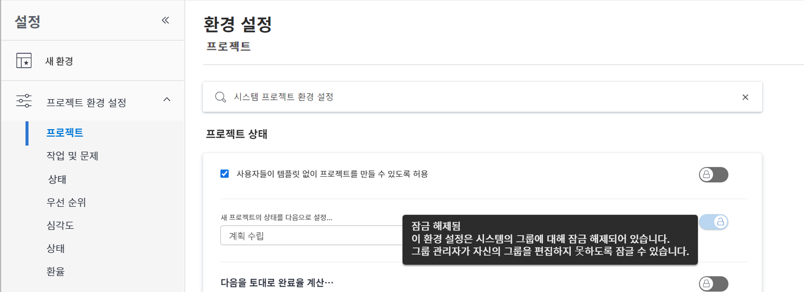

# 전역 기본 프로젝트 설정 구성

<!---
21.4 updates have been made
--->

이 비디오에서는 다음 방법을 알아봅니다.

* 사용자 지정 상태 변경
* 전역 프로젝트 환경 설정 지정
* 일정 만들기 및 사용

>[!VIDEO](https://video.tv.adobe.com/v/335065/?quality=12)

## 전역 및 그룹 프로젝트, 작업 및 문제 설정

를 열 때 [!UICONTROL 프로젝트] 의 설정 [!DNL Workfront], 다음과 같이 표시됩니다.[!UICONTROL 시스템 프로젝트 환경 설정]&quot;을 선택합니다. 이렇게 하면 이러한 설정이 의 모든 사용자에게 영향을 준다는 것을 알 수 있습니다. [!DNL Workfront] 시스템 — 글로벌 구성입니다.

![[!UICONTROL 프로젝트 환경 설정] 페이지 위치 [!UICONTROL 설정]](assets/admin-fund-system-project-preferences-1.png)

다음을 열면 유사한 항목이 표시됩니다. [!UICONTROL 작업 및 문제] 설정.

![[!UICONTROL 작업 및 문제 환경 설정] 위치: [!UICONTROL 설정]](assets/admin-fund-task-issue-preferences-2.png)

그러나 의 모든 그룹이 [!DNL Workfront] 에는 동일한 프로젝트, 작업 및 문제 환경 설정이 필요합니다. 예를 들어 마케팅 그룹은 새 프로젝트의 상태를 계획으로, 프로젝트 관리자 그룹은 요청 상태를 선호합니다.

[!DNL Workfront] 그룹 관리자가 그룹에 대한 특정 프로젝트, 작업 및 문제 환경 설정을 조정할 수 있습니다. 조정할 수 있는 기본 설정은 [!DNL Workfront] 잠금/잠금 해제 토글을 사용하는 시스템 관리자

다음 위치로 이동하여 시작 [!UICONTROL 설정] 영역:

1. 선택 **[!UICONTROL 설정]** 다음에서 **[!UICONTROL 메인 메뉴]**.
1. 확장 **[!UICONTROL 프로젝트 환경 설정]** 왼쪽 메뉴에서 을 클릭합니다.
1. 선택 **[!UICONTROL 프로젝트]** 또는 **[!UICONTROL 작업 및 문제]**, 수정할 설정에 따라 다릅니다.

그룹 관리자가 그룹의 해당 설정을 조정하지 못하도록 환경 설정을 잠급니다.

그룹 관리자가 사용자 정의할 수 있도록 기본 설정의 잠금을 해제합니다.

일부 설정은 잠금 해제할 수 없으며 전역 시스템 설정으로 유지됩니다.

### 그룹 및 하위 그룹 환경 설정 지정

시스템 관리자가 잠금 해제한 설정의 경우 그룹 관리자는 자신이 관리하는 그룹과 해당 그룹 아래에 중첩된 하위 그룹을 조정할 수 있습니다. 또한 그룹 관리자는 하위 그룹 관리자가 수정할 수 있는 설정을 제어할 수 있습니다.

1. 선택 **[!UICONTROL 설정]** 다음에서 **[!UICONTROL 메인 메뉴]**.
1. 클릭 **[!DNL Groups]** 왼쪽 메뉴에서 을 클릭합니다.
1. 그룹 또는 하위 그룹 이름을 클릭하여 엽니다.
1. 선택 **[!UICONTROL 프로젝트 환경 설정]** 또는 **[!UICONTROL 작업 및 문제 환경 설정]** 왼쪽 메뉴에서 을 클릭합니다.
1. 잠금이 해제된 각 환경 설정에 필요한 변경 작업을 수행합니다.
1. 선택 **[!UICONTROL 저장]**.

![[!UICONTROL 프로젝트 상태] 다음에 대한 섹션: [!UICONTROL 그룹] 페이지](assets/admin-fund-group-preferences.png)

조직에서 그룹 관리자를 사용하지 않는 경우 시스템 관리자가 다른 그룹의 환경 설정을 관리할 수 있습니다.

<!---
learn more URLs and guides
Create or edit a group status 
Group administrators 
Configure system-wide project preferences 
Configure project preferences for a group 
Configure task and issue preferences for a group 
Create and modify a group’s schedule 
--->
