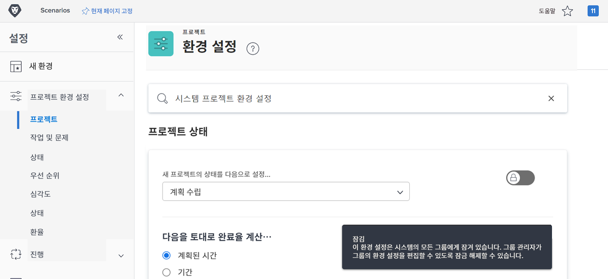
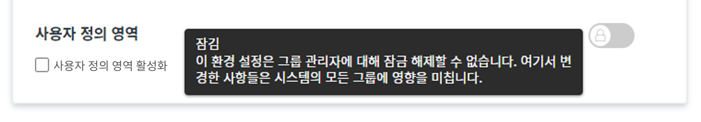

# 전역 기본 프로젝트의 설정 구성

<!---
21.4 updates have been made
--->

이 비디오에서는 다음 방법을 배우게 됩니다.

* 사용자 정의 상태 변경
* 전역 프로젝트 환경 설정 지정
* 일정 만들기 및 사용

>[!VIDEO](https://video.tv.adobe.com/v/335065/?quality=12&learn=on)

## 전역 및 그룹 프로젝트, 작업 및 문제 설정

[!DNL Workfront]에서 [!UICONTROL 프로젝트] 설정을 열면 창 상단의 검색창에 “[!UICONTROL 시스템 프로젝트 환경 설정]”이라고 표시됩니다. 이는 이러한 설정이 전역 구성이므로 [!DNL Workfront] 시스템의 모든 사람에게 영향을 미친다는 의미입니다.

[!UICONTROL 설정]](assets/admin-fund-system-project-preferences-1.png)의 ![[!UICONTROL 프로젝트 환경 설정] 페이지

[!UICONTROL 작업 및 문제] 설정을 열었을 때도 비슷한 내용이 표시됩니다.

[!UICONTROL 설정]](assets/admin-fund-task-issue-preferences-2.png)의 ![[!UICONTROL 작업 및 문제 환경 설정]

그러나 [!DNL Workfront]의 모든 그룹에 동일한 프로젝트, 작업 및 문제 환경 설정이 필요하지 않을 때도 있습니다. 예를 들어 마케팅 그룹은 새 프로젝트의 상태를 ‘계획’으로 설정하고자 하고 프로젝트 관리자 그룹은 ‘요청’ 상태를 선호하는 경우가 있습니다.

[!DNL Workfront]에서는 그룹 관리자가 그룹에 대한 특정 프로젝트, 작업 및 문제 환경 설정을 조정할 수 있습니다. 조정 가능한 환경 설정은 [!DNL Workfront] 시스템 관리자가 잠금/잠금 해제 토글을 사용하여 결정합니다.

[!UICONTROL 설정] 영역으로 이동하여 시작하십시오.

1. **[!UICONTROL 메인 메뉴]**&#x200B;에서 **[!UICONTROL 설정]**&#x200B;을 선택합니다.
1. 왼쪽 메뉴에서 **[!UICONTROL 프로젝트 환경 설정]**&#x200B;을 확장합니다.
1. 수정하려는 설정에 따라 **[!UICONTROL 프로젝트]** 또는 **[!UICONTROL 작업 및 문제]**&#x200B;를 선택합니다.

그룹 관리자가 그룹에 대한 설정을 조정하지 못하도록 하려면 환경 설정을 잠급니다.

그룹 관리자가 사용자 정의할 수 있도록 하려면 환경 설정을 잠금 해제합니다.

일부 설정은 잠금 해제할 수 없으며 전역 시스템 설정으로 유지됩니다.

### 그룹 및 하위 그룹 환경 설정 지정

시스템 관리자가 잠금 해제한 설정의 경우 그룹 관리자는 자신이 관리하는 그룹과 해당 그룹 아래 중첩된 모든 하위 그룹을 조정할 수 있습니다. 또한 그룹 관리자는 하위 그룹 관리자가 수정 가능한 설정을 제어할 수 있습니다.

1. **[!UICONTROL 메인 메뉴]**&#x200B;에서 **[!UICONTROL 설정]**&#x200B;을 선택합니다.
1. 왼쪽 메뉴에서 **[!DNL Groups]**&#x200B;를 클릭합니다.
1. 그룹 또는 하위 그룹 이름을 클릭하여 엽니다.
1. 왼쪽 메뉴에서 **[!UICONTROL 프로젝트 환경 설정]** 또는 **[!UICONTROL 작업 및 문제 환경 설정]**&#x200B;을 선택합니다.
1. 잠금 해제된 각 환경 설정을 필요에 맞게 변경합니다.
1. **[!UICONTROL 저장]**&#x200B;을 선택합니다.

[!UICONTROL 그룹] 페이지의 ![[!UICONTROL 프로젝트 상태] 섹션](assets/admin-fund-group-preferences.png)

조직에서 그룹 관리자를 사용하지 않는 경우 시스템 관리자가 다른 그룹의 환경 설정을 관리할 수 있습니다.

<!---
learn more URLs and guides
Create or edit a group status 
Group administrators 
Configure system-wide project preferences 
Configure project preferences for a group 
Configure task and issue preferences for a group 
Create and modify a group’s schedule 
--->
