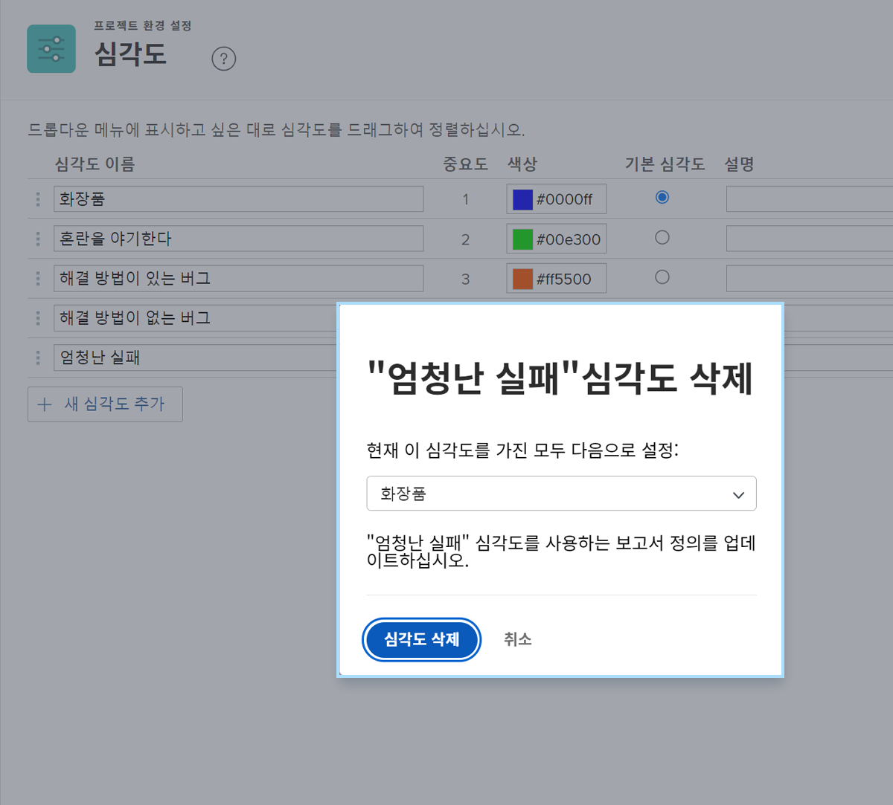

# 문제 심각도 만들기 및 관리

## 문제 심각성 소개

심각도는 문제가 얼마나 심각한지 또는 작업 수행에 어떤 영향을 미칠 수 있는지를 나타내는 데 사용할 수 있습니다.

![[!UICONTROL 심각도] 메뉴의 [!UICONTROL 문제 세부 정보] 창](assets/admin-fund-severity-issue-details.png)

다음 [!UICONTROL 심각도] 필드에서 액세스할 수 있습니다. [!UICONTROL 문제 세부 정보]. 목록 및 사용자 지정 보고서의 열 보기에 포함할 수도 있습니다.

[!DNL Workfront] 에는 5개의 기본 심각도가 있습니다.

* [!UICONTROL 표시용]
* [!UICONTROL 혼란 야기]
* [!UICONTROL 해결 방법이 있는 버그]
* [!UICONTROL 해결 방법이 없는 버그]
* [!UICONTROL 치명적인 오류]

시스템 관리자는 필요한 경우 이러한 기본 심각도의 이름을 바꾸거나 새 버전을 만들 수 있습니다.

심각도는 의 문제에만 사용할 수 있습니다 [!DNL Workfront].

## 문제 심각도 만들기 및 관리

시스템 관리자는 필요한 경우 문제 워크플로우를 완료하는 새 심각도를 만들 수 있습니다.

![[!UICONTROL 세속] 페이지 [!UICONTROL 설정]](assets/admin-fund-severity-section.png)

1. 클릭 **[!UICONTROL 설정]** 에서 **[!UICONTROL 기본 메뉴]**.
1. 를 확장합니다. **[!UICONTROL 프로젝트 환경 설정]** 왼쪽 메뉴 패널의 섹션에 있는 섹션을 참조하십시오.
1. 선택 **[!UICONTROL 세속]**.
1. 클릭 **[!UICONTROL 새 심각도 추가]**.
1. 용도에 맞는 이름을 심각도 로 지정합니다.
1. 다음 **[!UICONTROL 중요도]** 그 문제의 심각성과 일치되는 숫자이다. 가장 높은 숫자는 가장 높은 심각도에 해당합니다. 다음 [!UICONTROL 중요도] 숫자는 고유해야 합니다.
1. 우선 순위 색상을 선택합니다. 차트 보고서 및 [!DNL Workfront].
1. 심각도 옵션 중 하나를 **[!UICONTROL 기본 심각도]**. Workfront의 모든 새로운 문제에 자동으로 적용됩니다.
1. 사용 방법과 같이 심각도에 대한 설명을 포함합니다.
1. 저장할 필드 바깥쪽을 클릭합니다.

![[!UICONTROL 세속] list](assets/admin-fund-severity-new.png)

### 심각도 수정

심각도가 더 이상 문제 워크플로우와 관련이 없는 경우 이름을 변경하거나 숨기거나 삭제할 수 있습니다.

심각도가 더 이상 필요하지 않으면 [!DNL Workfront] 심각도( [!UICONTROL 숨기기] 설정 영역에서 옆에 있는 상자). 따라서 문제의 드롭다운 메뉴에서 심각도 옵션을 제거하지만 내역 데이터의 심각도가 유지되므로 보고 목적으로 계속 사용할 수 있습니다.

![[!UICONTROL 숨기기] 강조 표시된 열 [!UICONTROL 세속] 페이지 [!UICONTROL 설정]](assets/admin-fund-severity-hide.png)

[!DNL Workfront] 권장 사항 **포함하지 않음** 과거 문제에 사용된 심각도를 삭제합니다. 심각도를 삭제하면 다른 심각도를 대체하라는 메시지가 표시됩니다. 내역 데이터를 변경하고 보고에 영향을 줄 수 있습니다.

<!---
learn more URLs
Create and customize issue severities
Update issue severity
--->
