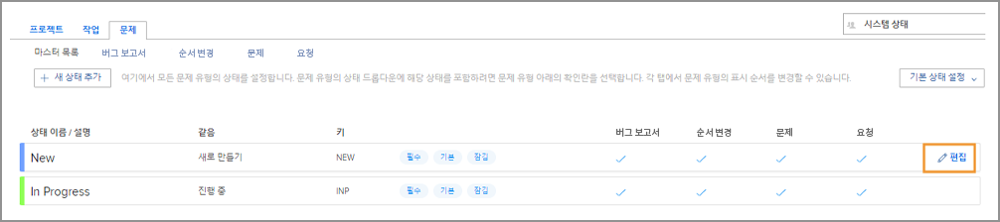
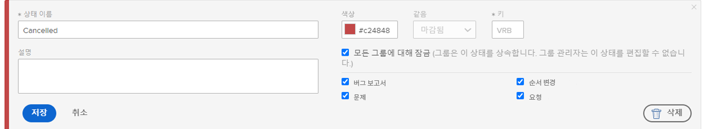
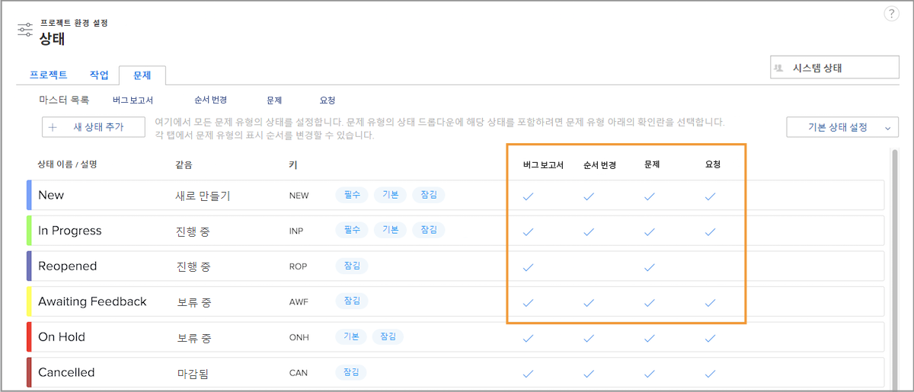

# 시스템 전체 문제 상태의 사용자 정의

[!DNL Workfront]는 조직의 문제 관리 워크플로를 수용할 수 있는 다양한 기본 상태를 제공합니다. 이러한 상태는 조직의 용어와 일치하도록 이름을 바꿀 수 있습니다. 그리고 특정 문제 유형에 상태를 할당할 수 있습니다.

필요한 경우 추가 상태를 만들 수 있습니다. 시스템 관리자만 시스템 전체 상태를 만들 수 있습니다. 또한 시스템 관리자는 그룹 관리자가 편집할 수 있는 상태를 제어합니다.

[!UICONTROL 설정]](assets/admin-fund-all-issue-statuses.png)의 [!UICONTROL 상태] 페이지에 있는 ![[!UICONTROL 문제] 탭

## 기존 상태 수정

[!DNL Workfront]는 최소 상태 수를 권장합니다. 이렇게 하면 사용자가 올바른 상태를 더 쉽게 선택할 수 있으며 유지 관리할 상태 목록이 더 짧아집니다.

기존 상태를 편집하여 이름, 할당된 문제 유형, 관련 색상 등을 변경할 수 있습니다.

[!UICONTROL 편집] 옵션이 강조 표시된 

1. **[!UICONTROL 메인 메뉴]**&#x200B;에서 **[!UICONTROL 설정]**&#x200B;을 클릭합니다.
1. 왼쪽 메뉴 패널에서 **[!UICONTROL 프로젝트 환경 설정]** 섹션을 확장합니다.
1. **[!UICONTROL 상태]**&#x200B;를 선택합니다.
1. **[!UICONTROL 문제]** 탭을 선택하고 오른쪽 상단에 [!UICONTROL 시스템 상태]가 표시되는지 확인합니다.
1. **[!UICONTROL 마스터 목록]**&#x200B;을 선택하여 모든 문제 유형의 상태를 확인합니다. 여기에서 문제 상태를 만들거나 수정합니다.
1. 이름을 변경할 상태의 오른쪽 위로 마우스 커서를 이동하고 **[!UICONTROL 편집]**&#x200B;을 클릭합니다
1. 상태에 새 이름을 지정하거나 원하는 대로 다른 정보를 변경합니다.
1. 이러한 설정이 [!DNL Workfront] 인스턴스의 모든 사용자에게 적용되어야 하는 경우 상태를 잠급니다.
1. 그룹 관리자가 자신의 그룹에 대해서만 상태를 편집할 수 있도록 상태를 잠금 해제합니다.
1. 상태를 적용해야 하는 문제 유형의 확인란을 선택합니다.
1. **[!UICONTROL 저장]**&#x200B;을 클릭합니다.

### 상태 할당

모든 문제 유형에 모든 상태가 할당되는 것은 아닙니다. [!UICONTROL 상태] 페이지에는 각 상태를 사용할 수 있는 문제 유형을 보여 주는 열이 있습니다.

특정 문제 유형에 할당된 상태만 보려면 창 상단에서 문제 유형 이름을 클릭하기만 하면 됩니다.

열이 강조 표시된 [!UICONTROL 상태] 페이지의 ![[!UICONTROL 문제] 탭](assets/admin-fund-statuses-issue-type.png)

여기에서 문제를 [!UICONTROL 상태] 드롭다운 메뉴에 표시할 순서로 끌어서 놓을 수 있습니다.

상태를 편집하려면 [!UICONTROL 마스터 목록]으로 다시 이동해야 합니다.
