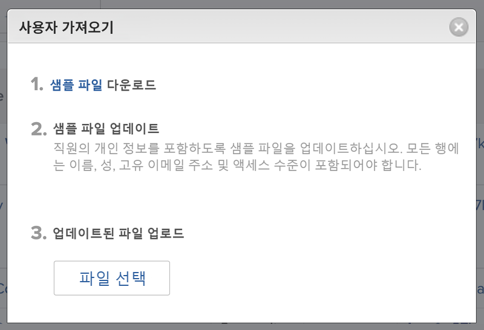
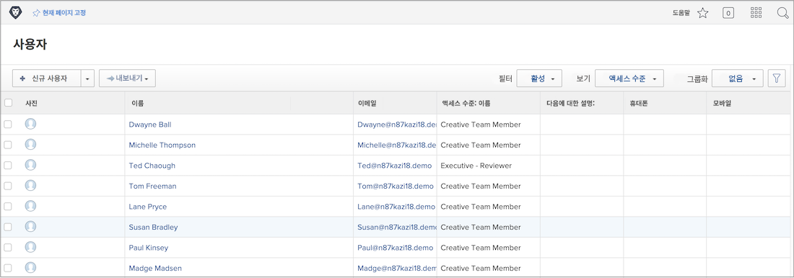

# 사용자 일괄 추가

사용자를 한 번에 하나씩 추가하면 시간이 많이 걸리고 힘들 수 있습니다. [!DNL Workfront]에서는 시스템 관리자가 가져오기 기능을 사용하여 동시에 여러 사용자를 추가할 수 있습니다.

![[!UICONTROL 사용자 가져오기] 메뉴 옵션](assets/admin-fund-adding-users-5.png)

1. [!UICONTROL 메인 메뉴]에서 **[!UICONTROL 사용자]**&#x200B;를 선택합니다.
1. **[!UICONTROL 새로운 개인]** 버튼의 화살표를 선택하고 **[!UICONTROL 사용자 가져오기]**&#x200B;를 선택합니다.
1. 열리는 창에서 가져올 사용자의 스프레드시트를 만드는 과정이 안내됩니다.
1. 샘플 파일([!DNL Excel] 스프레드시트)을 다운로드합니다.
1. 파일 자체의 지침에 따라 사용자 정보(이름, 성, 이메일 주소, 액세스 수준)로 스프레드시트를 업데이트합니다.
1. 사용자 목록을 저장한 후 **[!UICONTROL 파일 선택]** 버튼을 선택합니다.
1. 사용자 스프레드시트 파일로 이동하여 선택합니다.

가져온 사용자는 [!UICONTROL 사용자] 목록에 표시됩니다. 필요한 경우 개별 또는 여러 사용자에 대한 정보를 편집합니다.

## 사용자 가져오기: 빠른 시작 사용

[!DNL Workfront]에는 데이터를 시스템으로 가져오는 빠른 시작 템플릿이 있습니다. 사용자 가져오기에도 이 템플릿을 사용할 수 있습니다. [!DNL Workfront]의 권장 사항은 빠른 시작을 사용하기 전에 [!DNL Workfront] 컨설턴트와 협력하여 알아 두어야 할 고려 사항을 확인하는 것입니다.

<!--
paragraph below needs URL to article
-->

자세한 내용은 ‘빠른 시작을 통해 Workfront로 데이터 가져오기’를 참조하십시오.

[!UICONTROL 설정] 영역의 ![[!UICONTROL 데이터 가져오기]&#x200B;([!UICONTROL  빠른 시작]) 창](assets/admin-fund-adding-users-8.png)

<!--
Learn more URLs
Import users
Import data into Workfront via Kick-Starts
-->
