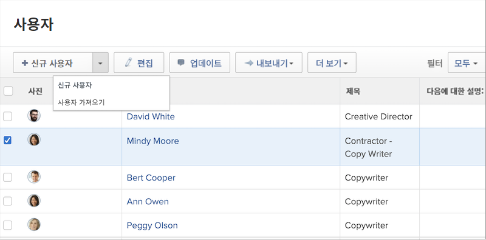

# 개인 사용자 프로필 만들기

신규 직원이 채용되거나 [!DNL Workfront]를 사용하여 부서로 이동하는 경우, 시스템 관리자는 사용자를 한 명만 생성해야 합니다. [!DNL Workfront]의 [!UICONTROL 사용자] 영역에서 빠르고 쉽게 수행할 수 있습니다.

1. **[!UICONTROL 메인 메뉴]**&#x200B;에서 **[!UICONTROL 사용자]**&#x200B;를 선택합니다.
1. **[!UICONTROL 새로운 개인]** 버튼을 클릭합니다.
1. [!UICONTROL 새로운 개인] 창에 사용자의 이름과 성을 입력합니다.
1. 사용자의 이메일 주소를 입력합니다. 이는 [!DNL Workfront] 로그인이며, [!DNL Workfront] 인스턴스 내에서 고유해야 합니다.
1. 사용자가 새 로그인에 대한 이메일을 받도록 하려면 초대 보내기 상자를 선택합니다.
1. 해당 개인에게 액세스 수준을 할당합니다. 그러면 [!DNL Workfront]에서 기본 권한이 부여됩니다.
1. 올바른 작업에 액세스할 수 있도록 사용자를 홈 그룹에 할당합니다.
1. 사용자 생성을 완료하려면 **[!DNL Add this Person]**&#x200B;를 선택합니다.

![[!UICONTROL 새로운 개인] 창](assets/admin-fund-adding-users-1.png)

[!UICONTROL 고급 옵션 표시] 링크를 클릭하면 전체 사용자 세부 정보 창이 열립니다. 이를 통해 시스템 관리자는 팀 및 작업 역할과 같은 추가 조직 및 리소스 계획 정보를 설정하고 사용자에 대한 개인 정보(전화 번호, 직위 등)를 입력할 수 있습니다.

[!UICONTROL 고급 옵션 표시]](assets/admin-fund-adding-users-2.png)를 클릭한 후 ![[!UICONTROL 새로운 개인] 창

이 정보 중 일부는 사용자가 수정할 수 있지만, 일부는 수정할 수 없습니다(사용자의 액세스 수준 권한에 따라 다름).

## 기존 사용자를 복사하여 새 사용자 생성

새 로그인을 생성하려면 시스템의 기존 사용자를 기본으로 사용합니다. 기존 사용자의 정보 중 일부는 복사되지만 일부 정보는 처음부터 입력해야 합니다.

1. **[!UICONTROL 메인 메뉴]**&#x200B;에서 **[!UICONTROL 사용자]**&#x200B;를 선택합니다.
1. 이름 옆의 확인란을 선택하여 복사할 사용자를 선택합니다.
1. **[!UICONTROL 새로운 개인]** 버튼의 화살표를 선택하고 **[!UICONTROL 선택한 개인에서 새로 만들기]**&#x200B;를 선택합니다.
1. **[!UICONTROL 개인 정보]** 섹션에 새로운 사용자의 정보를 입력합니다.
1. 일부 필드는 원래 사용자로부터 복사됩니다. 필요에 따라 정보를 변경합니다.
1. **[!UICONTROL 사용자 추가]**&#x200B;를 선택합니다.

![[!UICONTROL 새로운 개인] 창](assets/admin-fund-adding-users-4.png)

<!--
Learn more URLs
Add users
-->
