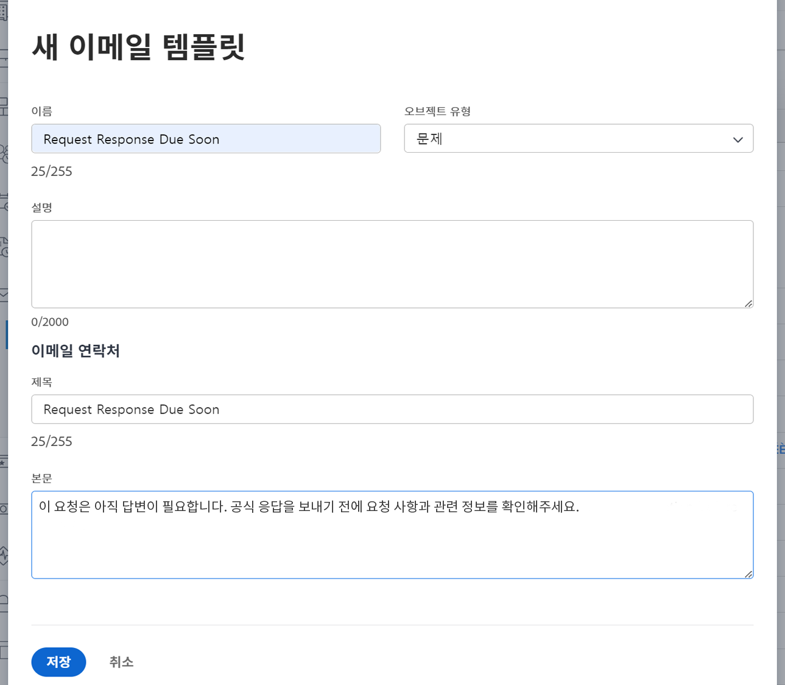

<!--
this has the same content as the system administrator notification setup and mangement section of the email and inapp notificiations learning path
-->

# 미리 알림 설정

미리 알림은 시스템 관리자가 [!UICONTROL 설정] 영역에 생성합니다. 그런 다음 프로젝트, 작업 및 문제 소유자가 작업 기한이 임박하거나 지난 경우 알림으로 첨부하여 사용할 수 있습니다.

미리 알림은 오브젝트별로 다르며 알림을 보낼 수 있도록 해당 작업 항목에 수동으로 첨부해야 합니다.

**미리 알림 만들기**

1. **[!UICONTROL 메인 메뉴]**&#x200B;에서 **[!UICONTROL 설정]**&#x200B;을 클릭합니다.
1. **[!UICONTROL 이메일]** 섹션을 클릭합니다.
1. **[!UICONTROL 알림]** 섹션을 클릭합니다.
1. **[!UICONTROL 새 알림]** 탭을 클릭합니다.
1. **[!UICONTROL +새 미리 알림]** 버튼을 클릭합니다.
1. 드롭다운 메뉴에서 원하는 오브젝트를 선택합니다.
1. 필수 정보를 입력합니다.
1. **[!UICONTROL 저장]**&#x200B;을 클릭합니다.

![[!UICONTROL 새로운 미리 알림] 창](assets/admin-fund-reminder-notification-1.png)

미리 알림을 설정할 때 고려해야 할 몇 가지 사항이 있습니다.

* **[!UICONTROL 미리 알림 이름]-** 프로젝트 관리자가 오브젝트에 미리 알림을 첨부할 때 표시되는 이름입니다. 이름은 간결하지만 설명적이어야 합니다.
* **[!UICONTROL 자격 기간] —** 시간 섹션에서 선택한 일자 이전/이후의 시간, 일, 주 또는 월 수
* **[!UICONTROL 시간]-** 오브젝트의 계획된 시작/완료 일자 이전 또는 이후에 알림을 보낼지 선택합니다. 타임시트 옵션은 시작 일자, 종료 일자 또는 마지막 업데이트 일자와 관련되어 있습니다.
* **[!UICONTROL 기준]-** 미리 알림을 보낼 기준을 지정합니다. 옵션은 오브젝트별 미리 알림에 따라 다릅니다.
* **[!UICONTROL 수신자]-** 미리 알림을 보낼 사람을 선택합니다. 관련자 옵션은 미리 알림에 대해 선택한 오브젝트 유형에 따라 다릅니다.

미리 알림 설정을 구성하고 저장하면 [!DNL Workfront] 내에 오브젝트 소유자가 미리 알림을 사용할 수 있습니다.

## 이메일 사용자 정의

미리 알림은 기본 이메일 형식과 메시지를 사용합니다. 이메일을 사용자 정의하려면 템플릿을 만들면 됩니다.

<!--
paragraph above needs a hyperlink to an article
-->

<!--
learn more URLs
-->
