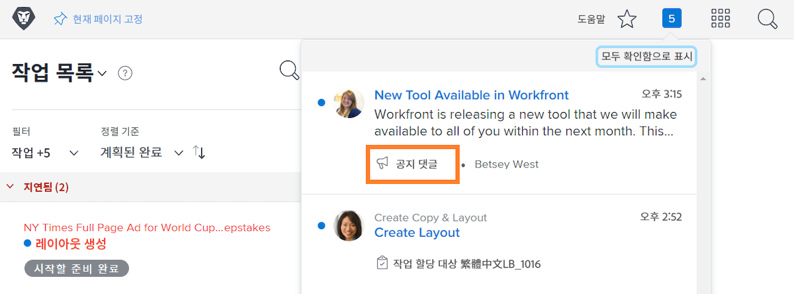
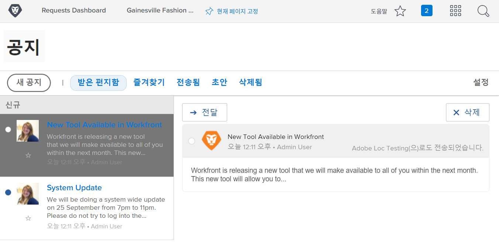

<!--
this has the same content as the system administrator notification setup and mangement section of the email and inapp notificiations learning path
-->

# [!UICONTROL 공지 센터] 메시지 보내기

[!UICONTROL 공지 센터]는 시스템 관리자가 [!DNL Workfront]로부터 커뮤니케이션을 받거나 조직의 [!DNL Workfront] 사용자에게 알림을 보낼 수 있는 중앙 집중식 위치입니다.

[!DNL Workfront]는 소프트웨어 릴리스, 예정된 웨비나, 시스템 유지 관리 등에 대한 알림을 시스템 관리자에게 보냅니다. [!UICONTROL 공지 센터]는 중요한 모든 정보를 한 곳에 보관하므로, 이메일 받은 편지함에 있는 다른 메시지 사이에서 해당 메시지가 손실되지 않습니다.

알림 아이콘에는 [!DNL Workfront]를 통해 전송된 읽지 않은 알림 및 공지가 표시됩니다. 목록의 공지는 레이블이 지정되어 있으며 열려는 경우 클릭 가능합니다.

시스템 관리자는 [!UICONTROL 공지 센터]를 사용하여 사용자에게 [!DNL Workfront] 전반의 메시지를 보낼 수도 있습니다. 지원을 위해 연락할 대상에 대한 미리 알림을 보내고 “오늘의 팁” 등을 제공할 수 있습니다.

![[!UICONTROL 모든 공지] 링크](assets/admin-fund-announcements-2.png)

**공지를 보내는 방법**

1. **알림 아이콘**&#x200B;을 클릭합니다.
1. **[!UICONTROL 모든 공지]**&#x200B;를 클릭합니다.
1. **[!UICONTROL 새 공지]** 버튼을 클릭합니다. 기본적으로 [!UICONTROL 수신인] 줄은 모든 [!DNL Workfront] 사용자에게 메시지를 보낼 [!UICONTROL 모든 사용자]로 채워집니다. 이를 삭제하고 사용자, 작업 역할, 팀, 그룹 또는 회사의 이름을 입력할 수 있습니다.
1. 제목을 입력합니다.
1. 그런 다음 원하는 대로 편집 도구를 사용하여 공지 텍스트를 입력합니다.
1. 해당되는 경우 **[!UICONTROL 첨부 추가]** 버튼을 클릭하여 공유할 파일을 첨부합니다.
1. **[!UICONTROL 보내기]**&#x200B;를 클릭합니다.

![[!UICONTROL 공지] 페이지의 공지 작성](assets/admin-fund-announcements-3.png)

공지 영역은 받은 편지함과 같으며, 왼쪽 패널에 받은 메시지가 있습니다. 메시지를 클릭하여 읽습니다.

