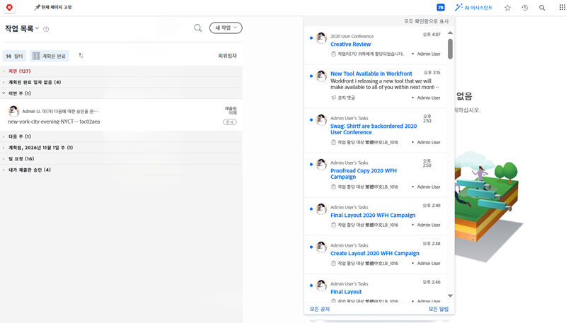
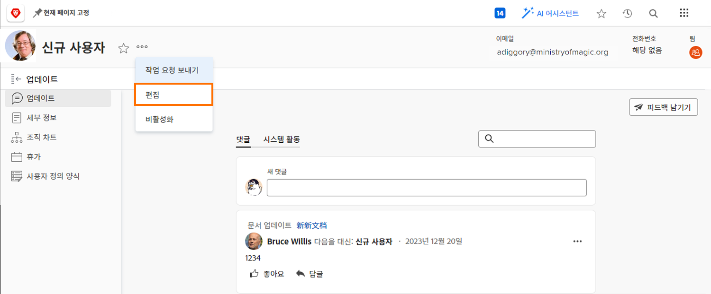

# 인앱 및 이메일 이벤트 알림 관리

이메일은 일상 생활의 일부이며, 어떤 날에는 이메일의 양이 압도적입니다. 그러나, [!DNL Workfront], 시스템 관리자는 모든 사람이 자신이 관련된 작업과 관련된 유용한 이메일을 수신하도록 할 수 있습니다.

Workfront이 사용자에게 보낼 수 있는 알림에는 몇 가지 유형이 있습니다. 이러한 알림 중 일부는 시스템 수준에서 제어되며 모든 사용자에게 영향을 줍니다. 일부 알림은 일별 다이제스트에서 즉시 이메일을 생성하도록 설정할 수 있습니다. 또는 Workfront 내의 알림만 생성하도록 이메일을 끕니다.

## 이벤트 알림

이벤트는 상태 변경, 게시된 댓글 또는 할당의 지정과 같은 것이며 의 인앱 알림을 트리거할 수 있습니다. [!DNL Workfront].

그러나 환경 설정에서 옵션을 선택하거나 선택 취소하여 이메일 알림을 받을 이벤트를 결정할 수 있습니다.

이러한 변경 작업을 수행하려면 [!UICONTROL 기본 메뉴].

![의 사용자 이름 [!UICONTROL 기본 메뉴]](assets/admin-fund-user-notifications-02.png)

클릭 [!UICONTROL 편집] 에서 [!UICONTROL 자세히] 메뉴 아래의 제품에서 사용할 수 있습니다.

클릭 [!UICONTROL 알림 을 참조하십시오] 에서 [!UICONTROL 개인 편집] 팝업 상자

![[!UICONTROL 개인 편집] 창](assets/admin-fund-user-notifications-04.png)

여기에서 즉시, 매일 또는 전혀 받지 않고 받을 알림을 결정할 수 있습니다. 여기서 변경하는 내용은 사용자별로 다르며 Workfront의 다른 사용자에게는 영향을 주지 않습니다.

**[!UICONTROL 일별]**

기본적으로 이메일은 즉시 전송되도록 설정되어 있습니다. 그러나 이메일 알림 빈도를 [!UICONTROL 즉시] to [!UICONTROL 일별]필요한 정보를 얻을 수 있도록 하는 것이 좋습니다.

![[!UICONTROL 알림] 섹션 [!UICONTROL 개인 편집] 창](assets/admin-fund-user-notifications-05.png)

일별 옵션은 일별 이벤트의 다이제스트를 하나의 이메일로 보냅니다. 사용자는 [!UICONTROL 알림 을 참조하십시오] 섹션을 참조하십시오.

예: [!UICONTROL 내 소유 프로젝트 정보] 섹션은 일일 전자 메일 하나를 생성합니다. [!UICONTROL 필요한 작업] 섹션은 하나의 일별 이메일 등을 생성합니다.

![[!UICONTROL 일별 다이제스트] 이메일 [!UICONTROL 내 소유 프로젝트 정보]](assets/admin-fund-user-notifications-06.png)

![[!UICONTROL 일별 다이제스트] 이메일 [!UICONTROL 필요한 작업]](assets/admin-fund-user-notifications-07.png)

일별 옵션을 선택할 수 있을 뿐만 아니라, 해당 이메일을 보낼 시간을 설정합니다. 가장 잘 작동하는 것에 따라, 다이제스트 이메일은 여러분이 아침에 출근하기 전 또는 하루를 위해 떠나기 직전에 발송될 수 있습니다.

![[!UICONTROL Email Daily Digest after] 드롭다운 메뉴에서 [!UICONTROL 개인 편집] 창](assets/admin-fund-user-notifications-08.png)

**전혀**

마지막 옵션은 전자 메일 알림을 완전히 해제하는 것입니다.

![선택한 알림 끄기 [!UICONTROL 개인 편집] 창](assets/admin-fund-user-notifications-09.png)

이렇게 하기로 결정한 경우, 이메일을 받지 않더라도 작업이 여전히 할당되고, 여기에 주석을 달고, 업데이트됩니다 [!DNL Workfront]. 모든 알림을 끄면 알아야 하는 중요한 정보가 누락될 수 있습니다.

다음과 같은 몇 가지 인스턴스가 있습니다 [!DNL Workfront] 사용자가 이메일 알림을 끄는 것을 보았습니다. 예를 들어 [!DNL Workfront] 모바일 앱에서는 앱을 통해서만 이메일 알림을 끄고 알림을 받을 수 있습니다.

에 관계없이 [!UICONTROL 이벤트 알림] 수신하기로 결정하면 조직의 목표에 적합한 작업이 성공적으로 수행되려면 알림이 중요합니다.

## Recommendations

다음과 같은 두 가지 알림이 있습니다 [!DNL Workfront] 인스턴트 이메일 또는 일별 다이제스트 중 어떤 것을 선택할지 선택된 상태로 두는 것이 좋습니다.

대부분의 사용자의 경우:

* [!UICONTROL 내 작업 중 하나의 전임 작업이 완료되었습니다.]
* [!UICONTROL 누군가가 지시된 업데이트에 나를 포함시킵니다.]
* [!UICONTROL 내 작업 항목에 대한 댓글]
* [!UICONTROL 나에게 할당된 작업의 기한 변경]

프로젝트 관리자 전용:

* [!UICONTROL 내가 진행 중인 프로젝트가 활성화됩니다.]
* [!UICONTROL 내가 소유한 프로젝트가 늦어지고 있습니다.]
* [!UICONTROL 내가 소유한 프로젝트에 문제가 추가됨]
* [!UICONTROL 이정표 작업은 내가 소유한 프로젝트에서 완료됩니다]

<!---
learn more URLs
Email notifications
guide: manage your notifications
--->
