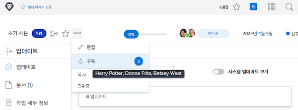

# 작업 항목 구독

이벤트 알림은 할당된 작업에 대해 업데이트 사항을 전달해 줍니다. 그러나 할당되지 않은 작업 항목이라도 자신이 수행하는 작업에 영향을 줄 수 있어 팔로우하려는 경우가 있을 수 있습니다. 이때 특정 항목을 구독하는 것이 완벽한 솔루션입니다.

예를 들어 ‘초기 복사’ 작업의 진행 상황에 관심이 있다고 해 보겠습니다. 이 작업에 할당되지는 않았지만 초기 사본을 편집할 책임이 있어 진행 상황을 알고자 하는 상황입니다. 작업을 구독하면 업데이트가 있을 때 작업 진행 상황에 대한 실시간 업데이트를 제공하는 이메일 알림을 받을 수 있습니다.

구독 이메일과 인앱 알림은 항목에 댓글이 달린 경우에만 전송된다는 점에 유의해야 합니다. 기한 수정 또는 할당 변경과 같은 다른 작업에 대해서는 이메일 및 알림이 전송되지 않습니다.

작업 항목을 구독하려면 해당 항목에 대해 최소한 ‘보기 공유’ 권한이 있어야 합니다.

![[!UICONTROL 작업 액세스] 창](assets/admin-fund-user-notifications-11.png)

작업 항목에 대한 액세스 권한이 있는 경우 다음을 통해 구독하면 됩니다.

1. 프로젝트, 작업 또는 문제의 랜딩 페이지로 이동합니다.
1. **[!UICONTROL 작업]** 메뉴를 클릭합니다.
1. **[!UICONTROL 구독]**&#x200B;을 클릭합니다.

작업 메뉴의 ![[!UICONTROL 구독] 옵션](assets/admin-fund-user-notifications-12.png)

메뉴에서 [!UICONTROL 구독/구독 취소] 옆의 숫자 위로 마우스를 가져가면 작업 항목을 구독한 다른 사람을 볼 수 있습니다.

작업 항목에 대한 [!UICONTROL 관리] 또는 [!UICONTROL 공유] 권한이 있는 경우 다음과 같이 다른 사용자를 프로젝트, 작업 또는 문제에 구독시킬 수 있습니다.

1. **[!UICONTROL 구독]** 옵션 옆의 숫자를 클릭합니다.
1. 작업 항목에 구독시키려는 사람의 이름을 추가합니다.
1. **[!UICONTROL 저장]**&#x200B;을 클릭합니다.

![[!UICONTROL 구독] 창](assets/admin-fund-user-notifications-15.png)

구독하는 사람들에게는 구독 알림이 전송되지 않습니다. 모든 구독자에게는 항목에 대한 ‘보기’ 권한이 부여됩니다. 단, 구독자에게 항목에 대한 [!UICONTROL 기여] 또는 [!UICONTROL 관리] 권한이 이미 있는 경우 해당 권한은 변경되지 않은 상태로 유지됩니다.

개별 항목의 [!UICONTROL 업데이트] 탭에 있는 입력 항목을 통해 누가 언제 구독했는지 표시됩니다. [!UICONTROL 업데이트] 탭에는 사용자가 다른 사람에 의해 구독된 경우도 기록됩니다.

구독이 표시된 작업 ![[!UICONTROL 업데이트] 페이지](assets/admin-fund-user-notifications-16.png)

사용자를 구독 취소하려면 풍선을 다시 클릭하여 [!UICONTROL 구독자] 창을 엽니다. 그런 다음 해당 사람의 이름 옆에 있는 X를 클릭합니다. 사용자는 구독이 취소되었다는 알림을 받지 않습니다.

프로젝트의 ![[!UICONTROL 구독 취소] 메뉴 옵션](assets/admin-fund-user-notifications-14.png)

<!--
learn more URL: Subscribe to items in Workfront
-->
