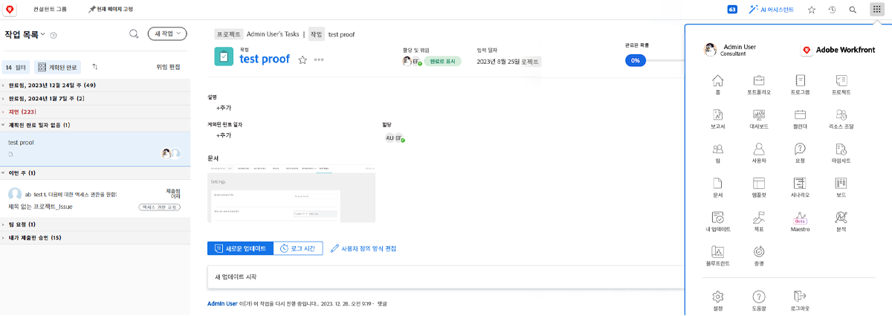
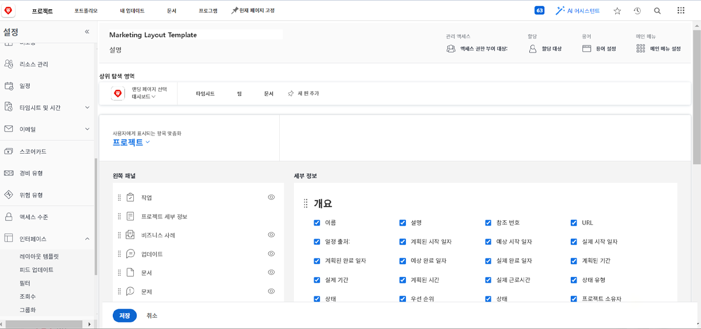
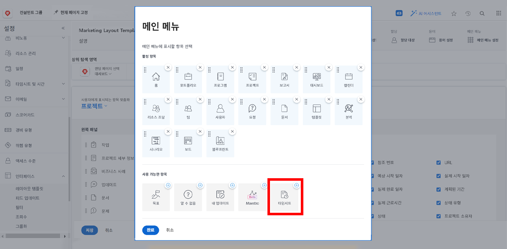
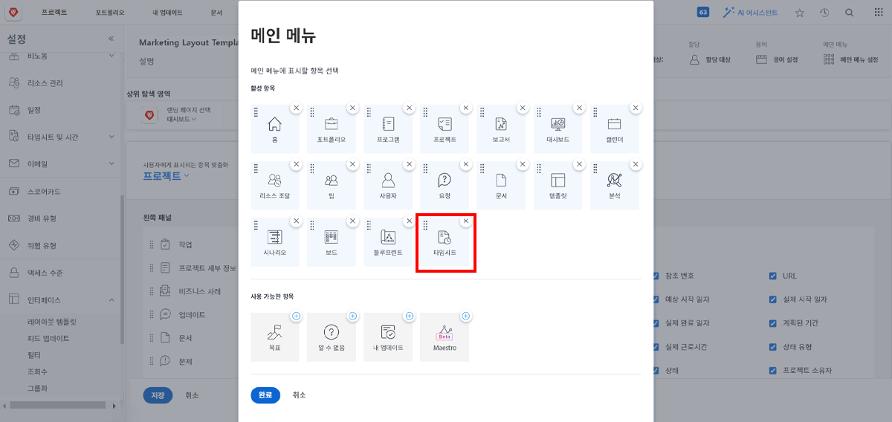

# 레이아웃 템플릿이란 무엇입니까?

Workfront에는 작업을 완료하는 데 도움이 되는 유용한 도구가 많이 있습니다. 하지만 좋은 것도 지나치면 독이 될 수 있습니다.

레이아웃 템플릿을 사용하면 시스템 관리자와 그룹 관리자가 사용자 환경을 사용자 정의하고 사용자가 중요한 것에 집중할 수 있습니다.

예를 들어 대부분의 조직은 시간을 기록하지 않습니다. 그러나 컨설턴트 팀은 고객에게 과금하므로 정확한 과금을 위해 시간을 기록해야 합니다. 레이아웃 템플릿을 사용하면 타임시트가 필요하지 않은 사람에게는 숨겨지고 필요한 사람에게는 표시될 수 있습니다.

## 빌드하기 전

Workfront는 레이아웃 템플릿을 만들기 전에 사용자와 소통할 것을 권장합니다. 그룹 관리자와 같이 레이아웃 템플릿을 사용할 사람을 참여시키면 적합한 사람 앞에 적합한 정보와 도구를 훨씬 더 원활하게 배치할 수 있습니다.

템플릿을 만든 후에는 자유롭게 변경하십시오. 필요로 하는 것과 보고 액세스하고 싶은 것에 대한 피드백을 계속해서 받습니다. 레이아웃 템플릿은 사용자에게 깔끔하고 쉬운 환경을 제공하기 위한 것입니다.
