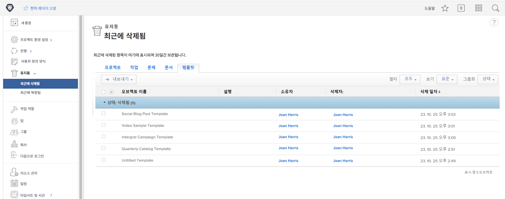
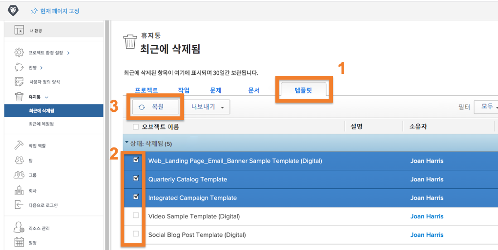
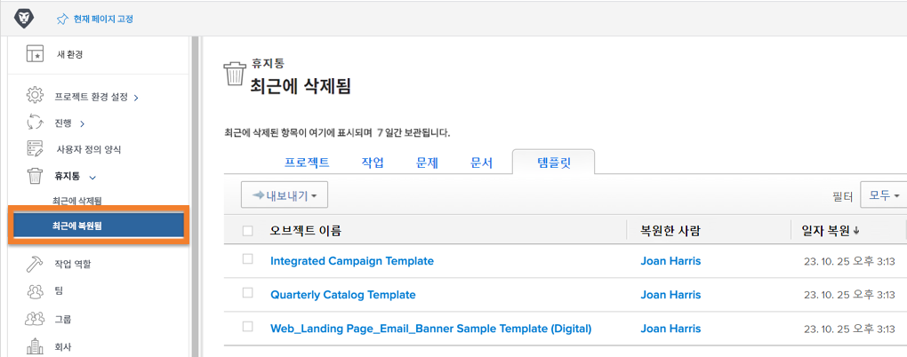

# 휴지통에서 개체 복원

프로젝트 작업은 많은 변화를 거칩니다. 항목을 삭제할 수 있습니다. 단 30분 후에 작업이 필요하거나 문서를 해결해야 하는 문제가 해결되었습니다.

휴지통을 사용하면 객체가 삭제되면 Workfront은 최대 30일 동안 저장소에 배치합니다. 시스템 관리자는 모든 정보(업데이트, 로그된 시간, 문서 등)와 함께 개체를 Workfront의 원래 위치로 복원할 수 있습니다.

## 개체 복원

1. 을(를) 선택합니다 **설정** 의 영역 **기본 메뉴**.
1. 클릭 **휴지통** 왼쪽 패널에 표시됩니다.
1. 선택 **최근에 삭제됨**.

복원할 각 객체에는 복원할 특정 항목을 쉽게 찾을 수 있는 탭이 있습니다.

1. 원하는 객체의 탭을 클릭합니다.
1. 복원할 개체 옆에 있는 상자를 선택합니다.
1. 을(를) 클릭합니다. **복원** 버튼을 클릭합니다.

복원되는 개체가 잠시 [!UICONTROL 진행 중] 섹션을 참조하십시오. 화면이 새로 고쳐지면 객체가 복원되었으므로 화면에 더 이상 표시되지 않습니다. 항목이 이전에 있었던 위치에 나타납니다 [!DNL Workfront]에서 확인할 수 있는 [!UICONTROL 최근에 복원됨] 화면.

그룹 관리자는 프로젝트와 관련된 작업, 문제 또는 문서와 함께 자신이 관리하는 그룹과 연관된 프로젝트를 복원할 수 있습니다.

<!---
learn more URL
Restoring deleted items
Viewing items that have been recently restored
--->
