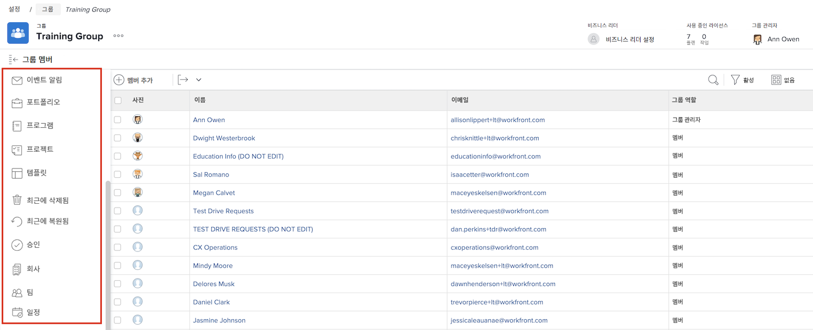

# 그룹 관리자의 필요성 이해

<!---
21.4 updates have been made
--->

대기업 또는 많은 회사의 시스템 관리자 [!DNL Workfront] 사용자, 유지 관리 [!DNL Workfront] 각 그룹 및 하위 그룹에 대한 설정은 시간이 많이 걸릴 수 있습니다.

그룹 관리자는에서 자신의 그룹에 대해 일부 관리 기능을 수행할 수 있습니다. [!DNL Workfront] 시스템 업데이트 및 유지 관리에 있어 부하의 균형을 맞추는 데 도움이 됩니다.

그룹 관리자들은 자신들의 일상에서 겪는 어려움들에 더 잘 맞추어 그룹의 요구 사항을 관리할 수 있습니다. 이렇게 하면 시스템 관리자가 [!DNL Workfront] 조직의 전체에 도움이 되는 구성입니다.

그룹 관리자가 수행할 수 있는 작업 중 일부는 [!DNL Workfront] 포함:

* 하위 그룹을 만들고 하위 그룹에 사용자를 추가합니다.
* 해당 그룹의 레이아웃 템플릿을 만듭니다.
* 그룹에 대한 승인 프로세스를 만듭니다.
* 그룹 수준 워크플로우 상태를 만듭니다.
* 그룹 페이지에서 그룹과 연관된 프로젝트, 프로그램 및 포트폴리오에 액세스합니다.
* 그룹 수준 프로젝트, 작업 및 문제 환경 설정을 관리합니다.
* 그룹 수준 작업표 환경 설정을 관리합니다.
* 그룹 수준 이벤트 알림을 관리합니다.
* 다른 그룹 구성원으로 로그인합니다.
* 그룹에 비즈니스 리더를 지정합니다.
* 회사 관리.

시스템 또는 그룹 관리자는 관리하는 그룹 및 하위 그룹 내에 하위 그룹을 생성할 수 있습니다. 이러한 하위 그룹에는 고유한 그룹 관리자를 할당할 수 있습니다.

>[!NOTE]
>
>한 그룹 아래에 하위 그룹의 수준이 14개로 제한됩니다.

**그룹 관리자에 대해 자세히 알아보기**

<!---
bullet points below need hyperlinks
--->

관리 시스템, 그룹 관리자 및 하위 그룹 관리자가 수행할 수 있는 작업 목록 [!DNL Workfront], 다양한 유형의 관리자에 대해 허용되는 작업 문서를 참조하십시오.

## 그룹 관리

의 그룹 페이지에서 그룹 구성원, 하위 그룹, 그룹 상태, 그룹 프로젝트 환경 설정 등을 빠르고 효율적으로 관리할 수 있습니다 [!DNL Workfront].

1. 선택 **[!UICONTROL 설정]** 에서 **[!UICONTROL 기본 메뉴]**.
1. 이동 **[!UICONTROL 그룹]** 왼쪽 패널에 표시됩니다.
1. 열 그룹의 이름을 선택합니다.
1. 왼쪽 패널에서 섹션을 클릭하여 업데이트할 섹션을 엽니다.

<!---
learn more URLs
Create and manage groups 
Create and manage subgroups 
Business leader overview 
--->
