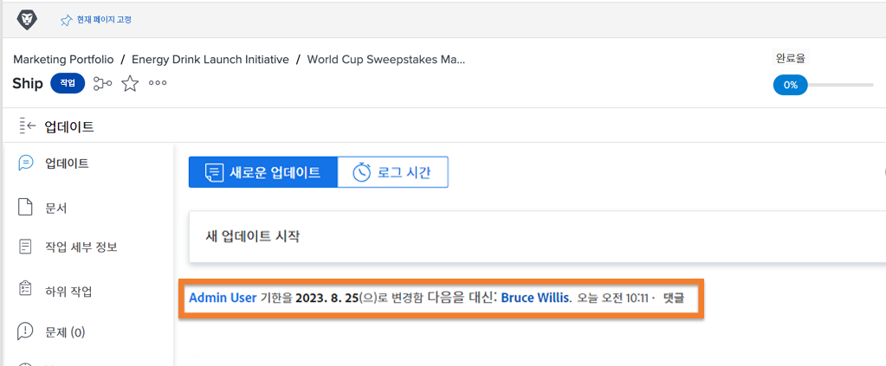

# 다른 사용자로 로그인

Workfront 관리자가 사용자 환경을 설정할 때 유용하다고 생각하는 한 가지 기능은 다음으로 로그인 기능입니다. [!UICONTROL 설정] 영역의 이 기능을 사용하여 자신의 계정에서 로그아웃하지 않고도 다른 사용자로 로그인할 수 있습니다.

[!UICONTROL 설정] 영역의 ![[!UICONTROL 다음으로 로그인] 페이지](assets/admin-fund-log-in-as-1.png)

## 다음으로 로그인의 이점

이 기능은 다음과 같은 여러 이유로 유용합니다.

* 관리자는 메뉴 항목이나 대시보드가 제대로 표시되도록 사용자에게 할당된 레이아웃 템플릿을 미리 볼 수 있습니다.
* 워크플로 테스트 중에 사용자 권한이 올바르게 설정되었는지 확인하는 데 유용합니다.
* 관리자는 이 기능을 사용하여 작업을 완료로 표시하거나 작업을 수행할 수 없는 사람을 승인할 수도 있습니다.

## 다음으로 로그인 액세스

1. **[!DNL Main Menu]**&#x200B;에서 **[!UICONTROL 설정]**&#x200B;을 선택합니다.
1. 왼쪽 패널에서 **[!UICONTROL 다음으로 로그인]**&#x200B;을 클릭합니다.
1. 로그인해야 하는 사용자 이름을 입력합니다.

[!UICONTROL 다음으로 로그인] 페이지의 ![[!UICONTROL 액세스 로그] 탭](assets/admin-fund-log-in-as-3.png)

로그인하면 화면 상단의 알림에 로그인한 사람이 표시됩니다.

[!DNL Workfront] 창 상단에 있는 ![[!UICONTROL 현재 다음으로 로그인됨] 메시지](assets/admin-fund-log-in-as-2.png)

## 업데이트 탭은 활동을 추적함

관리자가 다른 사용자로 로그인하여 해당 사용자를 대신하여 변경/업데이트한 경우, 해당 특정 항목에 대한 업데이트 영역에 변경 사항이 표시됩니다. 아래 예는 Joan Harris가 Roy Campbell을 대신하여 기한을 변경했음을 보여 줍니다.

