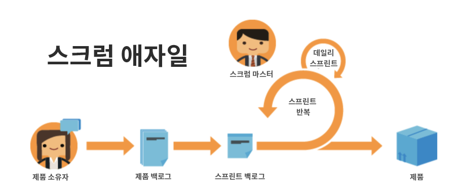

# 애자일 사용의 이점

## 신속한 조정 및 피벗 기능

이름에서 알 수 있듯이 팀은 애자일 방법론을 사용하여 방향과 초점을 빠르게 변경할 수 있는 더 나은 장비를 갖추게 됩니다. 소프트웨어 및 마케팅 회사는 특히 수요 변화가 매주 발생하는 경향을 잘 알고 있습니다. 팀은 애자일을 통해 수행 중인 작업을 재평가하고 주어진 증분 단위로 조정하여 작업 및 고객 환경이 변경됨에 따라 팀의 포커스도 변경되도록 합니다.

## 팀 작업의 투명성

애자일 팀은 “스탠드업”이라는 일일 회의를 통해 팀이 개발할 기능 또는 제품의 우선 순위 목록에 계속 집중하고 있는지 확인합니다. 더 이상 팀원들이 무엇을 하고 있는지 몰라 혼란을 겪지 않아도 됩니다. 팀이 전날부터 달성한 것, 해결해야 할 문제/장애물, 그날 작업할 계획을 정기적으로 확인합니다.

이러한 투명성과 일관된 방향을 통해 모두가 더 빠르게 향상할 수 있습니다.

## 잦은 피드백

애자일 채택의 마지막 주요 이점은 각 반복이 끝날 때 통합되는 피드백 루프입니다(반복은 팀이 특정 결과물을 완료하기 위해 작업해야 하는 정해진 시간임). 피드백 루프를 통해 팀은 지난 몇 주 동안 어떤 문제가 발생했는지, 계획이 앞으로 어떻게 변경될 수 있는지, 이전 요구 사항이 변경된 경우 지금 고객에게 필요한 것이 무엇인지, 팀으로서 배운 교훈은 무엇인지를 확인할 수 있습니다.
