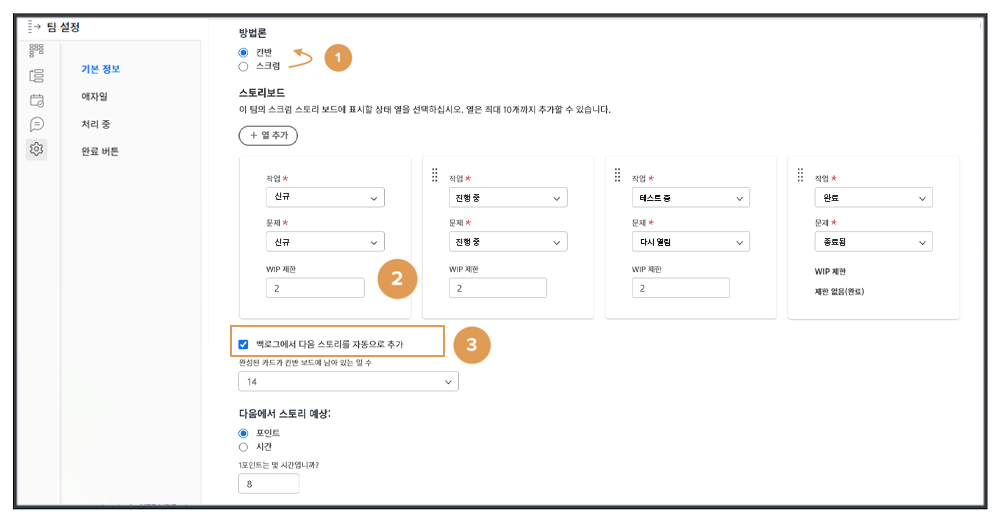
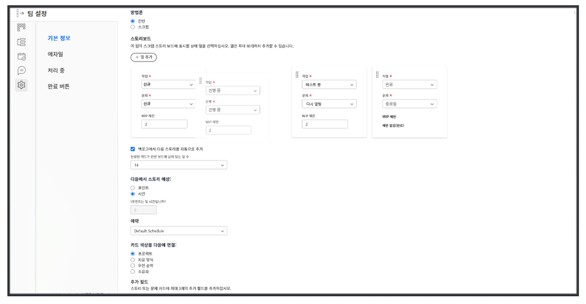
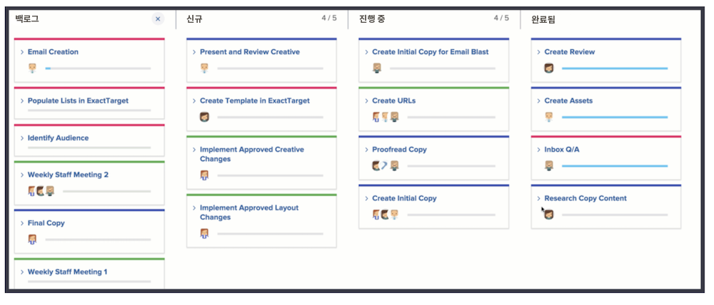
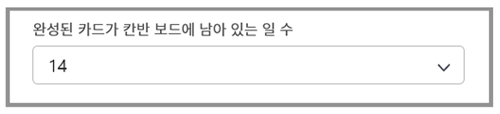

# 간판 팀 생성

크리에이티브 마케팅 팀이 잠시 스크럼을 사용하고 있습니다. 그들은 민첩한 팀의 유연한 환경에 감사하지만, 그들의 팀에 대해 얼마나 자주 우선순위가 바뀌는가에 따라 특정 시간대에 이야기를 커밋하는 것이 어렵다는 것을 발견하고 있습니다.

그들은 스크럼의 대안을 가지고 있다. 간판이라고 합니다.

간판은 스크럼 기반 반복이 필요한 기간 내에 작업 중인 내용을 정의하지 않으려는 팀에 대해 작동합니다. 대신 간판은 팀이 백로그를 통해 계속 작업할 수 있도록 합니다.

Creative Marketing 팀을 Screm 팀에서 간판 팀으로 전환하겠습니다 [1]. 팀 설정의 애자일 섹션에서 이 변경 작업을 수행합니다.

방법론을 변경한 후 &quot;WIP 제한&quot;을 조정하여 간판 팀이 각 열에서 한 번에 가질 수 있는 스토리의 수를 지정해야 합니다. [2개]. WIP는 진행 중인 작업을 의미합니다. 여기에서 지정할 수는 팀이 처리할 수 있는 활성 항목 수에 따라 다릅니다. 팀의 스토리보드에 표시하여 너무 많이 할당되었는지 여부를 알려줍니다. 또한, 편집 권한이 있는 팀의 모든 구성원이 스토리보드에서 WIP 제한 권한을 변경할 수 있습니다.

상태 열을 드래그하여 놓아 원하는 순서대로 배치할 수 있습니다.

또한 간판 팀은 스토리가 완료되면 백로그에 다음 스토리가 자동으로 스토리보드에 나타나도록 선택할 수 있습니다 [위쪽 이미지에서 3번 보기]. 이는 지속적인 작업 주기를 선호하는 팀에 도움이 됩니다.

아래 이미지는 스토리가 완료되면 스토리보드에 새 스토리가 자동으로 나타날 때의 모습을 보여줍니다.

완료된 작업을 보다 효율적으로 관리할 수 있도록 기본적으로 스토리는 14일 동안 게시됩니다.

필요한 경우 팀 설정 창에서 1~30일 사이로 설정을 조정할 수 있습니다.

비록 이것이 다른 방법이지만, 스토리 요구 사항과 스토리 우선 순위를 조절하여 백로그를 지속적으로 손질하는 것은 민첩한 환경에서 일하는 것이 여전히 중요합니다. 백로그의 우선 순위를 다시 지정하려면 한 탭을 백로그 탭으로 이동하여 다시 배열해야 합니다.
