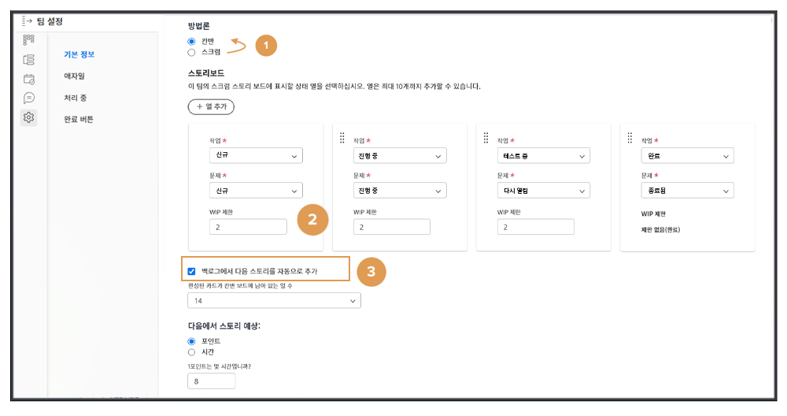
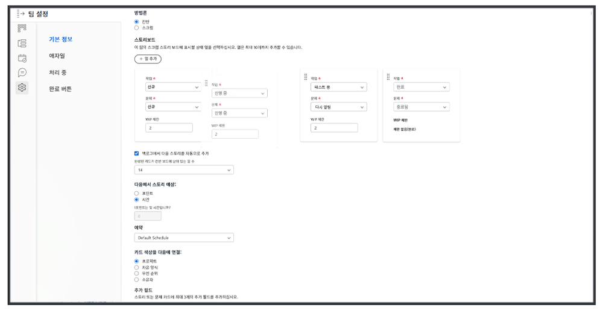
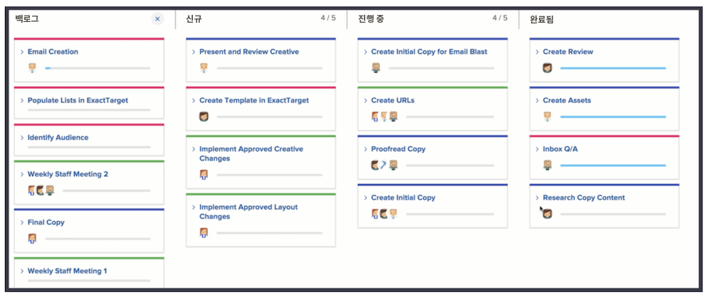
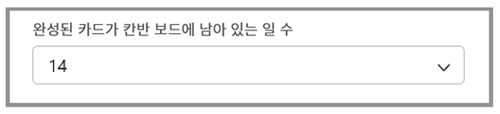

# 칸반 팀 만들기

크리에이티브 마케팅 팀은 한동안 스크럼을 사용해 왔습니다. 애자일 팀의 유연한 환경을 높이 평가하지만, 팀의 우선 순위가 자주 변경되기 때문에 특정 기간에 스토리를 커밋하기가 어렵다는 것을 알고 있습니다.

스크럼에 대한 대안이 있습니다. 바로 칸반입니다.

칸반은 스크럼 기반 반복에 필요한 일정 내에서 진행 중인 작업을 정의하고 싶지 않은 팀에 작동합니다. 대신 칸반을 사용하여 팀이 백로그를 통해 지속적으로 작업할 수 있습니다.

크리에이티브 마케팅 팀을 스크럼 팀에서 칸반 팀으로 전환합니다. [1] 팀 설정의 애자일 섹션에서 변경합니다.

방법론을 변경한 후에는 &quot;WIP 제한&quot;을 조정하여 각 열에서 칸반 팀이 한 번에 가질 수 있는 스토리 수를 지정해야 합니다. [2]. WIP는 진행 중인 작업을 의미합니다. 여기에 입력하기로 선택한 숫자는 팀에서 처리할 수 있는 활성 항목의 수에 따라 다릅니다. 초과 할당 여부를 상기시킬 수 있도록 팀의 스토리보드에 표시됩니다. 사용자(및 편집 권한이 있는 팀원)는 스토리보드에서 바로 WIP 제한을 변경할 수도 있습니다.

상태 열을 끌어서 놓아 원하는 순서대로 배치할 수 있습니다.

또한 칸반 팀은 스토리가 완성되면 백로그의 다음 스토리가 스토리보드에 자동 표시되도록 선택할 수 있습니다[상단 이미지의 3번 참조]. 지속적인 작업 주기를 선호하는 팀에 도움이 될 것입니다.

아래 이미지는 스토리가 완료되었을 때 스토리보드에 새 스토리가 자동으로 표시될 때의 모습을 보여 줍니다.

완료된 작업을 보다 효율적으로 관리할 수 있도록 스토리는 기본적으로 14일 동안 보드에 남아 있습니다.

필요한 경우, 팀 설정 창에서 해당 설정을 1일에서 30일 사이로 조정할 수 있습니다.

다른 방법론이지만 애자일 환경에서 작업할 때는 스토리 요구 사항을 논의하고 스토리 우선 순위를 조정하여 백로그를 지속적으로 정리하는 것이 여전히 중요하다는 점을 유념하십시오. 백로그의 우선 순위를 다시 지정하고 싶을 때마다 한 탭을 백로그 탭으로 이동하여 재정렬해야 합니다.
