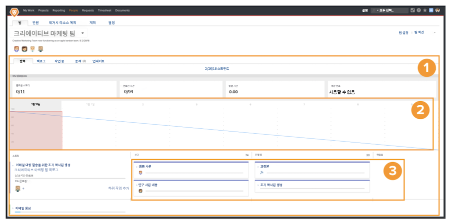

# 스크럼 애자일 팀 만들기

## 스크럼 팀 설정

Workfront의 애자일 팀이 반복 페이지에서 작업을 완료합니다 [1]. 번다운 차트 [2] 페이지 맨 위에는 이 반복 동안 지금까지 수행된 진행 상황에 대한 개요가 있습니다. 번다운 차트 아래에는 스토리가 있습니다 [3] 팀은 이 반복을 위해 을(를) 약속했습니다.

이 비디오에서는 애자일 팀을 만드는 방법에 대해 알아보고, 스크럼 방법을 선택하고, 스크럼 팀에 대한 설정을 결정합니다.

### 처음부터 스크럼 팀 설정

설정이 끝나면 이제 Workfront에서 설정하는 방법으로 바로 시작할 수 있습니다. 스와인이라는 회사의 사례 연구를 통해 설정을 살펴보자. 크리에이티브 팀의 작업을 담당하고 있으며, 크리에이티브 마케팅 팀이 애자일로 이동할 수 있도록 승인했습니다.

이 특정 팀은 스토리보드가 누가 무엇을 하고 있는지, 어떤 상태나 단계 작업 항목에 있는지에 대한 가시성을 훨씬 더 많이 제공하는 것을 좋아하기 때문에 스크럼 방법론을 채택하기로 결정했습니다. 짧은 반복을 계획할 수 있는 것은 현재 작업 요구에 잘 부합합니다. 팀에는 일반적으로 2~3주 마케팅 캠페인이 주어지며 짧은 시간 내에 팀이 수행하거나 처리할 수 있는 작업의 우선 순위를 지정할 수 있어야 합니다.

## Workfront에서 스크럼 애자일 팀 만들기

이 비디오에서는 다음 방법을 알아봅니다.

- 애자일 팀 만들기
- 스크럼 방법 선택
- 스크럼 팀에 대한 설정 결정

>[!VIDEO](https://video.tv.adobe.com/v/346281/?quality=12&learn=on)

이미 Workfront에 애자일 팀으로 전환하려는 팀이 있습니까? 문제 없습니다! 팀 설정으로 이동하여 &quot;애자일 팀입니다&quot; 상자를 선택합니다.

## 스크럼 팀 설정 변경

애자일 팀에서는 문제 탭이 더 이상 필요하지 않으므로 &quot;문제 탭에서, 표시&quot; 옵션이 팀 설정 페이지에 더 이상 포함되지 않습니다. 팀에 할당된 문제가 백로그 탭에 있으므로 작업과 문제를 모두 포함하는 반복을 보다 쉽게 계획할 수 있습니다.
