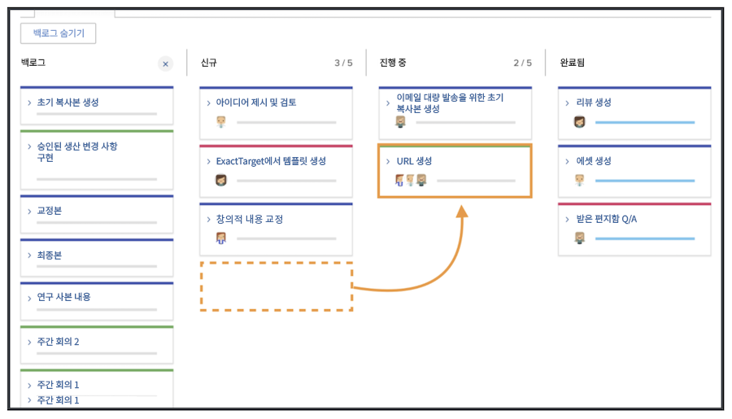
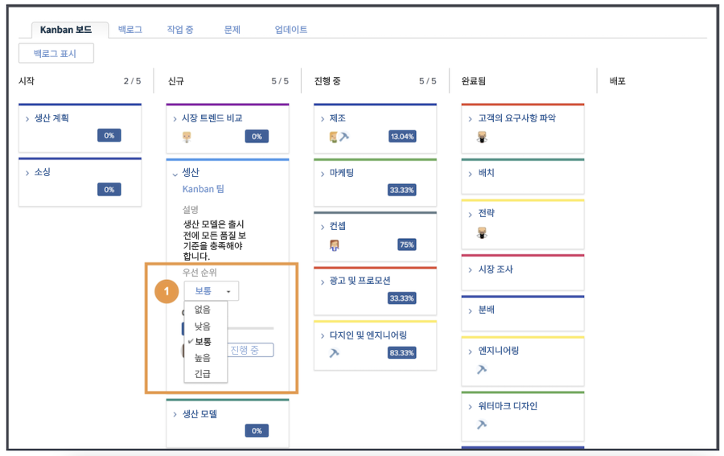
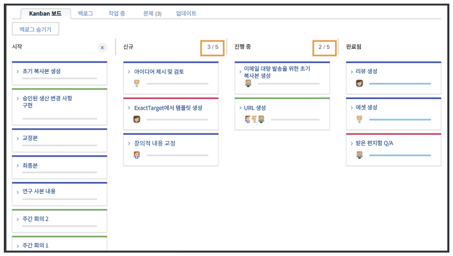
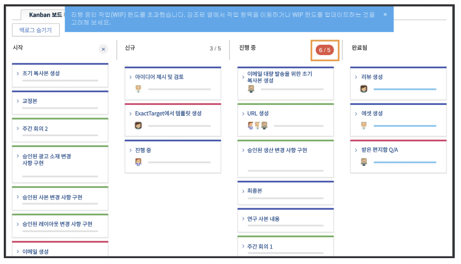

# 간판 팀으로서 작업 관리

작업을 간판 팀으로서 관리 간판 백로그에 스토리를 추가합니다. Creative Marketing 팀의 백로그에 스토리를 추가할 수 있는 여러 가지 방법이 있습니다.

팀은 백로그에서 직접 이야기를 추가할 수 있습니다.
프로젝트에 대한 작업을 지정할 수도 있습니다. Creative Marketing 팀이 요청에게 라우팅된 경우 해당 요청이 팀의 요청 탭에 표시됩니다. 팀이 요청을 선택하고 스토리로 변환하면 팀의 백로그에 표시됩니다.

## 간판 보드 사용

백로그에서 스토리를 우선시한 후 간판 보드로 이동해야 합니다. 여러분은 그 이야기를 작업할 팀 구성원들의 아바타를 스토리 카드에 끌어다 놓음으로써 임무를 수행할 수 있습니다.

이야기가 진행되면서, 팀이 스토리보드의 적절한 상태로 전환하게 됩니다. 팀 구성원은 간판 플래그를 사용하여 스토리가 On Track, Blocked 또는 Ready to Pull인지 나타낼 수 있습니다. 작업 항목이 진행 중이고 작업 준비가 되었는지 여부를 알 수 있는 다른 팀 구성원과 통신합니다.

팀 구성원은 스토리보드에서 바로 카드를 업데이트하여 설명, 상태 또는 우선 순위 등의 변경 사항을 반영할 수도 있습니다. 이렇게 하려면 스토리 카드의 드롭다운 메뉴를 클릭하고 적절한 필드를 편집하여 [1].

## 간판 스토리 실행

진행 중인 작업 한계(5개)를 사용하고 있습니다. 보드를 보면 작업을 상태 열로 이동할 때 각 레인의 작업 수가 각 상태 열의 오른쪽 상단에 표시됩니다.

New 또는 In Progress와 같은 상태 열의 제한을 초과하는 경우 진행 중인 작업을 초과했음을 나타내는 오류 메시지가 표시됩니다.

한 번에 더 많은 항목을 처리할 수 있다고 팀이 결정하는 경우, WIP 번호를 클릭하고 이를 편집하여 새로운 결정을 반영할 수 있도록, WIP 번호를 스토리보드에서 변경할 수 있습니다.
