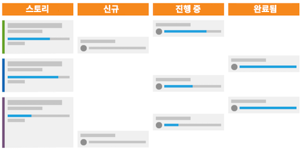

# 스크럼 방법론은 무엇이며 어떤 방식입니까?

Scrum 방법론은 유연성 모델을 포함하지만 제품 소유자, 스크럼 마스터 등과 같이 팀의 일부인 멤버의 역할을 정의한다는 점에서 다른 방법론과 다릅니다. -- 작업을 정의하고 완료하기 위한 실행을 정의합니다.

## 스크럼 팀 개요

스크럼으로 전환할지 여부를 결정할 때 팀 구조를 살펴보고 새로운 방법론으로 쉽게 전환할 수 있는지를 확인해야 합니다. 스크럼 팀에는 제품 소유자, 스크럼 마스터 및 팀원과 같은 세 가지 유형의 멤버가 있습니다.

### 제품 소유자

제품 소유자는 제품을 소유하며, 제품의 현재 또는 미래에 대한 비전을 가지고 있습니다. 고객을 대변하고 비즈니스 결정과 제품 기능의 우선 순위를 결정하는 주요 동인입니다.

### 스크럼 마스터

스크럼 마스터는 필요한 리소스를 찾고 팀 간의 합의를 통해 최대한 효율적으로 작업을 수행하여 팀이 작업을 완료할 수 있도록 합니다. 또한 프로세스 전반에 걸쳐 의사 소통과 합의를 지원합니다.

### 팀원

팀은 일반적으로 다기능적이며, 다양한 작업 역할과 기술을 갖춘 멤버로 이루어집니다. 이들은 제품 증분 계획, 실행 및 제공을 담당합니다. 물리적으로 같은 장소에 있거나, 하루 종일 일일 팀 스탠드업 미팅에서 서로 빠르고 쉽게 협업할 수 있는 도구에 액세스할 수 있는 이점이 있습니다.

## 스크럼 팀으로 작업

이러한 핵심 플레이어를 구성하면 작업을 완료하고 고객에게 제품을 제공하기 위한 새로운 스타일의 워크플로를 따를 것입니다. 다시 말하지만, 기존 또는 폭포수 방법론과 비교하여 최종 제품에 대한 계획을 세운 다음, 해당 제품을 제공하는 데 필요한 단계를 거치는 선형 프로세스를 더 이상 따르지 않습니다. 대신 스크럼 팀은 먼저 백로그를 빌드합니다.

### 백로그 빌드

스크럼 팀은 스토리라고 하는 원하는 기능 및 우선 순위 기능 목록을 살펴봅니다. 이들은 고객에게 빌드하려는 시스템 또는 제품에서 원하는/필요한 것이 무엇인지 고객에게 물어보고 팀으로서 논의해야 합니다.

주요 스토리를 만든 후에는 백로그를 정리해야 합니다. 팀으로서 네 가지 주요 단계를 거쳐야 합니다.

* 각 스토리에 대해 수행해야 할 작업을 논의하여 큰 스토리를 더 작게 나눕니다.

* 스토리의 우선 순위를 정하고 먼저 개발해야 할 기능을 결정합니다.

* 완료된 것으로 간주되는 스토리에 대한 요구 사항 및 수락 기준을 명확히 합니다.

* 팀이 각 스토리 및 백로그를 완료하는 데 필요한 노력의 정도를 예측합니다. 시간 단위 또는 포인트 단위로 예측할 수 있습니다. 포인트를 사용하면 스토리의 각 구성 요소에 필요한 시간을 계획하는 대신 스토리가 얼마나 어렵거나 복잡한지 알 수 있습니다.

### 반복 계획

백로그를 정리하고 우선 순위를 지정한 후에는 반복을 계획할 차례입니다. (많은 조직에서 “스프린트”와 “반복”이라는 단어를 같은 의미로 사용함) 팀은 준비가 된 것으로 간주되는 스토리를 기반으로 완료할 스토리를 결정합니다. 팀은 할당을 지정하고 반복 기간을 결정합니다.

### 반복 실행

이제 반복을 실행할 차례입니다. 팀원들은 기존 팀처럼 업무를 진행하지만, 이제는 스탠드업 미팅이라고 하는 빠른 일일 회의를 포함합니다.

팀원은 말 그대로 이 짧은 회의에 서 있는 채로 참여하며 다음 세 가지 질문에 답할 것입니다.

* 어제 무엇을 했습니까?
* 오늘은 무엇을 할 것입니까?
* 할당 진행을 방해하는 장애물은 무엇입니까?

이 회의를 통해 모든 사람과 같은 페이지를 공유하고 빠르게 진행할 수 있습니다.

## 번다운 차트 및 스토리보드를 사용하여 진행 상황 추적

팀이 스탠드업 미팅에서 세 가지 기본 질문에 답할 때 반복 완료를 위해 진행 상황을 모니터링하고 추적하는 것이 좋습니다. 이렇게 하면 반복이 끝날 때 모든 기능을 제 시간에 제공하도록 스토리를 충분히 빠르게 진행하고 있는지 확인할 수 있습니다. 스크럼 프로세스에는 이를 수행하는 두 가지 구성 요소가 있습니다.

### 스토리보드

팀은 스토리보드를 사용하여 상태 열에서 스토리를 이동하여 작업 항목이 새로 만들기, 진행 중 또는 완료일 때 표시합니다.

### 번다운 차트

번다운 차트를 사용하여 팀이 충분히 빠른 속도로 스토리를 완료하고 있는지 모니터링할 수 있습니다. 번다운 차트는 개별 반복 또는 전체 제품 릴리스에서 사용할 수 있습니다.

