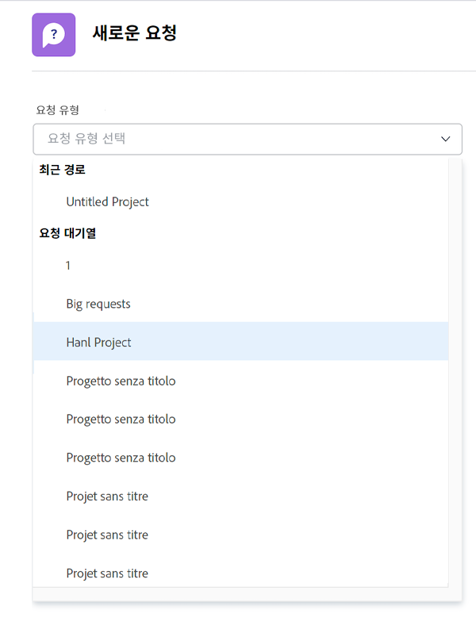
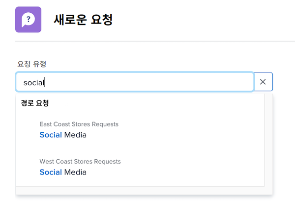

# 요청 작성

이 비디오에서는 다음 방법을 배우게 됩니다.

* 요청 영역으로 이동
* 요청 작성
* 제출된 요청 보기
* 요청 초안 찾기

>[!VIDEO](https://video.tv.adobe.com/v/336092/?quality=12&learn=on)

## 요청 대기열 경로에 빠르고 쉽게 액세스

[!UICONTROL 요청 유형] 필드를 클릭하면 최근에 제출한 마지막 세 개의 요청 경로가 목록 상단에 자동으로 표시됩니다. 동일한 대기열에 다른 요청을 제출하려면 옵션을 선택합니다.

목록 하단에는 액세스할 수 있는 모든 요청 대기열이 있습니다. 요청에 사용할 대기열이 확실하지 않은 경우 키워드 검색을 사용하여 필요한 대기열을 쉽고 빠르게 찾을 수 있습니다.

키워드를 입력하면 [!DNL Workfront]에서 일치 항목을 표시해 주므로 필요에 맞는 요청 대기열 경로를 찾을 수 있습니다. 예를 들어 소셜 미디어 게시물을 요청하려면 [!UICONTROL 요청 유형] 필드에 “소셜 미디어”를 입력하기 시작합니다. 그러면 목록이 동적으로 업데이트되어 일치 항목이 표시됩니다.

원하는 옵션을 선택하고 요청 양식을 작성한 후 요청을 제출합니다.

<!---
Learn more
Requests area overview
Create and submit Workfront requests
Guides
Make a work request
--->
