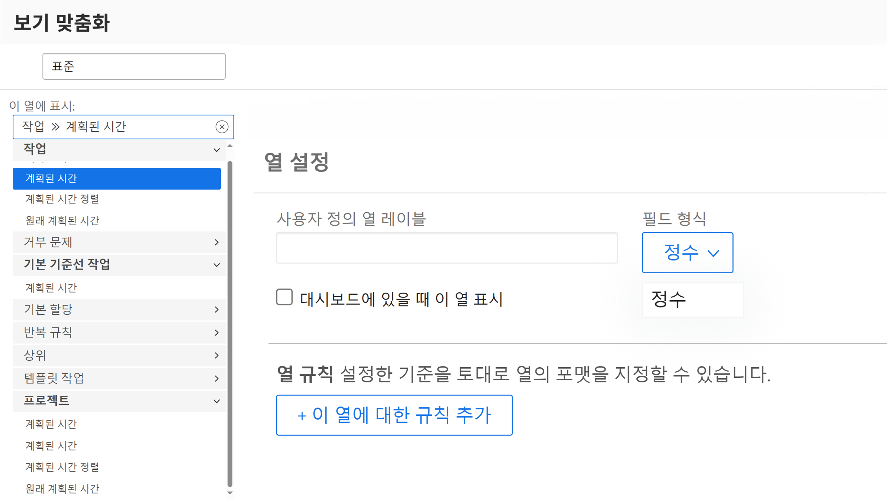
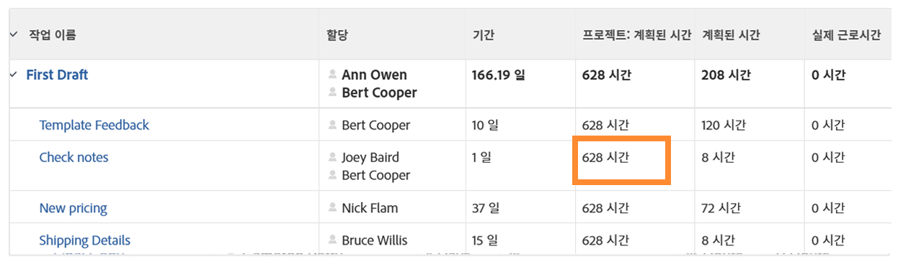

# SUB, SUM, DIV 또는 PROD 데이터 표현식을 생성합니다

이 비디오에서는 다음을 학습합니다.

* SUB, SUM, DIV 및 PROD 표현식에서 수행하는 작업
* 계산된 필드에서 SUB 데이터 표현식을 만드는 방법

>[!VIDEO](https://video.tv.adobe.com/v/335177/?quality=12)

## 추가 정보: ROUND 표현식

### ROUND 표현식 만들기

ROUND 표현식은 임의의 숫자를 사용하여 특정 소수 자릿수로 반올림합니다.

대부분의 경우 ROUND 데이터 표현식은 다른 데이터 표현식과 함께 사용되며 형식 필드가 Text 또는 Number로 남아 있을 때 사용됩니다.

SUB 표현식을 필요로 하며 다음과 같이 보이는 계획 및 작업에 실제로 로그온한 시간 간의 차이를 결정하는 계산된 필드를 만들어 보겠습니다.

**SUB(계획 시간,실제 시간)**

그리고 시간이 분 단위로 추적되고 기본 형식은 정보를 시간 단위로 표시하는 것이므로 표현식도 60으로 나누어져야 하며 다음과 같이 표시됩니다.

**DIV(SUB(계획됨 시간,실제 시간),60)**

사용자 지정 양식에서 계산된 필드를 작성할 때 형식이 Number로 변경되면 보기에서 필드를 추가할 때 숫자 형식을 변경할 수 있습니다.

그러나 사용자 지정 필드를 만들 때 필드 형식을 텍스트로 남겨두면 보기 내에서 형식을 쉽게 변경할 수 없습니다. 프로젝트에서 다음과 같은 숫자가 표시되지 않도록 ROUND 표현식을 사용해야 합니다.

계산 필드에 ROUND 데이터 표현식 사용 ROUND 표현식은 표현식의 이름(ROUND)과 일반적으로 두 개의 데이터 포인트를 포함합니다. 이러한 데이터 포인트는 [!DNL Workfront]를 차례로 클릭하거나 숫자를 추가하여 소수점 이하 자리 수를 지정합니다.

표현식은 다음과 같이 구조화됩니다. ROUND(데이터 포인트, #)

계획된 시간과 실제 시간 간의 차이를 계산하는 식에서 이 표현식(DIV(SUB(Planning Hours, Actual Hours),60)을 첫 번째 데이터 포인트로 사용합니다. 그런 다음 해당 표현식에서 나오는 숫자가 소수점 오른쪽에 2자리 이상 들어가지 않는지 확인합니다.

다음과 같이 표현식을 쓸 수 있습니다. ROUND(DIV(SUB(Planning Hours,Actual Hours),60),2).
