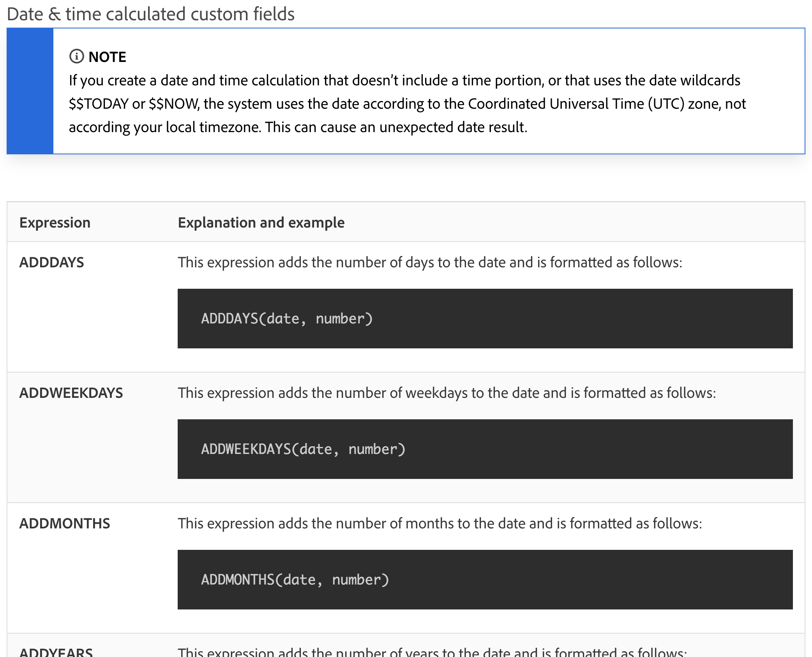

# 일자 및 시간과 수학 표현식 이해

## 일자 및 시간 표현식

일자 및 시간 표현식을 사용하면 중요한 일자를 보고서 맨 앞으로 가져오거나, 작업을 완료하는 데 걸린 작업 일수를 자동으로 계산하거나, 필요하지 않은 경우 보기에서 타임스탬프를 제거할 수 있습니다.

사용 가능한 일자 및 시간 표현식을 살펴보면 사용 가능한 몇 가지 옵션이 있습니다.

[!DNL Workfront] 고객이 가장 많이 사용하는 일자 및 시간 표현식 세트는 다음 두 가지입니다.

* ADDDAYS/ADDWEEKDAY/ADDMONTHS/ADDYEARS 및
* DATEDIFF/WEEKDAYDIFF

## 수학 표현식

수학 표현식을 사용하면 단순하든 복잡하든 [!DNL Workfront]를 통해 자동으로 계산할 수 있습니다.

사용 가능한 일자 및 시간 표현식을 살펴보면 몇 가지 옵션을 사용할 수 있습니다.

Workfront 고객은 일반적으로 다음 두 가지 수학 표현식 세트를 사용합니다.

* SUB, SUM, DIV, PROD
* ROUND

>[!NOTE]
>
>전체 표현식 목록과 각 표현식에 대한 자세한 내용을 보려면 [계산된 데이터 표현식](https://experienceleague.adobe.com/ko/docs/workfront/using/reporting/reports/calculated-custom-data/calculated-data-expressions) 설명서 페이지로 이동하십시오.

