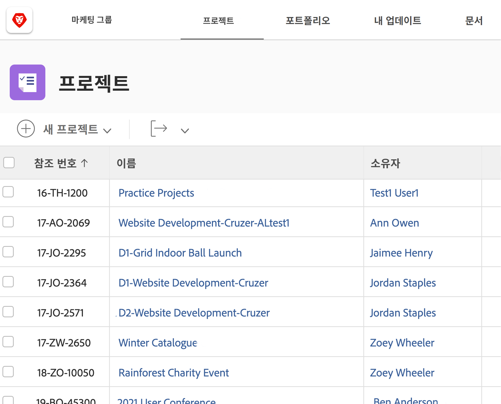

# 계산된 필드 및 표현식 시작

<!-- **Note**: The expression examples shown are simple and some may be mitigated by fields already supplied by  . However, the examples are used to illustrate the foundational knowledge needed in order to build expressions in Workfront.-->

Workfront은 여러 비즈니스 영역에서 공통으로 사용되는 다양한 필드를 제공하며 작업 관리에 정기적으로 사용됩니다. 계획 완료 날짜, 프로젝트 예산, 태스크 담당자 이름 등의 필드

그러나 각 조직에는 회사 목표가 충족되는지 파악하기 위해 수집해야 하는 업계 및 회사별 데이터가 있습니다. 예를 들어 조직에서 다음을 추적하려고 합니다.

* 프로젝트가 기여하는 사업 부문
* 자금 조달이 공급자, 내부 또는 둘 다에서 이루어지는 경우.
* 사용된 이미지에 필요한 해결 방법

이러한 필드는 기본적으로 [!DNL Workfront]사용자 지정 양식을 통해 사용자 지정 데이터 입력 필드와 미리 채워진 다중 선택 응답 필드를 만들 수 있습니다.

이 학습 경로는 계산된 필드에 중점을 둡니다. 계산된 필드가 무엇인지, 데이터 표현식을 통해 계산된 필드에 가져올 수 있는 다양한 유형의 정보를 확인하고, 데이터 수집 및 보고를 향상시키기 위해 이러한 계산된 필드를 작성하는 방법을 알아봅니다.

## 계산된 필드란?

계산된 필드에는 데이터 표현식과 기존 Workfront 필드를 사용하여 만든 사용자 지정 데이터가 포함됩니다.

예를 들어, 조직에 다음 항목이 포함된 특정 프로젝트 번호 또는 작업 번호가 있습니다.

* 프로젝트가 만들어진 해에,
* 프로젝트 소유자의 이니셜입니다.
* 다음 [!DNL Workfront] 프로젝트 참조 번호.

계산된 필드에서 표현식을 사용하여 이미 저장된 각 정보를 가져올 수 있습니다 [!DNL Workfront] 다음과 같이 보고서에 추가할 수 있는 고유한 프로젝트 ID 또는 작업 번호를 만듭니다.

필요한 특정 데이터에 따라 하나 또는 두 개의 표현식을 사용하여 계산된 필드가 간단하거나 여러 포함된 표현식을 사용하여 더 복잡할 수 있습니다. Workfront에서는 계산된 필드에 이미 저장되거나 시스템으로 가져온 데이터만 사용할 수 있습니다.

## 텍스트 표현식

텍스트 표현식에서 찾은 정보를 검색, 분석 및 결합합니다 [!DNL Workfront] 보다 의미 있는 데이터를 만들거나 조직에 대해 수행되는 작업에 대한 통찰력을 얻을 수 있습니다.

예를 들어 텍스트 표현식을 사용하여 다음을 수행할 수 있습니다.

* 프로젝트 비용이 5,000달러 이상인 경우 &quot;5,000달러 이상&quot; 또는 프로젝트 보기의 열에 &quot;비용이 5,000달러 미만인 경우&quot; 표시

* 각 프로젝트에 프로젝트가 생성된 연도, 프로젝트의  [!DNL Workfront] 참조 번호, 프로젝트 이름 및 프로젝트 소유자의 이니셜입니다.

* 관리자 모임에서 사용할 수 있도록 포트폴리오 및/또는 프로그램에 할당되지 않은 모든 프로젝트를 나열하는 보고서를 만듭니다.

텍스트 표현식은 사용자 지정 필드에서 사용하여 Workfront에서 이러한 유형의 검색 및 조합을 수행할 수 있습니다.

가능한 텍스트 표현식을 보면 몇 가지 옵션이 있습니다.

가장 자주 사용되는 6개의 텍스트 표현식이 있습니다.

* CONCAT
* 왼쪽/오른쪽
* 포함
* IF
* ISBLANK