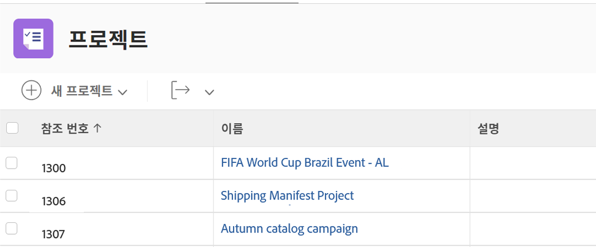
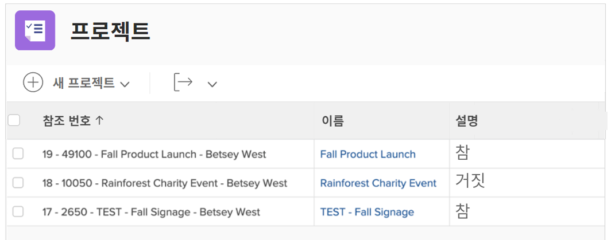
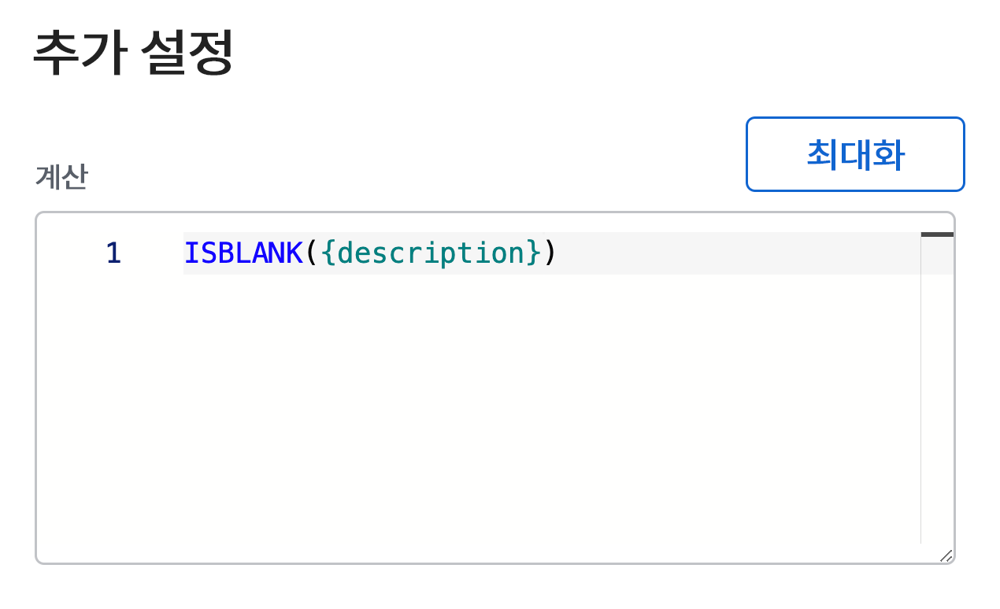
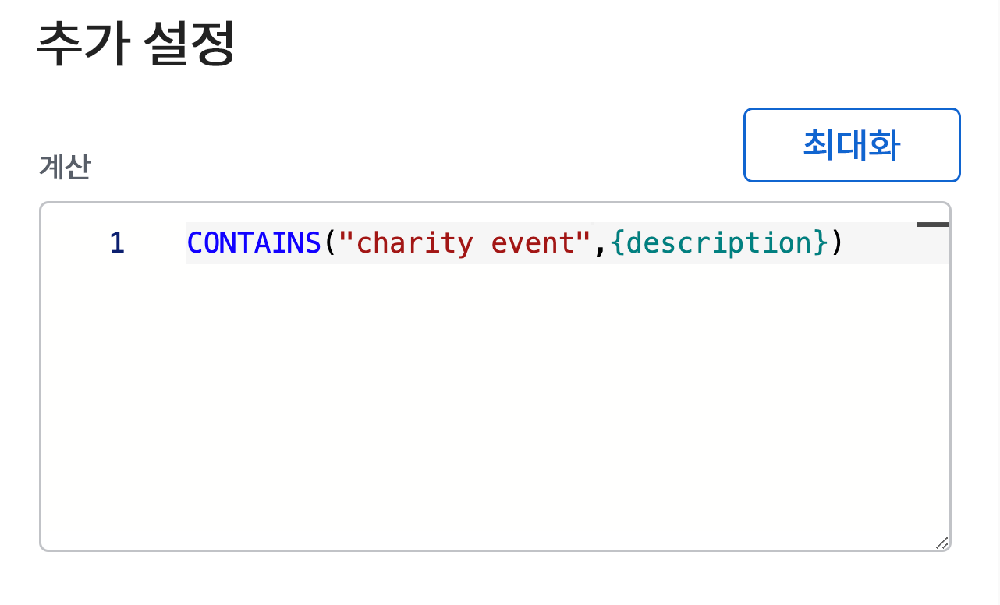

# ISBLANK 및 CONTAINS 표현식 사용

CONTAINS 및 ISBLANK 표현식은 모두 간단한 true 또는 false 값을 제공하는 데 사용됩니다. 차이점은 CONTAINS 텍스트 표현식이 필드 내에서 특정 문자열을 찾는 동안 ISBLANK 표현식이 필드에 값이 있는지 확인한다는 것입니다.

예를 들어 프로젝트에 설명이 있는지 확인하려면 ISBLANK 표현식을 사용합니다. 설명 필드가 비어 있으면 표현식은 true 값을 반환합니다. 설명 필드가 비어 있지 않으면 false 값을 반환합니다.

설명에서 “자선 이벤트”와 같은 특정 값을 찾으려면 CONTAINS 텍스트 표현식을 사용합니다. 설명에서 “자선 이벤트”를 찾으면 계산된 필드에 “true”가 표시됩니다. “자선 이벤트”를 찾지 못하면 “false”가 표시됩니다.

## ISBLANK

ISBLANK 텍스트 표현식에는 표현식 이름과 하나의 데이터 포인트가 포함됩니다.

**ISBLANK({data point})**

위의 예에서 프로젝트에 설명이 있는지 확인할 수 있는 표현식은 다음과 같습니다.

ISBLANK({description})

## 포함

CONTAINS 텍스트 표현식에는 표현식의 이름, 찾고 있는 단어나 구문, 찾을 필드가 포함됩니다.

**CONTAINS(“phrase”,{fields})**

찾고 있는 단어나 구문을 따옴표로 묶어야 하며 그렇지 않으면 표현식이 유효하지 않습니다.

위의 예(프로젝트 설명에서 “자선 이벤트” 찾기)에서 표현식은 다음과 같습니다.

**CONTAINS(“charity event”,{description})**

**메모**: CONTAINS 표현식은 대소문자를 구분합니다. 예를 들어 “자선 이벤트”가 설명 필드에 대문자로 표시된 경우, 표현식에서 해당 구문을 대문자로 표시합니다.

**CONTAINS(“Charity Event”,{description})**

값이 있는지 확인하려는 경우 ISBLANK 및 CONTAINS 표현식을 모두 사용하는 것이 좋습니다. 그러나 값이 무엇인지 알고 실제로 값을 보거나 더 나은 인사이트를 제공하기 위해 일종의 설명자를 갖는 것이 더 유용할 수 있습니다.

예를 들어 프로젝트가 요청에서 전환되었음을 아는 대신 원래 요청의 이름을 알고자 합니다.

이 경우, CONTAINS 표현식을 IF 표현식과 함께 사용합니다.

종종 ISBLANK 및 CONTAINS 텍스트 표현식은 IF 텍스트 표현식과 함께 사용됩니다.
