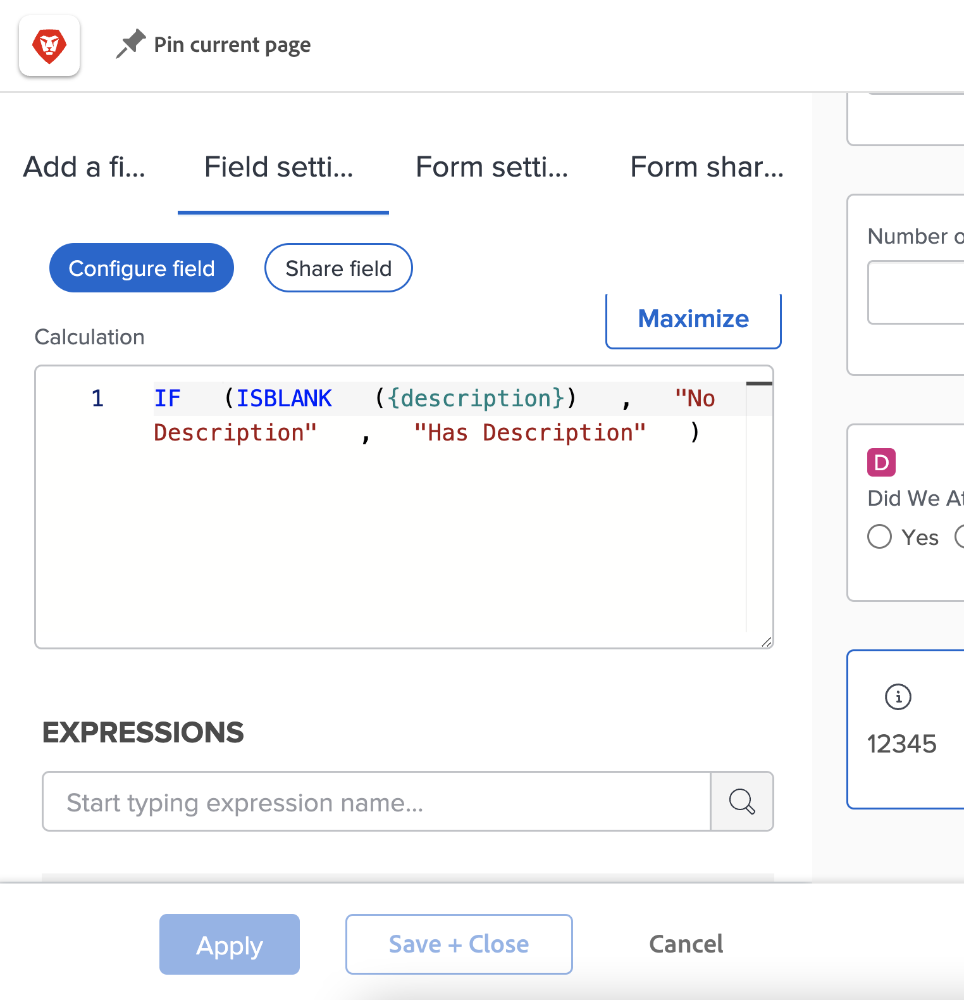
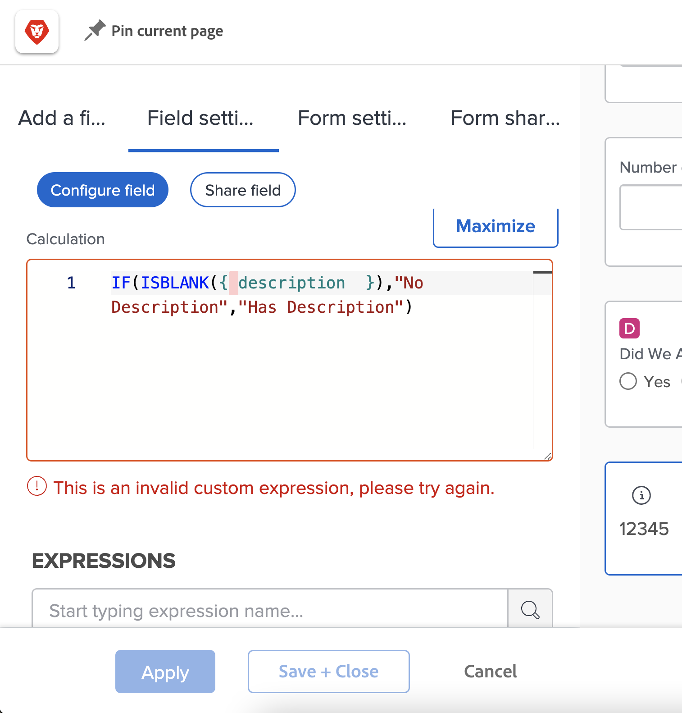

# 계산된 필드 표현식에 대해 알아야 할 사항

다음은 Workfront에서 사용자 지정 계산된 필드를 사용하여 작업할 때 유용한 개념 목록입니다.

## 표현 이름에서 케이싱이 중요함

표현 이름에 관한 한 케이싱이 중요하다. 표현식 이름을 처음 쓸 때는 대문자, 소문자 또는 둘 다를 혼합하여 사용할 수 있습니다.

그러나 시스템에서 표현식을 인식하고 필드를 저장하려면 모든 대문자 문자로 표현식을 작성해야 합니다.

## 시간은 분 단위로 저장됩니다

Workfront 데이터베이스의 시간은 분 단위로 저장됩니다. 계획 시간 또는 실제 시간과 같은 필드를 참조하는 경우 60으로 나누면 시간이 분 단위로 표시됩니다.

## 간격은 표현식에 영향을 주지 않습니다

각 표현식 사이에 간격을 거의 두지 않고 표현식을 작성하는 데 권장되는 방법은 입니다.

* IF(ISBLANK({description}),&quot;설명 없음&quot;,&quot;설명 있음&quot;)

하지만 간격을 사용하면 진행 상황을 볼 수 있으며 표현식에 일부 간격을 추가할 수 있습니다. 추가 공백으로 인해 표현식이 값을 모으거나 계산하지 않아야 합니다 [!DNL Workfront].

* IF (ISBLANK ({description}), &quot;설명 없음&quot; , &quot;설명 있음&quot; )

공백 사이에 포함할 수 없는 유일한 것은 필드와 중괄호입니다. 그렇지 않으면 오류 메시지가 표시되므로 필드 또는 사용자 지정 양식을 저장할 수 없습니다.

## 따옴표는 직선이어야 합니다

표현식에서 따옴표를 사용할 때는 따옴표가 직선(&quot;)인지 확인하십시오. 따옴표가 곡면(&quot;)이면 [!DNL Workfront] 시스템에서 &quot;사용자 지정 표현식이 잘못되었습니다.&quot; 메시지를 계속 표시합니다.

## 양식 저장 및 개체 편집 시 계산 업데이트

이는 이해할 수 있는 계산된 필드의 중요한 측면입니다.

계산된 필드에 표시된 정보는 사용자 지정 양식이 다시 계산되지 않는 한 동일하게 유지되며 사용되지 않습니다.

객체의 자세히 메뉴에서 표현식 재계산 옵션을 사용하여 표현식을 새로 고칠 수 있습니다.

문제가 열린 날짜 수를 확인하고 싶습니다. DATEFF 표현식을 사용하여 &quot;Days Open&quot;이라는 계산된 필드를 만듭니다.

* 필드 이름 = 연 일 수
* 식 = DATEDIFF({entryDate},$$TODAY)

일단 저장되면, 문제가 처음 만들어지거나 Workfront에 입력된 시간 사이의 일 수와 오늘 날짜가 개체의 세부 정보 페이지나 보고서 보기에 표시될 수 있습니다.

다음 날 동일한 세부 사항 페이지 또는 보고서 보기를 볼 때 해당 숫자가 하나씩 증가할 것으로 예상됩니다. 오늘 5시면 내일 6시가 됩니다 다음 날은 7일, 8일 등이 됩니다.

하지만 필드는 매일 5개가 계속 표시됩니다. 필드를 &quot;다시 실행&quot;하거나 다시 계산하여 정보를 새로 고쳐야 합니다.

표현식 재계산 옵션을 사용하여 필드를 갱신하려면

* 개체 이름을 클릭하여 엽니다.
* 자세히 메뉴를 클릭합니다.
* 목록에서 표현식 재계산을 선택합니다.

목록 또는 보고서에서 &quot;대량 편집&quot; 기능을 사용하여 여러 표현식을 동시에 다시 계산할 수도 있습니다. 열에 열린 일수 계산과 관련된 문제 목록을 표시하는 보고서를 작성했다고 가정합니다. 모든 문제를 한 번에 다시 계산하려는 경우:

* 보고서에서 모든 문제를 선택합니다.
* 선택한 모든 문제를 벌크로 편집하려면 편집 옵션을 선택합니다.
* 왼쪽의 사용자 지정 Forms 레이블을 클릭하여 사용자 지정 양식 섹션으로 스크롤합니다.
* 사용자 지정 Forms 섹션의 하단에서 사용자 지정 표현식 다시 계산 상자를 선택합니다.
* 변경 내용 저장을 클릭합니다.

화면이 새로 고쳐져서 계산된 필드에 업데이트된 정보가 표시됩니다.

**참고**: 계산된 필드에서 표현식을 업데이트하거나 다시 계산하는 다른 방법이 있지만 가장 빠르고 쉬운 방법입니다.

## 계산은 동일한 필드 내에서 양식에서 양식에서 서로 다를 수 있습니다

계산된 필드가 사용자 지정 양식에 저장되고 사용자 지정 양식이 저장되면 계산된 필드가 필드 라이브러리에 추가되어 다른 사용자 지정 양식에서 사용할 수 있습니다.

그러나 양식 A에 계산된 필드가 있고 양식 B에 동일한 계산된 필드가 있는 경우, 초기 생각은 계산이 정확히 동일한 것이라는 것입니다. 항상 그런 것은 아니다. 양식 A의 계산된 필드는 양식 B에서 완전히 다른 방법을 계산할 수 있습니다.

필드 라이브러리에서 계산된 사용자 지정 필드를 선택하여 사용자 지정 양식에 추가하면 필드가 추가되지만 계산은 비어 있습니다. 이러한 문제가 발생하는 한 가지 이유는 계산이 다른 개체 유형에 대해 존재하지 않는 필드를 참조할 수 있기 때문입니다.

예를 들어, 프로젝트에서 작업을 완료하는 데 걸리는 시간을 결정하기 위해 계산된 필드 &quot;완료 일 수&quot;를 만들었습니다.

* WEEKDAYDIFF({actualStartDate},{actualCompletionDate})

반복에 대해 동일한 작업을 수행합니다. 동일한 표현식을 사용할 수 있습니다. 그러나 작업 객체에 사용할 수 있는 필드는 반복 객체에 항상 사용할 수는 없습니다. 그래서 [!DNL Workfront] 는 올바른 개체 필드를 사용하여 계산을 작성할 수 있는 기회를 제공합니다.

**Pro-Tip**: 사용자 지정 필드를 생성할 때 계산 상자에서 지침 필드에 계산된 표현식을 복사합니다. 계산된 사용자 지정 필드가 필드 라이브러리에서 사용자 지정 양식에 추가되면 이 필드가 지워지지 않습니다.

필요에 따라 사용자 지정 양식의 계산된 필드는 매우 간단하거나 매우 복잡할 수 있습니다. 표현식은 조직에서 수행되는 작업의 진행 상황을 더 잘 이해하는 데 필요한 세부 정보 수준을 제공하기 위해 다른 표현식 및 값을 포함 또는 중첩할 수 있습니다.

<!--Depending on the need, calculated fields in custom forms can be quite simple or very complex. Expressions can embed, or nest, other expressions and values to provide the level of detail needed to get a better picture of what is going on with the work being done at your organization. 

Most of the examples and exercises in this course have been relatively simple to provide a base understanding of the expressions most commonly used and how to build those expressions in a custom calculated field. 

Now you’re ready to start building your own calculated custom fields.-->
