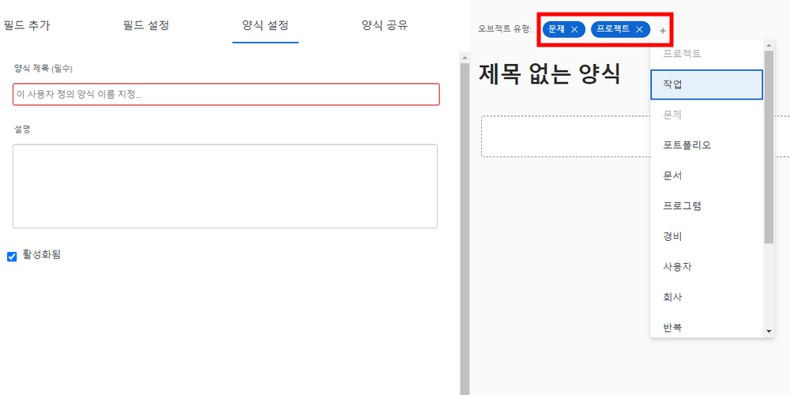

# 사용자 정의 양식 만들기 및 공유

이 비디오에서는 다음 방법을 알아봅니다.

* 양식에 사용할 개체 결정
* 다양한 형식의 고유 필드 추가
* 섹션 및 논리를 사용하여 필드 구성
* 다른 사용자와 양식 공유

>[!VIDEO](https://video.tv.adobe.com/v/335172/?quality=12)

## 사용자 정의 양식은 여러 오브젝트 유형에서 작동합니다

다음을 클릭하면 [!UICONTROL 새 사용자 정의 양식] 단추에서는 단일 사용자 정의 양식에서 사용할 수만큼 개체를 선택할 수 있습니다. 이 양식에 추가한 모든 필드는 사용자 정의 양식을 첨부할 때 선택한 오브젝트에서 사용할 수 있습니다.

![다음을 표시하는 사용자 정의 양식 창 [!UICONTROL 새 사용자 정의 양식] 개체 옵션](assets/create-custom-form.png)

사용자 정의 양식을 편집하면 선택한 모든 객체 유형을 볼 수 있습니다. 이 목록에서 개체 유형을 추가하거나 삭제할 수 있습니다.

유형 프로젝트 및 문제의 사용자 정의 양식을 만들 수 있습니다. 문제에 첨부되면 해당 문제와 관련된 필드를 작성할 수 있습니다. 나중에 문제를 프로젝트로 전환하기로 결정하면 사용자 정의 양식이 프로젝트에 자동으로 로드되고 문제 사용자 정의 양식의 필드에 입력한 데이터는 프로젝트 사용자 정의 양식에서 보거나 편집할 수 있습니다.

## 사용자 정의 필드 옵션

**[!UICONTROL 레이블] 및 [!UICONTROL 이름] 필드**

다음 [!UICONTROL 레이블] 및 [!UICONTROL 이름] 사용자 정의 필드의 용도는 서로 다릅니다. [!UICONTROL 레이블] 은 사용자가 볼 필드 이름입니다. [!DNL Workfront]. [!UICONTROL 이름] 는 API와 같은 통합과 함께 사용할 수 있는 것입니다.

![사용자 정의 양식 창 표시 [!UICONTROL 레이블] 및 [!UICONTROL 이름] 필드](assets/custom-forms-field-label-and-name.png)

이렇게 하면 통합 또는 특정 필드 이름에 의존하는 기타 연결에 영향을 주지 않고 조직의 변경 사항에 맞게 사용자 표시 레이블을 변경할 수 있는 유연성을 제공합니다.

**[!UICONTROL 포맷이 지정된 텍스트 필드]**

다음 [!UICONTROL 서식이 있는 텍스트 필드 ]사용자 정의 양식의 필드를 채우는 동안 텍스트에 볼드체, 기울임체 또는 밑줄을 추가할 수 있는 기본 텍스트 마크업 도구를 포함합니다.

![사용자 정의 양식 창 표시 [!UICONTROL 서식이 있는 텍스트 필드] 옵션](assets/custom-forms-text-field-with-formatting.png)

필드에는 15,000자의 문자 제한이 있으므로 중요한 정보를 제공하고 다른 사람이 읽기 쉽도록 서식을 지정할 수 있는 충분한 공간을 제공합니다.

**[!UICONTROL 자동 완성] 필드**

다음 [!UICONTROL 자동 완성] 필드에서는 필드에 대해 선택한 객체를 기반으로 옵션 목록을 자동으로 채울 수 있습니다.

![사용자 정의 양식 창 표시 [!UICONTROL 자동 완성] 필드 옵션](assets/custom-forms-typeahead-1.png)

예를 들어 [!UICONTROL 자동 완성] &quot;마케팅 관리자 승인 이름&quot;이라는 필드 및 선택 [!UICONTROL 사용자] 사용자가 사용자 정의 양식의 해당 필드를 채울 때 참조된 개체 유형으로 사용자 이름 목록이 표시됩니다. 다음 [!UICONTROL 자동 완성] 필드는 사용자 정의 데이터를 시스템에서 캡처한 정보와 연결하고 드롭다운 필드의 많은 옵션을 수동으로 유지 관리할 필요가 없도록 하기 위한 것입니다.

![사용자 정의 양식 창 표시 [!UICONTROL 자동 완성] 드롭다운 메뉴](assets/custom-forms-typeahead-2.png)
