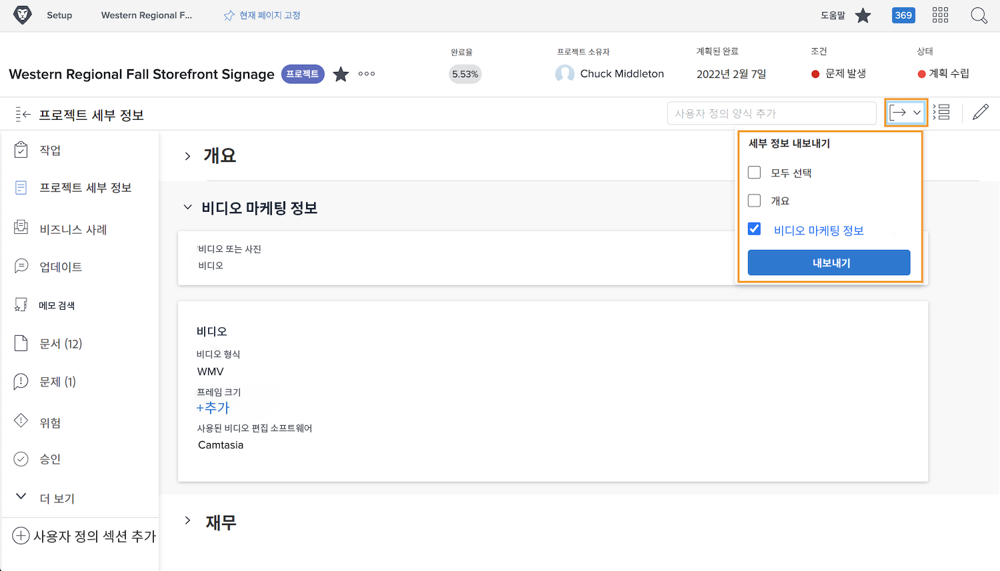

# 사용자 정의 양식을 PDF으로 내보내기

조직의 고유 데이터를 캡처하는 것은 작업 관리의 필수적인 부분입니다. 사용자 정의 양식은 일반적으로 이러한 용도로 사용됩니다. 맞춤형 양식을 내보낼 수 있으므로 쉽게 유통되고 공유할 수 있습니다. 의 양식에 액세스할 때 프로젝트, 작업 또는 문제에서 사용자 정의 양식을 내보낼 수 있습니다. [!UICONTROL 세부 사항] 객체 섹션에 있는 섹션을 참조하십시오.

다음을 포함할 수도 있습니다. [!UICONTROL 개요] 내보낸 PDF의 영역.

예를 들어 프로젝트에 첨부된 비디오 마케팅 정보라는 사용자 정의 양식을 내보내려면 다음을 수행합니다.

1. 다음을 클릭합니다. **[!UICONTROL 내보내기]** 아이콘. 프로젝트에 첨부된 모든 사용자 정의 양식은 드롭다운 메뉴에 표시됩니다. [!UICONTROL 개요] 섹션.
1. 목록에서 비디오 마케팅 정보 를 선택합니다.
1. 클릭 **[!UICONTROL 내보내기]** 목록의 맨 아래.

서식이 지정된 PDF 파일이 다운로드됩니다.

