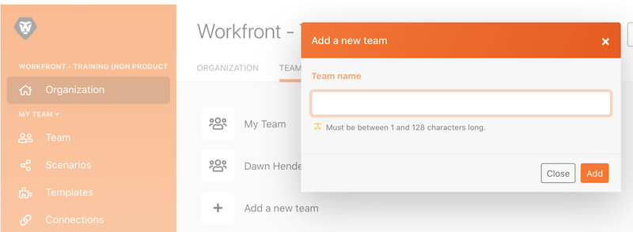

# 관리 워크스루

다른 조직 또는 팀 간에 전환하고 시스템에 사용자를 추가하는 방법에 대해 알아봅니다.

## 관리 워크스루

이 비디오를 통해 다음과 같은 사항을 알아볼 수 있습니다.

* 조직과 팀 간에 전환하는 방법
* 팀을 만드는 방법
* 사용자를 조직 및 팀에 초대하는 방법

>[!VIDEO](https://video.tv.adobe.com/v/335310/?quality=12&learn=on&enablevpops)

>[!NOTE]
>
>귀사가 Adobe Admin Console에 온보딩된 경우 [Adobe Admin Console을 통해 Adobe Workfront Fusion에 사용자 추가](https://experienceleague.adobe.com/docs/workfront/using/adobe-workfront-fusion/fusion-in-experience-cloud/add-fusion-users-admin-console.html?lang=ko)를 참조하십시오.

## 자세히 알아보시겠습니까? 다음 자료를 참조하십시오.

[Workfront Fusion 설명서](https://experienceleague.adobe.com/docs/workfront/using/adobe-workfront-fusion/workfront-fusion-2.html?lang=ko-KR)
