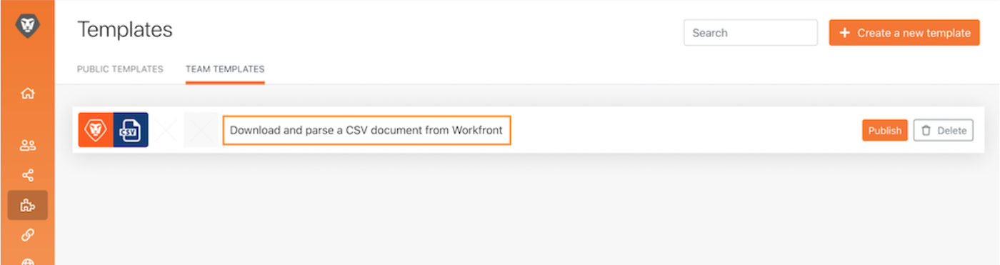

# 접근성 및 명확성

Workfront Fusion 교육 초기에는 시나리오를 쉽게 읽고, 공유하고, 이해할 수 있도록 하는 몇 가지 기본 모범 사례에 대해 배웠습니다. 이러한 사례는 향후 Workfront Fusion 사용자나 Workfront Fusion 인스턴스의 문제 해결 또는 지원을 쉽게 수행할 수 있도록 하는 데 도움이 됩니다. 시나리오를 디자인할 때는 아래 지침에 따라 비용을 지불하십시오.

## 레이블 및 메모

일반적으로 Workfront Fusion의 기본 목표는 항상 간단한 시나리오 설계를 갖는 것입니다. 다음은 설계를 간단하게 해석할 수 있는 몇 가지 방법입니다.

* 모든 모듈의 이름을 지정해야 합니다. 모듈을 마우스 오른쪽 단추로 클릭하고 이름 변경을 선택합니다. 모듈 레이블은 짧지만 모듈에서 수행하는 작업을 이해할 수 있어야 합니다. 예를 들어 &quot;Ch 템플릿을 사용하여 Mktg 프로젝트 만들기&quot;가 있습니다.
  
* 라우팅 경로에도 레이블을 지정합니다. 경로에서 라우터 바로 다음에 필터를 사용하지 않더라도 필터 논리를 채우지 않고 레이블을 적용할 수 있습니다. 이렇게 하면 다른 사람이 어떤 번들이 어떤 경로와 이유를 전달하는지 이해할 수 있습니다. 필터 없이 라우터 경로에 대한 레이블을 만들려면 경로를 마우스 오른쪽 단추로 클릭하고 레이블을 추가한 다음 저장합니다.
  
* 모듈 레이블이나 라우팅 경로 레이블이 너무 짧아 실제 상황을 명확하게 설명할 수 없는 경우 시나리오에서 적용 가능한 위치에 메모를 추가합니다. 디자인 및 반복 프로세스 전체에서 원할 때마다 메모를 추가할 수 있습니다.

그러나 시작할 준비가 되었을 때 시나리오 디자인의 맨 끝에 메모를 추가하는 경우 읽고 이해하는 것이 더 쉬울 수 있습니다. 시나리오 설계의 끝(맨 아래, 오른쪽 모서리)에서 뒤로 작업합니다. 이렇게 하면 [메모] 패널을 열 때 시나리오의 시작 부분에 적용되는 메모가 목록의 맨 위에 표시됩니다.

메모 패널을 저장하거나 닫으면 메모가 가장 최근에 만들어진 상태로 정렬됩니다. 아래 그림에서는 만든 첫 번째 메모가 목록 맨 아래에 나타납니다. 메모는 의도적으로 오른쪽 아래에서 위의 경로로 그리고 마지막으로 트리거로 만들어졌으며, 본질적으로 데이터 번들이 시나리오를 통과하는 역순입니다. 이렇게 하면 데이터 번들에서 시나리오가 실제로 실행하는 순서로 메모가 표시됩니다.

## Workfront Fusion 템플릿

모듈 및 라우팅 경로의 레이블 지정을 간소화하는 가장 좋은 방법은 템플릿을 사용하는 것입니다. 모범 사례 템플릿을 사용하면 일반적인 사용 사례에 대한 시나리오를 빠르게 만들 수 있습니다.

### 템플릿 예

시나리오를 시작할 때 먼저 도움이 되는 템플릿이 있는지 확인하십시오. 예를 들어 Workfront에서 CSV 문서를 다운로드하여 시작한 다음 구문 분석하는 시나리오를 만들려고 합니다.

템플릿 섹션을 클릭하여 공용 템플릿이 사용자의 요구 사항에 맞는지 확인합니다.

팀 템플릿 탭을 클릭하여 팀의 누군가가 유용할 수 있는 템플릿을 만들었는지 확인합니다.

사용할 템플릿을 찾은 경우 해당 이름을 클릭하여 엽니다.

그런 다음 오른쪽 상단 모서리로 이동하여 옵션을 클릭하고 시나리오 만들기를 선택합니다.

### 템플릿 만들기

팀 템플릿 섹션에서 템플릿을 만들 수 있습니다. 만든 템플릿은 사용자와 팀이 사용할 수 있지만, 게시 버튼을 클릭하면 팀 외부의 사용자와 공유할 수 있습니다.

템플릿을 작성할 때 이 템플릿을 사용하는 사람이 시나리오를 작성하고, 연결, 매핑된 데이터 및 기타 패널 필드를 적절하게 변경하도록 안내하는 마법사를 포함할 수 있습니다.

&quot;마법사에서 사용&quot; 확인란을 선택하여 누군가가 템플릿을 사용하여 시나리오를 작성할 때 사용할 수 있는 지침을 추가합니다. 이 정보는 도움말 필드에 나타납니다. 템플릿을 사용할 때 사용자가 이 텍스트를 볼 수 있도록 하려면 기본값으로 사용 을 활성화합니다.

## 자세히 알아보시겠습니까? 다음 사항을 권장합니다.

[Workfront Fusion 설명서](https://experienceleague.adobe.com/docs/workfront/using/adobe-workfront-fusion/workfront-fusion-2.html?lang=en)
