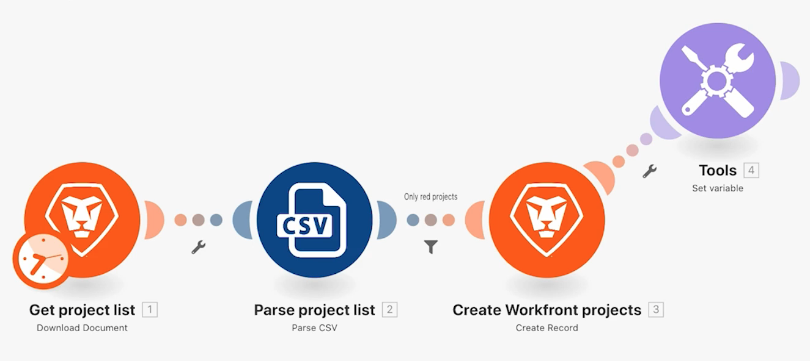

# 이전 버전 액세스

시나리오의 이전 버전으로 돌아가는 방법을 알아봅니다.

## 연습 개요

시나리오를 변경하고 여러 번 저장한 후 이전 버전을 복원하는 방법을 알아봅니다.

## 따라야 할 단계

1. 강력한 필터 사용 시나리오를 복제하고 이름을 “이전 버전 액세스”로 지정합니다.
1. Workfront 프로젝트 만들기 모듈 뒤에 설정 변수 모듈을 추가합니다. 변수 이름을 “테스트”로 지정합니다.
1. 새 위치로 끌어다 놓아 시나리오를 저장합니다.

   

1. 반복기 모듈을 추가하고 이전 모듈에서 연결을 해제한 다음 시나리오를 다시 저장합니다.

   

1. 이제 모든 모듈을 삭제하고 저장합니다.
1. 도구 모음에서 점 3개로 된 메뉴를 클릭하고 이전 버전 옵션을 클릭합니다. 선택 목록에는 저장된 각 버전의 일자 및 타임스탬프가 표시됩니다.

   

1. 이전 버전을 선택하고 디자이너 시나리오가 저장한 위치로 돌아가는 방법을 확인합니다.
