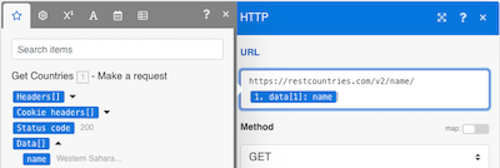
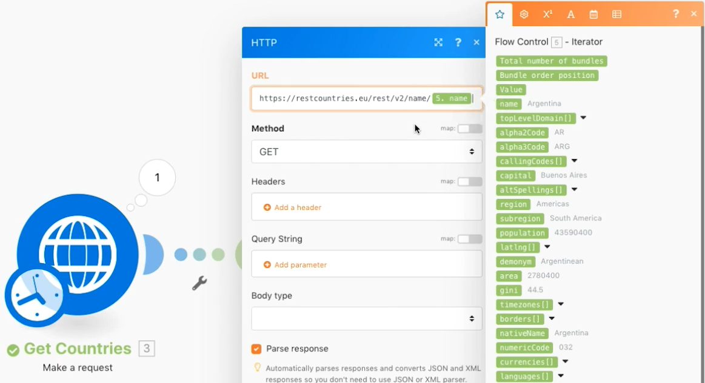

# 고급 집계

집계할 때 그룹화를 사용하는 방법을 이해합니다.

## 연습 개요

웹 서비스에 전화하여 여러 국가에 대한 세부 정보를 반환하고 하위 지역별로 그룹화된 모든 국가의 총 모집단을 식별합니다.

## 수행할 단계

**국가 세부 사항을 확인하십시오.**

1. 새 시나리오를 만들고 이름을 &quot;고급 집계&quot;로 지정합니다.
1. 트리거 모듈을 HTTP - 요청 모듈을 만듭니다.
1. 스페인어가 사용되는 모든 국가의 목록을 제공하는 이 URL https://restcountries.com/v2/lang/es 을 사용하십시오.
1. 메서드를 Get으로 둡니다.
1. 응답 구문 분석 확인란을 클릭합니다.
1. 이 모듈의 이름을 &quot;국가 가져오기&quot;로 바꿉니다.
1. 저장 후 실행을 한 번 클릭합니다.

   **출력물은 한 묶음이지만 스페인어를 사용하는 각 국가에 대해 하나씩 24개의 컬렉션이 들어 있다.**

   

   **각 국가에 대한 하위 지역 정보를 수집해야 하므로 추가 HTTP 요청을 수행해야 합니다.**

1. 다른 요청을 추가하여 하위 영역 정보를 가져옵니다. 첫 번째 나라만 돌아온다고 하지만 지금은 괜찮다. 다른 HTTP 추가 요청 모듈을 만들고 URL https://restcountries.com/v2/name/ 을 사용합니다.
1. 첫 번째 국가의 이름을 가져오려면 매핑 패널로 이동하고 데이터, 배열에서 이름 을 차례로 클릭합니다. 다음 [1] 데이터 필드에서 는 배열의 첫 번째 항목을 반환함을 의미합니다.

   + 숫자를 클릭하고 필요한 경우 인덱스를 변경하지만 이 경우 첫 번째 항목만을 원할 수 있습니다.

1. 매핑 패널에서 구문 분석 응답을 선택한 다음 확인을 클릭합니다.
1. 이 &quot;국가 세부 정보 가져오기&quot;의 이름을 변경합니다.
1. 저장 을 클릭한 다음 한 번 실행을 클릭합니다.

   + 결과는 단일 국가에 대한 정보입니다.

1. 다른 나라를 구하려면 이 배열을 반복해야 합니다. 항목 목록을 가져와서 목록의 각 항목에 대한 번들을 출력하는 반복기를 추가합니다.

   **반복기와 집계를 추가합니다.**

1. HTTP 모듈 간을 마우스 오른쪽 단추로 클릭하고 반복기 흐름 제어 모듈을 추가합니다.
1. 배열 필드의 국가 가져오기 모듈에서 데이터를 선택합니다.

   

1. 국가 세부 정보 가져오기 모듈에서 URL 필드를 업데이트하여 국가 가져오기 모듈이 아니라 반복기에서 이름 필드를 가져옵니다.

   

1. 이제 국가 세부 정보 가져오기 를 사용하여 모집단을 그룹화하고 합합니다.
1. 소스 모듈은 반복기 모듈입니다.
1. 집계 함수는 SUM입니다.
1. 값은 입니다. [데이터:모집단] 국가 세부 정보 가져오기 모듈에서
1. 맨 아래에 있는 고급 설정 표시 옵션을 클릭하고 그룹화 기준 을 클릭합니다. [데이터:하위 영역] 국가 세부 정보 가져오기 모듈에서

   

   **텍스트 누적 을 사용하여 숫자 누적 내에서 그룹화한 내용을 집계합니다.**

1. 끝에 텍스트 집계를 추가합니다.
1. 소스 모듈은 숫자 누적 모듈입니다.
1. 텍스트 영역에 &quot;전체 [키] is [결과].&quot;

   

1. 한 번 저장하고 실행합니다.

   + 최종 모듈의 출력을 검토합니다.
