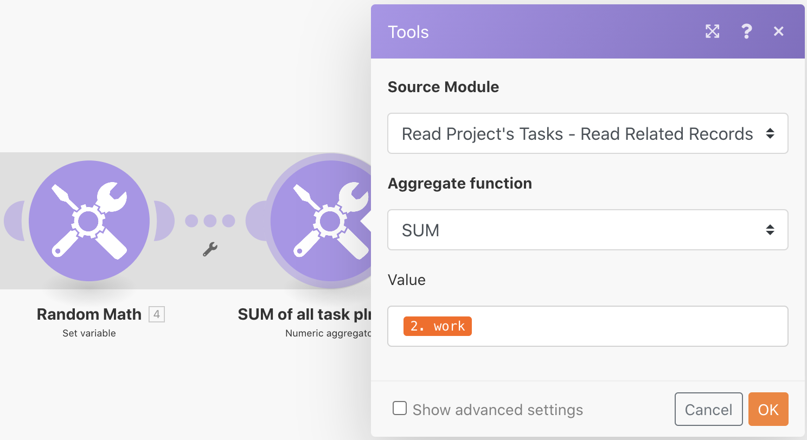

# 응집 운동

여러 정보 번들을 단일 값으로 집계하는 방법을 배웁니다.

## 연습 개요

마지막 연습에서 빌드한 “반복 소개” 시나리오를 사용하여 프로젝트의 모든 작업에 대해 계획된 시간을 집계하고 해당 정보가 포함된 이메일을 자신에게 보냅니다.

## 따라야 할 단계

**필터를 추가하고 계획된 시간을 합산합니다.**

1. 이전 연습에서 만든 “반복 소개” 시나리오를 복제하고 이름을 “집계 소개”로 지정합니다.
1. 프로젝트 읽기의 작업 모듈과 작업 수 계산 모듈 사이에 필터를 추가합니다. 필터 이름을 “진행 중인 작업만”으로 지정합니다.
1. 조건을 하위 항목 수 [숫자 연산자: 같음] 0으로 설정합니다.

   

1. 임의 수학 모듈 뒤에 숫자 집계기 도구 모듈을 추가합니다.
1. 소스 모듈을 프로젝트 작업 읽기로 설정합니다.
1. 집계 함수를 SUM으로 설정합니다.
1. 프로젝트 작업 읽기 모듈에서 값을 작업 필드로 설정합니다.
1. 이 모듈의 이름을 “모든 작업 계획 시간의 합산”으로 바꿉니다.

   

   **집계 반복을 종료함을 나타내는 그림자에 유의하십시오.**

   

   **집계된 시간이 포함된 이메일을 보냅니다.**

1. 숫자 집계기 뒤에 이메일 앱에서 이메일 전송 모듈을 추가합니다.
1. 자신에게 이메일을 보냅니다.
1. 제목은 “프로젝트 세부 정보”입니다.
1. 콘텐츠 필드에 “[결과] 계획된 시간의 총계가 있는 [프로젝트 이름]이라는 프로젝트가 있습니다”라고 입력합니다. “[프로젝트 이름]”은 레코드 읽기 모듈에서 가져온 것이고 “[결과]”는 집계기 모듈에서 가져온 것입니다.

   

1. 저장하고 한 번 실행을 클릭합니다. 받은 편지함에서 이메일을 찾습니다.

반복 내에서 개별 번들에 액세스할 수 있습니다. 그러나 반복 외부의 이메일 전송 모듈에서는 집계된 필드에만 액세스할 수 있습니다.
