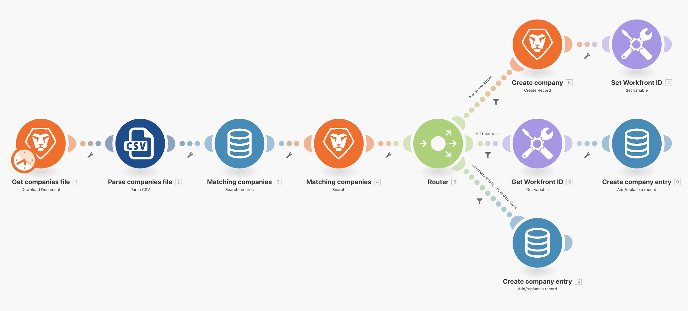
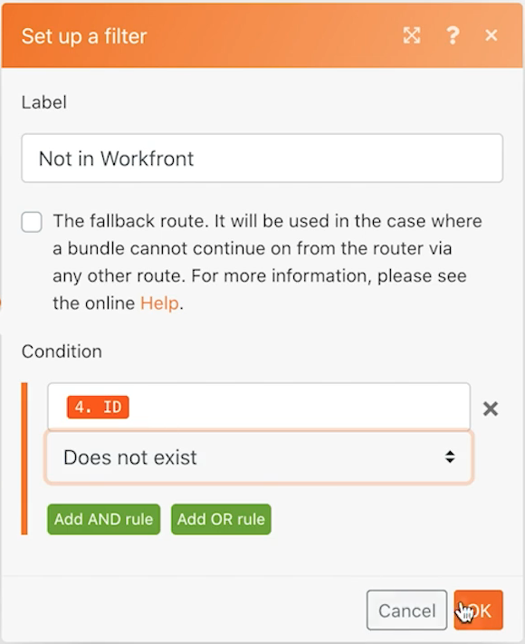

# 데이터 저장소

두 시스템 간에 회사 이름을 동기화하는 방법을 알아봅니다.

## 연습 개요

이는 Workfront과 다른 시스템에서 회사의 일방향 동기화의 첫 번째 부분입니다. 현재는 Fusion 데이터 저장소와 Workfront 사이에서만 동기화됩니다. 데이터 저장소의 테이블은 각 회사의 CSV 파일(CID)에서 WFID(Workfront ID)와 회사 ID를 추적합니다. 이를 통해 미래의 특정 시점에서 양방향 동기화를 수행할 수 있습니다.

## 수행할 단계

**Workfront에서 파일을 다운로드합니다.**

1. Workfront &quot;Fusion Experience Files&quot; 폴더에서 &quot;_Companies.csv&quot;를 선택하고 문서 세부 정보 를 클릭합니다.
1. URL 주소에서 첫 번째 ID 번호를 복사합니다.
1. Fusion에서 &quot;데이터 저장소를 사용하여 데이터 동기화&quot;라는 새 시나리오를 만듭니다.
1. 트리거 모듈에서 Workfront 다운로드 문서 모듈을 선택합니다.
1. Workfront 연결을 설정하고 Workfront URL에서 복사한 문서 ID를 포함합니다.
1. 이 모듈의 이름을 &quot;Get companies file&quot;으로 지정합니다.
1. 이제 구문 분석 CSV 모듈을 추가합니다.
1. 열 수 필드에 2를 입력합니다.
1. CSV 필드의 다운로드 문서 모듈에서 데이터를 매핑합니다.
1. 이 모듈의 이름을 &quot;Parse companies file&quot;로 지정합니다.
1. 시나리오를 저장하고 실행 을 한 번 클릭합니다.

   **데이터 저장소 및 데이터 구조를 만듭니다.**

1. 데이터 저장소 검색 레코드 모듈을 추가합니다.
1. &quot;Company sync&quot;라는 새 데이터 저장소를 만듭니다.
1. 데이터 저장소 내에서 &quot;회사 동기화(struc)&quot;라는 데이터 구조를 만듭니다.
1. 네 개의 필드를 만듭니다.

   + CID - CSV 파일의 회사 ID입니다.
   + 회사 이름
   + WFID - Workfront 회사 ID
   + 작성일 - 데이터 유형이 날짜인지 확인합니다

   

1. 데이터 구조에서 저장 을 클릭한 다음 데이터 저장소 크기를 1로 설정하고 데이터 저장소를 저장합니다.
1. 데이터 저장소 모듈에서 CID가 CSV 구문 분석 모듈(열 1)의 회사 ID와 동일한 경우 필터를 설정합니다.
1. 고급 설정 표시 를 클릭하고 &quot;이 모듈이 아무 결과도 없는 상태로 반환되더라도 시나리오 또는 라우트의 실행을 계속 진행합니다.&quot;라는 옵션을 선택합니다.

   

1. 이 모듈 &quot;일치하는 회사&quot;의 이름을 바꾸십시오.
1. Workfront 검색 레코드 모듈을 추가합니다.
1. 레코드 유형으로 회사를 선택합니다.
1. 검색 기준은 Workfront 내의 회사 이름이 CSV 파일의 회사 이름과 같습니다.
1. 출력에 대해 회사 이름과 ID를 선택합니다.

   

1. 확인 을 클릭하고 &quot;일치하는 회사&quot; 모듈의 이름을 변경합니다.

   **회사가 Workfront 내에 있는지 데이터 저장소 내에 있는지 여부를 기준으로 다른 경로를 만듭니다.**

   **라우팅 경로 1 - 회사를 만듭니다.**

1. Workfront 검색 레코드 모듈 오른쪽에 라우터 모듈을 추가합니다.
1. 상단 경로에 Workfront 레코드 만들기 모듈을 추가합니다.
1. 레코드 유형을 Company로 설정합니다.
1. 매핑할 필드에서 이름 을 선택합니다. 이름 필드를 CSV 구문 분석 모듈(열 2)의 출력에 매핑합니다.
1. 이 모듈 이름을 &quot;회사 만들기&quot;로 바꿉니다.

   

1. Workfront에 없는 경우에만 공유기 뒤에 필터를 추가하여 회사를 만듭니다. 이름을 &quot;Workfront에서 아님&quot;으로 지정합니다.
1. Workfront 검색 모듈에서 &quot;조건&quot;을 ID로 설정하고, 존재하지 않습니다.

   

   **다음 경로에서 데이터 저장소 업데이트를 준비합니다.**

1. 상단 경로의 끝에 변수 설정 모듈을 추가합니다.
1. 변수 이름을 &quot;Workfront ID&quot;로 설정합니다.
1. 회사 만들기 모듈에서 변수 값을 ID로 설정합니다.
1. 이 모듈 이름을 &quot;Workfront ID 설정&quot;으로 바꿉니다.

   **라우팅 경로 2 - 데이터 저장소를 업데이트합니다.**

1. 라우팅 경로 2에 필터를 만듭니다. 이름을 &quot;Not in data store&quot;로 지정합니다.

1. Data Store 모듈에서 Condition 을 Key 로 설정하고 존재하지 않습니다.

   

1. 이 경로의 첫 번째 모듈은 Get 변수 모듈입니다.
1. 변수 이름을 &quot;Workfront ID&quot;로 설정합니다.
1. 이 모듈 이름을 &quot;Get Workfront ID&quot;로 변경합니다.
1. 데이터 저장소 앱에서 다른 모듈을 추가, 레코드 추가/바꾸기
1. 데이터 저장소 필드에서 회사 동기화를 선택합니다. 이전에 만든 데이터 저장소입니다.
1. 키 필드를 비워 둡니다.
1. CSV 구문 분석 모듈의 열 1에서 CID 필드를 매핑합니다.
1. 회사 이름 필드를 CSV 구문 분석 모듈의 열 2에서 매핑합니다.
1. Workfront ID 가져오기 모듈에서 WFID 필드를 매핑합니다.
1. 만든 날짜 필드의 경우 날짜 및 시간 탭의 formatDate 함수를 사용하여 현재 날짜를 YYYY/MM/DD로 형식을 지정합니다.

   

1. 확인 을 클릭하고 &quot;회사 항목 만들기&quot; 모듈의 이름을 변경합니다.

   **라우팅 경로 3 - 시스템 간에 데이터 저장소를 동기화합니다.**

1. 라우팅 경로 3에 필터를 만들어 보십시오. 이름을 &quot;Company exists, not in data store&quot;로 지정합니다.
1. 데이터 저장소 검색 레코드 모듈에서 Condition을 Key로 설정하고 존재하지 않습니다.
1. AND 규칙 추가 단추를 클릭하고 CSV 파일(열 2)의 회사 이름이 Workfront 검색 모듈에 있는 회사의 이름과 같은지 지정합니다.

   

1. 이제 경로 2 끝에 있는 레코드 모듈을 복제하여 다른 레코드 모듈을 추가/교체하십시오.
1. 라우팅 경로 3의 끝에 복제된 모듈을 배치합니다. 거기에 있던 빈 모듈을 삭제합니다.
1. 복제된 모듈을 클릭합니다. WFID 필드를 제외하고 모든 필드는 동일하게 유지되어야 합니다. 일치 회사 검색 모듈에서 매핑합니다.

   

1. 확인 을 클릭하고 &quot;회사 항목 만들기&quot; 모듈의 이름을 변경합니다.
