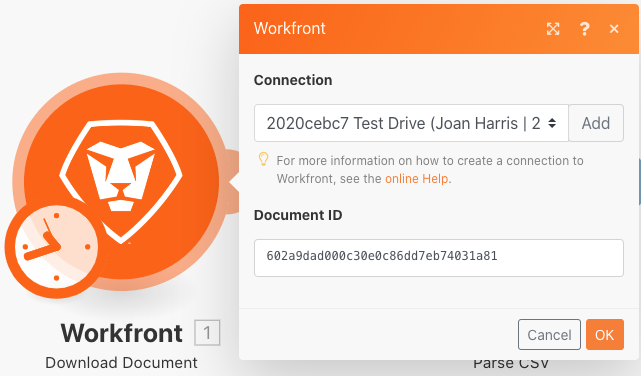
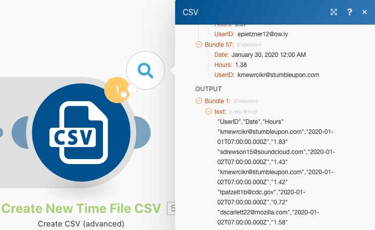

# 데이터 구조

소스 파일의 데이터를 대상 파일로 변환합니다.

## 연습 개요

시간 항목 목록이 포함된 CSV 파일을 엽니다. 이 시간 항목은 여러 사용자가 특정 요일 동안 기록한 시간(분 단위)입니다. 이 정보를 가져와서 매일 각 사용자가 기록한 총 시간(시간 단위)을 보여 주는 새 CSV를 만드는 것이 목표입니다.

이 시나리오에서는 일자와 시간, 입력한 시간(분), 입력한 사람의 이메일 주소를 포함하여 작업한 시간(분)의 시간 항목 목록이 포함된 파일을 엽니다. 100개의 시간 항목이 있으며, 일부는 동일한 개인이 작성했고 일부는 다른 사람과 같은 날에 작성되었습니다.

각 개인이 매일 작업한 총 시간(시간 단위)을 보여 주는 파일을 생성하려면 다음 단계를 따르십시오.

1. 트리거 모듈에서 Workfront 폴더의 파일을 가져옵니다. 파일을 다운로드합니다.
1. 첫 번째 CSV 모듈에서 시간 항목 데이터를 구문 분석하여 각 시간 항목에 대해 하나의 번들을 출력합니다. 이를 반복기라고 합니다.
1. 첫 번째 도구 모듈은 숫자 집계기입니다. 이렇게 하면 모든 분을 합산하고, 이메일 주소별로 행을 그룹화한 다음, 일자별로 그룹화합니다. 이는 이메일 주소로 매일 작업한 총 시간(분)입니다.
1. 두 번째 도구 모듈은 변수 설정 모듈입니다. 이를 사용하여 분을 60으로 나누고 소수점 이하 2자리로 반올림하도록 형식을 지정합니다.
1. 두 번째 CSV 모듈에서 출력 파일을 설정합니다.
1. 마지막 모듈에서 CSV 파일을 Workfront에 업로드합니다.

## 따라야 할 단계

**Workfront에서 파일을 다운로드합니다.**

1. Workfront “Fusion 연습 파일” 폴더에서 “_Fusion1.0JanTime.csv”를 선택하고 문서 세부 정보를 클릭합니다.
1. URL 주소에서 첫 번째 ID 번호를 복사합니다.
1. 새 시나리오를 만듭니다. 이름을 “데이터 구조의 생성 및 사용”으로 지정합니다.
1. Workfront 앱에서 문서 다운로드 모듈로 시작합니다.
1. Workfront 연결을 설정하고 Workfront URL에서 복사한 문서 ID를 포함합니다.

   

   **시간 항목 데이터를 구문 분석합니다.**

1. CSV 구문 분석을 선택하여 다른 모듈을 추가합니다.
1. 7개 열에 대한 CSV 구문 분석을 설정합니다. CSV에 헤더 포함 상자를 선택합니다. Comma delimiterType을 선택하고 데이터를 CSV 필드에 입력합니다.

   

1. 한 번 실행을 클릭하여 출력을 봅니다.
1. 실행 검사기를 열어 CSV 구문 분석 모듈의 입력 및 출력을 확인합니다. 입력으로 하나의 번들(CSV 파일)이 있고, 출력으로 여러 번들(CSV 파일의 각 행에 대해 하나의 번들)이 있습니다. 다음과 같아야 합니다.

   

   **그 다음, 데이터를 원하는 출력 형식으로 변환하며 집계된 총 시간은 분 대신 시간으로 표시됩니다.**

1. 숫자 집계기 도구 모듈을 추가합니다.
1. CSV 구문 분석 모듈인 소스 모듈을 선택합니다.
1. 집계 함수에 대해 합산을 선택합니다.
1. 값 필드는 CSV 파일의 7열입니다. 각 사용자가 기록한 시간(분)입니다.
1. 그룹별로 필드를 합산하려면 고급 설정을 클릭하고 그룹화 기준을 이메일(열 4), 일자(열 5)로 설정합니다.

   + 이메일과 일자의 모든 조합에 대해 합산됩니다. 열 4과 열 5 사이에 쉼표를 넣어야 합니다. 이는 나중에 구분 기호로 사용됩니다.

   **매핑 패널은 다음과 같아야 합니다.**

   

1. 한 번 실행을 클릭하여 집계 출력을 확인합니다.

   **출력 번들은 다음과 같아야 합니다.**

   

   **이제 집계된 분을 시간으로 전환합니다.**

1. 변수 설정을 선택하여 다른 도구 모듈을 추가합니다.
1. 변수 이름을 “시간”으로 지정합니다.
1. 변수 값을 formatNumber(result/60;2;.;,)

   **매핑 패널은 다음과 같아야 합니다.**

   

   **다음으로 출력 파일에 대해 설정된 값을 가져옵니다. 그룹화에 사용되는 userID와 일자 값이 필요합니다. 계산된 시간도 필요합니다.**

1. 집계기 CSV 만들기(고급)를 사용하여 다른 모듈-CSV 모듈을 추가합니다.
1. 소스 모듈은 도구 - 숫자 집계기입니다.
1. 데이터 구조 필드 옆의 추가를 클릭하고, 데이터 구조의 이름을 “기록된 시간 일별 합산”으로 지정합니다.
1. 항목 추가를 클릭하여 첫 번째 항목을 만듭니다.
1. 항목 이름을 “UserID”로 지정하고 유형을 텍스트로 설정합니다. 추가를 클릭합니다.
1. 항목 추가를 다시 클릭하여 두 번째 항목을 만듭니다.
1. 항목 이름을 “일자”로 지정하고 유형을 일자로 설정한 다음, 추가를 클릭합니다.
1. 항목 추가를 한 번 더 클릭합니다.
1. 항목 이름을 “시간”으로 지정하고 유형을 숫자로 설정한 다음 추가를 클릭합니다.

   **데이터 구조는 다음과 같아야 합니다.**

   

1. 저장을 클릭하여 기록된 시간 일별 합산 데이터 구조를 완료합니다.

   **이제 방금 만든 세 필드의 값을 제공합니다. CSV 매핑 패널에 이 세 필드가 표시되어야 합니다.**

1. UserID 필드를 클릭하고 일반 함수 탭에서 GET을 선택합니다. 첫 번째 매개변수에 텍스트 및 이진 함수 탭의 SPLIT를 입력합니다. SPLIT 함수의 첫 번째 매개변수는 키 필드입니다. 구분 기호로 쉼표를 추가하고 인덱스로 1을 추가합니다. 이는 GET이 키 배열의 첫 번째 필드를 검색할 것임을 나타냅니다.
1. 이 표현식을 일자 필드에 복사합니다. 인덱스를 1에서 2로 변경하여 배열의 두 번째 값을 GET합니다.
1. 시간 필드의 경우, 변수 설정 도구에서 시간 필드를 추가합니다.

   **CSV 매핑 패널은 다음과 같아야 합니다.**

   

   **지금 시나리오를 실행하면 다음 출력이 표시됩니다.**

   

   **이제 모듈을 추가하여 이 출력을 가져오고 Workfront의 기존 프로젝트에 문서로 업로드합니다.**

1. Workfront에서 프로젝트를 열고 URL에서 프로젝트 ID를 복사합니다.
1. Fusion의 시나리오로 돌아가서 다른 모듈(Workfront 앱의 문서 업로드 모듈)을 추가합니다.
1. 관련 레코드 ID 필드에 프로젝트 ID를 붙여넣습니다.
1. 관련 레코드 유형으로 프로젝트를 선택합니다.
1. 소스 파일에 대한 맵 옵션을 선택합니다.
1. 문서 이름은 다운로드한 파일 이름을 사용하고 그 앞에 “업데이트됨”을 추가합니다.
1. 파일 콘텐츠의 경우, CSV 만들기 모듈의 텍스트 출력을 사용합니다.

   **매핑 패널은 다음과 같아야 합니다.**

   

1. 확인을 클릭하고 시나리오를 저장합니다.
1. 한 번 실행을 클릭하여 시나리오를 실행합니다.

   **문서 업로드 모듈에서 실행 검사기를 확인하여 문서가 업로드되었는지 확인합니다.**

   
