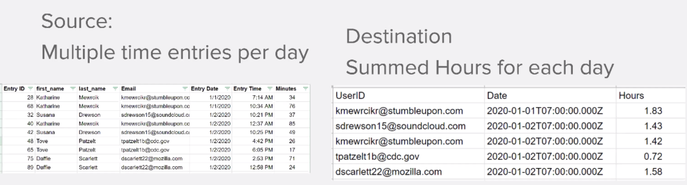

# 데이터 구조

소스 파일의 데이터를 대상 파일로 변환합니다.

## 연습 개요

시간 항목 목록이 포함된 CSV 파일을 엽니다. 이러한 시간 항목은 여러 사용자가 특정 일 동안 기록한 분 단위입니다. 목표는 이 정보를 가져와서 각 사용자가 매일 기록한 총 시간(시간)을 표시하는 새 CSV를 생성하는 것입니다.

이 시나리오에서는 날짜 및 시간, 입력한 분 수, 입력한 사람의 이메일 주소 등 분 작업에 대한 시간 항목 목록이 포함된 파일을 엽니다. 100개의 시간 항목이 있고, 일부는 같은 개인이 만들고 일부는 다른 사람과 같은 날 만든 것입니다.

각 개인이 매일 작업한 총 시간(시간)을 보여 주는 파일을 생성하려면 다음 단계를 수행합니다.

1. 트리거 모듈에서 Workfront 폴더에서 파일을 가져옵니다. 파일을 다운로드합니다.
1. 첫 번째 CSV 모듈에서 시간 항목 데이터를 구문 분석하여 각 시간 항목에 대해 하나의 번들을 출력합니다. 반복자입니다.
1. 첫 번째 도구 모듈은 숫자 집계기입니다. 모든 분을 합하고 이메일 주소별로 행을 그룹화한 다음 날짜별로 그룹화합니다. 그 결과는 이메일 주소별로 매일 작업한 총 시간(분)입니다.
1. 두 번째 도구 모듈은 변수 설정 모듈입니다. 이 형식을 사용하여 60으로 나누고 소수점 이하 2자리로 반올림하는 분 형식을 지정합니다.
1. 두 번째 CSV 모듈에서 출력 파일을 설정합니다.
1. 마지막 모듈에서 CSV 파일을 Workfront에 업로드합니다.

## 따라야 할 단계

**Workfront에서 파일을 다운로드합니다.**

1. Workfront &quot;Fusion Exercise Files&quot; 폴더에서 &quot;_Fusion1.0JanTime.csv&quot;를 선택하고 문서 세부 정보 를 클릭합니다.
1. URL 주소에서 첫 번째 ID 번호를 복사합니다.
1. 새 시나리오를 만듭니다. 이름을 &quot;데이터 구조 생성 및 사용&quot;으로 지정합니다.
1. Workfront 앱에서 문서 다운로드 모듈로 시작합니다.
1. Workfront 연결을 설정하고 Workfront URL에서 복사한 문서 ID를 포함합니다.

   

   **시간 항목 데이터를 구문 분석합니다.**

1. 다른 모듈을 추가하고 CSV 구문 분석을 선택합니다.
1. 7개 열에 대한 CSV 구문 분석을 설정합니다. CSV에 헤더 포함 상자를 선택합니다. 쉼표 구분 기호 유형을 선택하고 CSV 필드에 데이터를 입력합니다.

   

1. 실행 을 한 번 클릭하여 출력을 확인합니다.
1. 실행 검사기를 열어 CSV 구문 분석 모듈의 입력 및 출력을 확인합니다. 입력으로서 번들(CSV 파일)이 한 개 있고 출력으로서 번들(CSV 파일의 각 행에 대해 번들 한 개)이 여러 개 있습니다. 다음과 같이 표시되어야 합니다.

   

   **그런 다음 집계된 시간 합계를 분 대신 시간 단위로 표시하여 데이터를 원하는 출력 양식으로 변환합니다.**

1. 숫자 집계 도구 모듈을 추가합니다.
1. 소스 모듈(CSV 구문 분석 모듈)을 선택합니다.
1. 집계 함수에 대한 SUM을 선택합니다.
1. 값 필드는 CSV 파일의 7열입니다. 각 사용자가 기록한 분입니다.
1. 필드를 그룹별로 합하려면 고급 설정을 클릭하고 그룹화 기준을 이메일(4열), 날짜(5열)로 설정합니다.

   + 이메일과 날짜의 모든 조합에 대한 합계입니다. 4열과 5열 사이에 반드시 쉼표를 넣으세요. 이는 나중에 구분 기호로 사용됩니다.

   **매핑 패널은 다음과 같아야 합니다.**

   

1. 실행을 한 번 눌러 합계 출력을 확인합니다.

   **출력 번들은 다음과 같아야 합니다.**

   

   **이제 집계된 분을 시간으로 변환합니다.**

1. 다른 도구 모듈을 추가하고 변수 설정을 선택합니다.
1. 변수 이름을 &quot;Hours&quot;로 지정합니다.
1. 변수 값을 formatNumber(result/60;2;로 설정합니다.;,)

   **매핑 패널은 다음과 같아야 합니다.**

   

   **그런 다음 출력 파일에 대한 값을 설정합니다. 그룹화에 userID 및 날짜 값을 사용하려는 경우 계산된 시간도 필요합니다.**

1. 집계 CSV 만들기(고급)를 사용하여 다른 모듈-CSV 모듈을 추가합니다.
1. 소스 모듈은 도구 - 숫자 집계기입니다.
1. 데이터 구조 필드에서 추가 를 클릭하고 데이터 구조의 이름을 &quot;기록된 일별 시간 합계&quot;로 지정합니다.
1. 항목 추가 를 클릭하여 첫 번째 항목을 만듭니다.
1. 항목의 이름을 &quot;UserID&quot;로 지정하고 유형을 [텍스트]로 설정합니다. 추가를 클릭합니다.
1. 항목 추가 를 다시 클릭하여 두 번째 항목을 만듭니다.
1. 항목의 이름을 &quot;Date&quot;로 지정하고 유형을 Date로 설정한 다음 추가를 클릭합니다.
1. 항목 추가 를 한 번 더 클릭합니다.
1. 항목의 이름을 &quot;시간&quot;으로 지정하고 유형을 숫자로 설정한 다음 추가를 클릭합니다.

   **데이터 구조는 다음과 같아야 합니다.**

   

1. 저장 을 클릭하여 기록된 일별 합계 데이터 구조를 완료합니다.

   **이제 방금 생성한 세 개의 필드에 대한 값을 제공합니다. CSV 매핑 패널에 이러한 세 개의 필드가 표시됩니다.**

1. UserID 필드를 클릭하고 일반 기능 탭에서 GET을 선택합니다. 첫 번째 매개 변수에는 텍스트 및 이진 함수 탭에서 SPLIT를 입력합니다. SPLIT 함수의 첫 번째 매개 변수는 키 필드입니다. 구분 기호로 쉼표를 추가하고 색인으로 1을 추가합니다. 이는 GET이 키 배열에서 첫 번째 필드를 검색하도록 함을 나타냅니다.
1. 이 표현식을 날짜 필드에 복사합니다. 인덱스를 1에서 2로 변경하여 배열에서 두 번째 값을 GET 합니다.
1. 시간 필드의 경우 변수 설정 도구에서 시간 필드를 추가합니다.

   **CSV 매핑 패널은 다음과 같이 표시됩니다.**

   

   **지금 시나리오를 실행하면 다음 출력이 표시됩니다.**

   

   **이제 이 출력을 가져와 Workfront의 기존 프로젝트에 문서로 업로드하는 모듈을 추가합니다.**

1. Workfront에서 프로젝트를 열고 URL에서 프로젝트 ID를 복사합니다.
1. Fusion의 시나리오로 돌아가서 다른 모듈(Workfront 앱의 문서 업로드 모듈)을 추가합니다.
1. 프로젝트 ID를 관련 레코드 ID 필드에 붙여넣습니다.
1. 관련 레코드 유형에 대한 프로젝트를 선택합니다.
1. 소스 파일에 대한 맵 옵션을 선택합니다.
1. 문서 이름에 다운로드한 파일 이름을 사용하고 그 앞에 &quot;업데이트됨&quot;을 추가합니다.
1. 파일 콘텐츠의 경우, CSV 만들기 모듈의 텍스트 출력을 사용합니다.

   **매핑 패널은 다음과 같아야 합니다.**

   

1. 확인 을 클릭하고 시나리오를 저장합니다.
1. 실행을 한 번 눌러 시나리오를 실행합니다.

   **문서 업로드 모듈에서 실행 검사자를 선택하여 문서가 업로드되었는지 확인합니다.**

   
