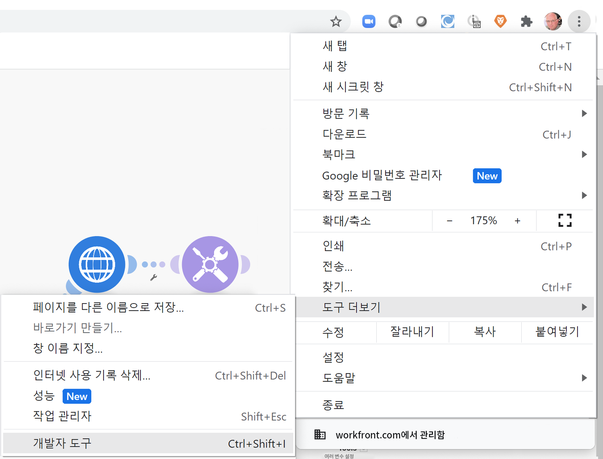

# 개발 도구 연습

개발 도구를 사용하여 시나리오 문제를 해결하고 복잡한 구성을 용이하게 하는 역량을 향상합니다.

## 연습 개요

Workfront 개발 도구의 다양한 영역을 설치하고 사용하여 요청/응답 및 고급 시나리오 디자인 요령에 대해 자세히 알아봅니다.

>[!NOTE]
>
>Workfront Fusion 개발 도구는 [Chrome 개발자 도구](https://developer.chrome.com/docs/devtools/)를 사용할 때 Chrome 브라우저에서만 사용할 수 있습니다.

## 따라야 할 단계

**개발 도구를 설치합니다.**

1. 테스트 드라이브의 Fusion 연습 파일 폴더에 있는 “workfront-fusion-devtool.zip” 문서를 다운로드합니다.
1. 폴더에 Zip 파일을 추출합니다.
1. Chrome에서 탭을 열고 **chrome://extensions**&#x200B;를 입력합니다.
1. 오른쪽 상단의 스위치를 사용하여 개발자 모드를 켠 다음, 왼쪽 상단에 표시되는 “압축 풀기” 버튼을 클릭합니다. 개발 도구가 포함된 폴더를 선택합니다(압축을 푸는 위치).

   

1. 압축을 풀면 개발 도구가 다른 확장 기능 사이에 표시됩니다.

   

   **라이브 스트림을 사용합니다.**

1. “데이터 저장소를 사용하여 데이터 동기화” 시나리오를 열어 시작합니다.
1. F12 또는 기능 키 F12를 입력하여 개발 도구를 엽니다. 또는 Chrome 주소 표시줄에서 점 세 개로 된 메뉴를 클릭하고 개발자 도구로 이동할 수 있습니다.

   

1. Workfront Fusion 탭을 클릭한 다음, 왼쪽 목록에서 라이브 스트림을 선택합니다.
1. 한 번 실행을 클릭하여 발생하는 이벤트를 확인합니다.
1. 이벤트를 클릭하면 오른쪽에 요청 헤더, 요청 본문, 응답 헤더 및 응답 본문 탭이 표시됩니다.

   

   **시나리오 디버거 사용**

1. 시나리오 디버거를 선택하고 모듈을 클릭하여 해당 모듈 작업에 대한 정보를 확인합니다.

   

1. 기록 탭으로 이동합니다. 실행에 대한 세부 정보를 클릭하여 특정 실행에 대한 모듈 작업 세부 정보를 검사합니다.

   

   **도구 사용**

1. 시나리오 디자이너로 돌아가서 개발 도구에서 도구를 선택합니다. 사용 가능한 도구가 표시됩니다.

   

+ 모듈 포커스 - 모듈 ID를 사용하여 모듈을 빠르게 찾고 엽니다.
+ 매핑으로 모듈 찾기 - 키워드로 시나리오를 검색하여 모듈에서 매핑된 값 및/또는 키를 찾습니다.
+ 앱 메타데이터 가져오기 - 시나리오에서 선택한 앱의 메타데이터를 확인합니다.
+ 매핑 복사 - 한 모듈에서 다른 모듈로 매핑을 복사합니다. 디자이너에서 모듈을 복제할 수도 있습니다.
+ 필터 복사 - 필터를 복사합니다. 필터는 항상 오른쪽에 있는 모듈에 할당됩니다.
+ 연결 교체 - 이 도구는 선택한 모듈에서 연결을 가져오고 시나리오에서 동일한 앱의 모든 모듈에 대해 동일한 연결을 설정합니다. 완료된 시나리오 전체에서 연결을 변경해야 하는 경우에 유용합니다. 이 도구를 사용하여 모든 매핑 손실을 방지하고 시간을 절약합니다.
+ 변수 교체 - 전체 시나리오 또는 한 모듈에서 지정된 변수의 모든 발생 횟수를 찾아 새 항목으로 바꿉니다. 와일드카드는 지원되지 않습니다. 실수로 전체 시나리오에서 값을 매핑한 경우, 올바른 값으로 쉽게 바꿀 수 있습니다.
+ 앱 교체 - 지정된 앱을 다른 앱으로 교체합니다.
+ Base 64 - 입력된 데이터를 Base64로 인코딩하거나 Base64를 디코딩합니다. 인코딩된 요청에서 특정 데이터를 검색하려는 경우에 유용합니다.
+ 모듈 이름 복사 - 선택한 모듈 이름을 클립보드에 복사합니다.
+ 소스 다시 매핑 - 한 모듈에서 다른 모듈로 매핑 소스를 변경합니다. 먼저 소스 모듈로 사용할 모듈을 시나리오 경로에 추가해야 합니다.
+ OS 마이그레이션 - Google 시트(기존) 모듈을 최신 Google 시트 버전으로 업그레이드하기 위해 특별히 제작되었습니다. 시나리오 경로에서 모듈의 기존 버전 바로 뒤에 새 버전의 모듈을 추가합니다.
