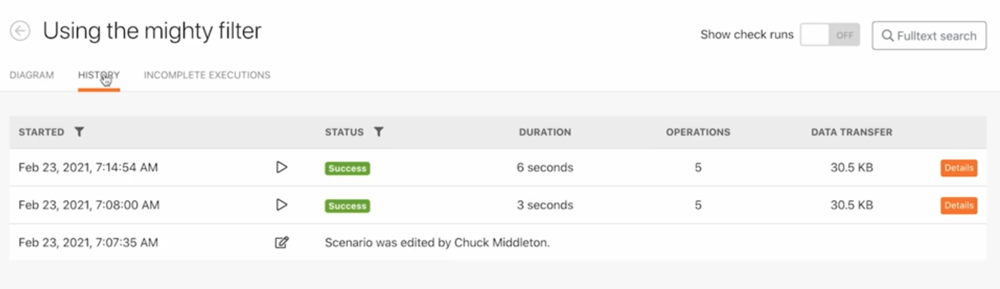
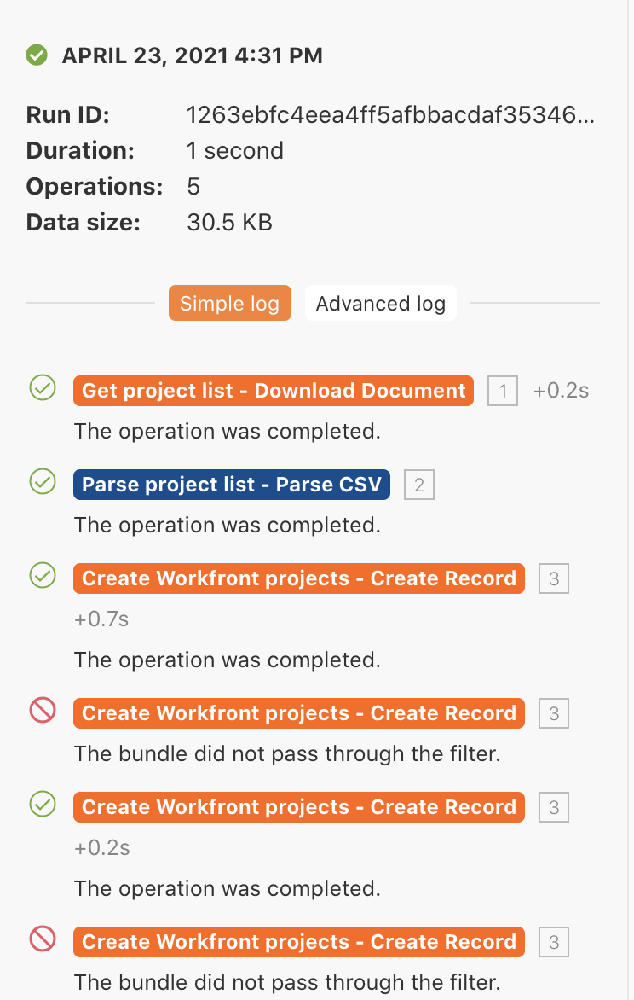

# 실행 기록 연습

이전 실행 및 시나리오 구성에 대한 세부 정보를 검토하고 감사합니다.

## 연습 개요

“강력한 필터 사용” 시나리오에 대한 실행 기록을 검토하여 실행이 발생했을 때 발생한 상황과 실행 시 구성 방식을 이해합니다.

## 따라야 할 단계

1. “강력한 필터 사용” 시나리오를 엽니다.
1. 개요 페이지에서 기록 탭(상단의 시나리오 이름 아래)을 클릭합니다.

   

1. 실행을 찾고 세부 정보 버튼을 클릭하여 오른쪽 패널에서 수행된(또는 수행되지 않은) 특정 작업을 보여 주는 페이지를 엽니다. 왼쪽 패널에서 실행 당시의 시나리오를 검토할 수 있습니다.

   

1. 시나리오 패널에서 모듈을 클릭하면 모듈 검사기 패널이 나타나 모듈 설정에 대한 정보를 표시합니다. 모듈 또는 필터 옆에 있는 실행 검사기를 클릭하여 실행된 정보 번들을 확인합니다.

   

   

1. 오른쪽 패널에서 단순 로그를 스크롤하거나 클릭하여 실행의 “단계별” 세부 정보를 봅니다.

   + 모듈에서 작업이 완료된 경우와 번들이 필터를 통과한(또는 통과하지 않은) 경우를 확인할 수 있습니다.

   

   + 로그 항목을 클릭하면 시나리오 패널에서 작업 패널이 열립니다. 로그는 발생한 시간순으로 나열됩니다.

   

1. 고급 로그에 유사한 정보가 표시됩니다. 실행당 수행된 주기 수에 대한 자세한 정보를 제공하고, 각 주기에서 처리된 정보 번들에 대해 더 자세히 알아볼 수 있습니다.

