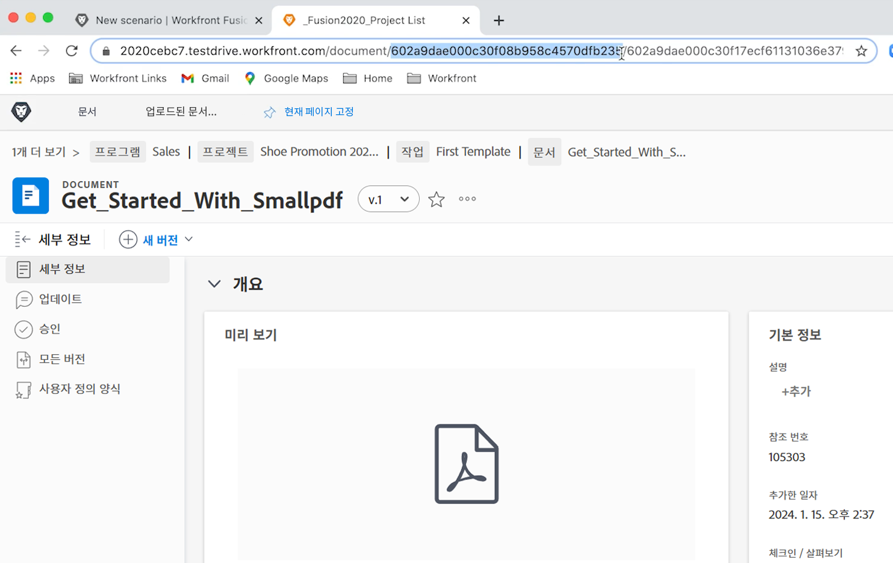

# 초기 시나리오 디자인 연습

Workfront Fusion에 처음 로그인하고 첫 번째 시나리오를 빌드할 때 필요한 몇 가지 기본 탐색 팁을 알아봅니다.

## 전제 조건

1. 이 연습에는 Workfront 테스트 드라이브가 필요합니다. [이 양식](https://forms.office.com/r/f1J8HRGrNY)을 작성하여 요청할 수 있습니다. 양식에 액세스할 수 없다면 이름, 이메일 주소, 회사 이름을 wfttstdr@adobe.com으로 보내 주십시오.
1. Fusion 연습은 해당 연습의 워크스루 비디오를 시청했다고 가정한 상태에서 진행됩니다. 이 경우에는 [초기 시나리오 디자인 워크스루](https://experienceleague.adobe.com/docs/workfront-learn/tutorials-workfront/fusion/understand-the-basics/initial-scenario-design-walkthrough.html?lang=ko)가 여기에 해당합니다.

## 연습 개요

프로젝트 목록 CSV 파일의 각 행에 대해 Workfront에 새 프로젝트를 만듭니다.

## 따라야 할 단계

1. “Fusion 활성화 연습”이라는 시나리오 섹션에 폴더를 만듭니다.
1. 폴더를 클릭한 다음 새 시나리오 만들기를 클릭합니다.

   

1. 다음 페이지에서 Workfront를 검색하고 해당 앱을 선택합니다. 그런 다음 계속을 클릭합니다.
1. 시나리오 디자이너 화면의 왼쪽 상단에서 시나리오 이름을 “초기 시나리오 디자인”으로 바꿉니다.
1. 화면 중앙에 있는 빈 트리거 모듈을 클릭하고 Workfront 앱을 선택한 다음 문서 다운로드 모듈을 선택합니다.

   **Workfront 계정에 대한 모듈 연결을 인증합니다.**

1. 처음으로 연결을 만들려면 추가 버튼을 클릭합니다.

   

1. 연결에 “My Workfront 2020”과 같은 이름을 지정합니다.

   

1. **Workfront 인스턴스**&#x200B;의 URL을 입력하고 ‘다음’을 클릭합니다.

   

1. 암호를 입력하고 로그인을 클릭합니다.

   **연결이 설정됩니다. 이제 Workfront에서 다운로드하려는 문서의 문서 ID를 입력합니다.**

   

1. Workfront로 돌아갑니다. “Fusion 연습 파일” 폴더에서 “_Fusion2020_Project List.csv”를 선택하고 왼쪽 패널에서 문서 세부 정보를 클릭합니다. URL 주소에서 문서 ID 번호를 복사합니다(URL의 첫 번째 긴 번호).

   

1. Fusion으로 돌아가서 문서 ID 필드에 번호를 붙여넣고 확인을 클릭합니다.
1. 모범 사례는 모듈을 만들 때 이름을 바꾸는 것입니다. Workfront 모듈을 마우스 오른쪽 버튼으로 클릭하고 이름 바꾸기를 선택합니다. 모듈 이름을 “프로젝트 목록 가져오기”로 지정합니다.

   **다음으로 파일의 각 행에 액세스할 수 있도록 방금 다운로드한 CSV 파일을 구문 분석합니다. 각 행에서 프로젝트를 만들 때 이 정보를 사용합니다.**

1. 다른 모듈을 추가하려면 Workfront 모듈의 오른쪽을 클릭합니다. CSV 앱을 검색하고 CSV 구문 분석 모듈을 선택합니다.
1. 6개 열에 대해 CSV 구문 분석을 설정합니다. CSV에는 헤더, Comma delimiterType이 포함되며 CSV 필드에 데이터를 입력합니다. 그런 다음 확인을 클릭합니다.

   

1. 이 모듈 이름을 “프로젝트 목록 구문 분석”으로 바꿉니다.
1. 시나리오 디자이너 하단에서 저장을 클릭하여 시나리오를 저장합니다.
1. 한 번 실행을 클릭하여 출력을 봅니다.

   >[!NOTE]
   >
   >변환기가 마지막 모듈이 되어서는 안 된다는 경고를 무시합니다(사실이나 이 테스트에서는 중요하지 않음). 그대로 실행을 클릭합니다.

   

1. CSV 구문 분석 모듈에서 실행 검사기를 열어 모듈의 입력 및 출력을 확인합니다. 입력으로 하나의 번들(CSV 파일)이 있고, 출력으로 여러 번들(CSV 파일의 각 행에 대해 하나의 번들)이 있습니다. 다음과 같아야 합니다.

   

   **CSV 파일의 각 행에 대한 프로젝트를 생성하는 모듈을 추가합니다.**

1. 다른 모듈을 추가합니다. 레코드 만들기 모듈을 선택하여 Workfront 앱을 선택합니다.
1. 레코드 유형을 프로젝트로 설정합니다.

   >[!TIP]
   >
   >*proj*&#x200B;와 같은 몇 글자를 입력하여 검색하면 바로 이동할 수 있습니다.

1. 그런 다음 Cmd/Ctrl+G를 사용하여 이름(프로젝트 이름)을 찾습니다. 이름 옆의 상자를 선택하면 필드가 아래에 나타납니다.
1. 이제 계획된 시작 일자 및 우선 순위 옆의 상자를 선택합니다.
1. 이름 필드를 클릭하면 매핑 패널이 나타납니다. CSV 구문 분석 모듈에서 열 1 필드를 클릭하여 이름 필드에 추가합니다. CSV 파일의 프로젝트 이름입니다.
1. 계획된 시작 일자의 경우, CSV 구문 분석 모듈에서 열 5를 클릭합니다.
1. 우선 순위의 경우, 드롭다운 메뉴에서 일반을 선택합니다.

   **매핑 패널은 다음과 같아야 합니다.**

   

1. 확인을 클릭합니다.

   >[!NOTE]
   >
   >확인을 클릭하지 않고 실수로 디자이너를 다시 클릭하면 작업이 저장되지 않고 다시 매핑해야 합니다.

1. Workfront 모듈을 마우스 오른쪽 버튼으로 클릭하고 이름을 “Workfront 프로젝트 만들기”로 바꿉니다.
1. 시나리오를 저장하고 한 번 실행 버튼을 클릭합니다.
1. 마지막 모듈의 오른쪽 상단에 있는 실행 검사기를 클릭합니다.

   + 20개의 작업이 수행된 것을 볼 수 있습니다. 각 작업은 CSV 파일에서 하나의 행을 의미하는 번들을 입력으로 가져오고 Workfront에서 만든 프로젝트인 하나의 번들을 출력합니다. 생성된 프로젝트의 프로젝트 ID가 출력 번들과 함께 나타납니다.

   

   **메모 사용**

1. 메모를 통해 시나리오 디자인에 대한 가시성을 높일 수 있습니다. Workfront 프로젝트 생성 모듈에 메모를 추가하려면 마우스 오른쪽 버튼을 클릭하고 메모 추가를 선택합니다. 디자이너 창 오른쪽의 패널이 팝아웃하여 모듈에 메모를 추가할 수 있습니다. “CSV 파일에서 매핑된 이름, 계획된 시작 일자 및 우선 순위를 사용하여 프로젝트 만들기”를 입력합니다.
1. 트리거 모듈(첫 번째 Workfront 모듈)이 수행하는 작업을 설명하는 다른 메모를 추가합니다.
1. 오른쪽 상단에 있는 X를 클릭하여 메모 패널을 닫습니다.

   + 하단 도구 모음에서 메모 버튼을 클릭하거나 모듈을 마우스 오른쪽 버튼으로 클릭하고 새 메모를 추가하여 메모에 다시 액세스합니다.
   + 메모는 시간 역순으로 정렬됩니다.
   + 메모가 추가되면 메모 버튼에 주황색 점이 나타납니다.

   

1. 컨트롤 도구 모음에서 저장 버튼을 클릭하여 시나리오를 저장합니다.
1. Workfront 인스턴스에서 생성된 프로젝트를 볼 수 있습니다.
