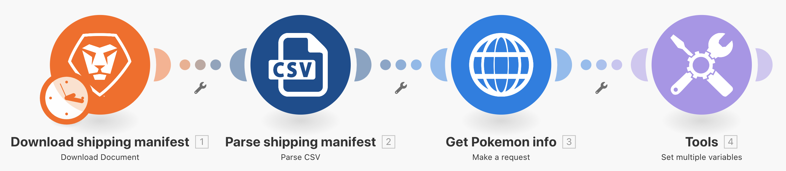

# 범용 커넥터 소개

REST 범용 커넥터 작업 및 반환된 데이터 작업에 대한 이해를 넓히십시오.

## 연습 개요

스프레드시트의 Pokemon 캐릭터를 사용하여 HTTP 커넥터를 통해 Poke API를 호출하고 해당 캐릭터에 대한 추가 정보를 수집하고 게시합니다.

## 따라야 할 단계

**Workfront에서 CSV 파일을 다운로드합니다.**

1. Workfront “Fusion 연습 파일” 폴더에서 “_Fusion2020_Shipping Manifest.csv”를 선택하고 문서 세부 정보를 클릭합니다.
1. URL 주소에서 첫 번째 ID 번호를 복사합니다.
1. Workfront Fusion에 새 시나리오를 생성합니다. 이름을 “범용 커넥터 사용”으로 지정합니다.
1. Workfront 앱에서 문서 다운로드 모듈로 시작합니다.
1. Workfront 연결을 설정하고 Workfront URL에서 복사한 문서 ID를 포함합니다.
1. 이 모듈의 이름을 “배송 매니페스트 다운로드”로 바꿉니다.

   

   **배송 매니페스트 데이터를 구문 분석합니다.**

1. CSV 구문 분석을 선택하여 다른 모듈을 추가합니다.
1. 11개 열에 대한 CSV 구문 분석을 설정합니다. CSV에 헤더 포함 상자를 선택합니다. Comma delimiterType을 선택하고 CSV 필드에 문서 다운로드 모듈의 데이터를 입력합니다.

   

1. 이 모듈의 이름을 “배송 매니페스트 구문 분석”으로 바꿉니다.
1. 시나리오를 저장하고 한 번 실행을 클릭하면 다음 단계에서 CSV 파일의 데이터를 볼 수 있습니다.

   **범용 커넥터를 사용하여 Pokemon 데이터를 가져옵니다.**

1. HTTP 요청 만들기 모듈을 추가합니다.
1. URL 필드에서 `https://pokeapi.co/api/v2/pokemon/[Character]`을 사용하며, 여기서 [문자]는 CSV 구문 분석 모듈에서 열 3에 매핑됩니다.
1. 응답 구문 분석 확인란을 선택합니다.
1. 고급 설정 표시를 선택한 다음, “모든 상태를 오류로 평가” 옆의 확인란을 선택합니다.
1. 확인을 클릭하고 모듈 이름을 “Pokemon 정보 가져오기”로 바꿉니다.

   **매핑 패널은 다음과 같아야 합니다.**

   

   **이 연습 부분에서는 CSV 파일의 행 1만 처리하려고 합니다.**

1. Pokemon 정보 가져오기 모듈 앞에 필터를 추가합니다. 이름을 “행 1만”으로 지정합니다.
1. ID 1번만 통과하도록 상태를 설정합니다. ID 1번은 행 1에 있고, ID 필드는 CSV 파일의 열 1에 있습니다.

   

1. 시나리오를 저장합니다.
1. 한 번 실행을 클릭하고, HTTP 요청 만들기 모듈에서 받은 오류 메시지를 확인합니다.

   >[!IMPORTANT]
   >
   >입력 데이터 URL 필드에서 문자 이름이 대문자임을 확인합니다. 문자 이름은 소문자여야 하므로 API 호출 시에는 작동하지 않습니다.

   

1. HTTP 요청 URL 만들기 필드의 매핑 패널을 사용하여 **하위** 기능으로 [문자] 필드를 모두 소문자로 만듭니다.

   

   **여러 변수 설정 모듈을 사용하여 API에서 정보를 다시 매핑합니다.**

1. Pokemon 정보 가져오기 다음에 여러 변수 설정 모듈을 추가합니다. 이름, 높이, 두께 및 기능을 매핑합니다.
1. 기능 필드는 배열이므로, 매핑 함수를 사용하여 배열의 각 기능 이름에 액세스해야 합니다.

   

   **다른 오류를 발견하려면 필터 없이 시나리오를 실행합니다.**

1. CSV 파일의 모든 행을 처리하려면 이름이 행 1만인 필터를 삭제합니다.

   + 필터 아이콘을 클릭하여 편집합니다.
   + 필터 레이블을 삭제합니다.
   + 상태를 삭제합니다.
   + 확인을 클릭합니다.

1. 시나리오를 저장하고 한 번 실행을 클릭합니다.
1. Pokemon 정보 가져오기 모듈에서 오류가 발생합니다. 슈퍼히어로 캐릭터가 Pokemon API에 전달된 것을 볼 수 있습니다.

   >[!NOTE]
   >
   >라우터 워크스루에서는 슈퍼히어로를 처리하는 별도의 경로를 생성하여 이 오류를 해결하는 방법을 볼 수 있습니다.

   
