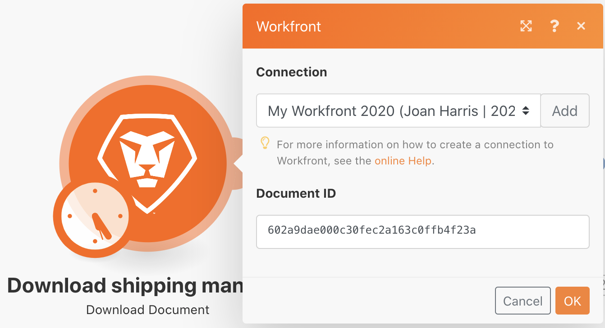
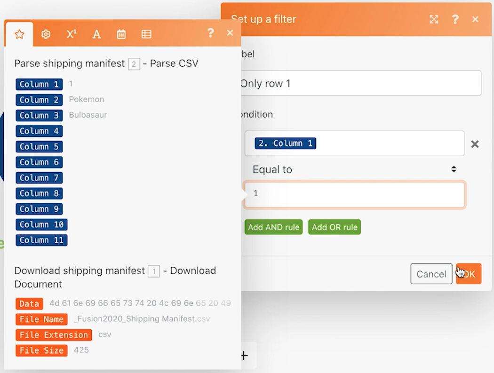

# 범용 커넥터 소개

REST 범용 커넥터 작업 및 반환된 데이터 작업에 대한 이해를 확장합니다.

## 연습 개요

스프레드시트에서 Pokemon 문자를 사용하여 HTTP 커넥터를 통해 Poke API를 호출하여 해당 캐릭터에 대한 자세한 정보를 수집하고 게시합니다.

## 수행할 단계

**Workfront에서 CSV 파일을 다운로드합니다.**

1. Workfront &quot;Fusion Experience Files&quot; 폴더에서 &quot;_Fusion2020_Shipping Manifest.csv&quot;를 선택하고 문서 세부 정보 를 클릭합니다.
1. URL 주소에서 첫 번째 ID 번호를 복사합니다.
1. Workfront Fusion에서 새 시나리오를 만듭니다. 이름을 &quot;범용 커넥터 사용&quot;으로 지정합니다.
1. Workfront 앱에서 문서 다운로드 모듈로 시작합니다.
1. Workfront 연결을 설정하고 Workfront URL에서 복사한 문서 ID를 포함합니다.
1. 이 모듈 이름을 &quot;Download shipping manifest&quot;로 변경합니다.

   

   **운송 매니페스트 데이터를 분석합니다.**

1. 다른 모듈을 추가하고 CSV 구문 분석을 선택합니다.
1. 11개 열에 대한 CSV 구문 분석을 설정합니다. CSV 헤더 포함 상자를 선택합니다. 쉼표 구분 기호 유형을 선택하고 CSV 필드의 문서 다운로드 모듈에서 데이터를 넣습니다.

   

1. 이 모듈 이름을 &quot;Parse shipping manifest&quot;로 변경합니다.
1. 시나리오를 저장하고 실행 을 한 번 클릭하여 다음 단계의 CSV 파일에서 데이터를 볼 수 있습니다.

   **범용 커넥터를 사용하여 Pokemon 데이터를 가져옵니다.**

1. HTTP Make a Request 모듈을 추가합니다.
1. URL 필드에서 `https://pokeapi.co/api/v2/pokemon/[Character]`, 위치 [문자] 는 CSV 구문 분석 모듈에서 열 3에 매핑됩니다.
1. 구문 분석 응답 확인란을 선택합니다.
1. 고급 설정 표시를 선택한 다음 &quot;모든 상태를 오류로 평가&quot; 옆에 있는 상자를 선택합니다.
1. 확인 을 클릭하고 &quot;Get Pokemon info&quot; 모듈의 이름을 변경합니다.

   **매핑 패널은 다음과 같아야 합니다.**

   

   **이 연습에서는 CSV 파일에서 행 1만 처리하려고 합니다.**

1. Get Pokemon 정보 모듈 앞에 필터를 추가합니다. 이름을 &quot;1행만&quot;으로 지정합니다.
1. ID 번호 1만 전달하도록 조건을 설정합니다. ID 번호 1은 1행에 있고 ID 필드는 CSV 파일의 열 1에 있습니다.

   

1. 시나리오를 저장합니다.
1. 한 번 실행 을 클릭하고 HTTP 요청 만들기 모듈에서 받은 오류 메시지를 확인합니다.

   >[!IMPORTANT]
   >
   >입력 데이터 URL 필드에 문자 이름을 대문자로 지정합니다. 문자 이름은 소문자로 지정해야 하므로 이 API 호출은 작동하지 않습니다.

   

1. HTTP 요청 URL 만들기 필드의 매핑 패널을 사용하여 [문자] 모든 소문자를 **lower** 함수 위에 있어야 합니다.

   

   **여러 변수 설정 모듈을 사용하여 API에서 정보를 다시 매핑합니다.**

1. Get Pokemon 정보 뒤에 여러 변수 설정 모듈을 추가합니다. 이름, 높이, 가중치 및 기능을 매핑합니다.
1. Permissions 필드는 배열이므로 맵 함수를 사용하여 배열에 있는 각 기능의 이름에 액세스해야 합니다.

   

   **필터 없이 시나리오를 실행하여 다른 오류를 파악합니다.**

1. CSV 파일의 모든 행을 처리하려면 행 1만 이라는 필터를 삭제합니다.

   + 필터 아이콘을 클릭하여 편집합니다.
   + 필터 레이블을 삭제합니다.
   + 조건을 삭제합니다.
   + 확인 을 클릭합니다.

1. 시나리오를 저장하고 실행 을 한 번 클릭합니다.
1. Get Pokemon 정보 모듈에서 오류가 발생합니다. Pokemon API에 전달된 수퍼히어로 캐릭터가 보입니다.

   >[!NOTE]
   >
   >라우터 연습에서는 슈퍼히어로를 처리하는 별도의 경로를 만들어 이 오류를 해결하는 방법을 확인할 수 있습니다.

   
