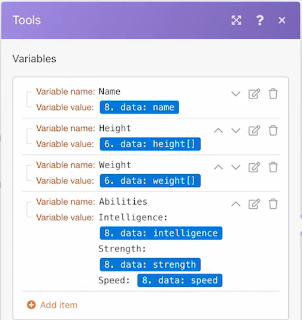
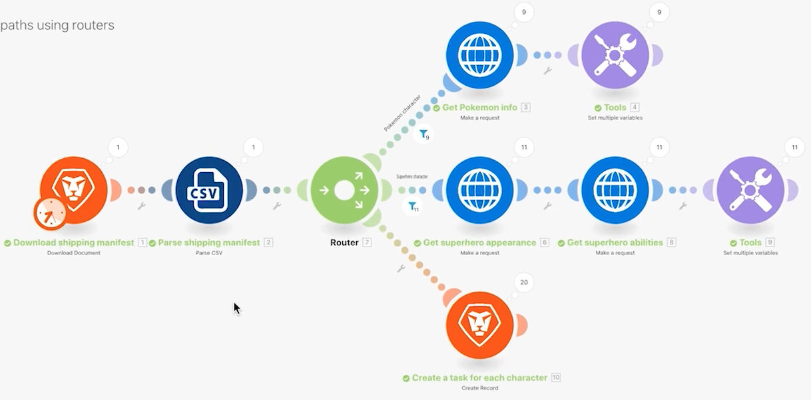

# 라우터 연습

라우터의 중요성과 다양한 모듈을 조건부로 처리하는 데 라우터를 사용하는 방법을 이해합니다.

## 연습 개요

라우터를 사용하여 Pokemon 대 슈퍼히어로 번들을 올바른 경로로 전달한 다음 각 캐릭터에 대한 작업을 만듭니다.

## 따라야 할 단계

1. 이전 연습에서 범용 커넥터 사용 시나리오를 복제합니다. 이름을 “라우터를 사용하여 다른 경로 만들기”로 지정합니다.

   **모듈을 복제하고 라우터를 추가하여 슈퍼히어로를 위한 새로운 경로를 만듭니다.**

   

1. Pokemon 정보 가져오기 모듈을 마우스 오른쪽 버튼으로 클릭하고 복제를 선택합니다. 복제되면 새 HTTP 모듈과 CSV 구문 분석 모듈 사이의 줄에 끌어서 연결합니다.

   >[!NOTE]
   >
   > 경로가 두 개인 라우터를 자동으로 추가하는 방법을 살펴봅니다.

1. 이 모듈 이름을 “슈퍼히어로 모양 가져오기”로 지정합니다.
1. 이 모듈을 복제하고 클론을 오른쪽으로 이동한 다음, 이름을 “슈퍼히어로 능력 가져오기”로 지정합니다.
1. 도구 모듈을 복제하고 두 번째 경로의 끝으로 이동합니다.
1. 도구 모음에서 지팡이 아이콘(자동 정렬 버튼)을 클릭합니다.

   **시나리오는 다음과 같아야 합니다.**

   

   **다음으로 복제된 새 모듈에서 매핑된 값을 변경합니다.**

1. <https://www.superheroapi.com/>으로 이동하고 Facebook 계정을 사용하여 액세스 토큰을 가져옵니다.

   >[!NOTE]
   >
   >자체 슈퍼히어로 토큰에 액세스하는 데 문제가 있는 경우, 다음 공유 토큰(10110256647253588)을 사용할 수 있습니다. 모든 사람에게 공유 토큰이 계속 작동하도록 슈퍼히어로 API에 호출하는 횟수를 고려하십시오.

1. 슈퍼히어로 모양 가져오기의 설정을 열고 URL을 `https://www.superheroapi.com/api/[access- token]/332/appearance`로 변경합니다. URL에 액세스 토큰을 포함해야 합니다. 확인을 클릭합니다.
1. 슈퍼히어로 능력 가져오기의 설정을 열고 URL을 `https://www.superheroapi.com/api/[access- token]/332/powerstats`로 변경합니다. URL에 액세스 토큰을 포함해야 합니다. 확인을 클릭합니다.
1. 각 슈퍼히어로 모듈을 마우스 오른쪽 버튼으로 클릭하고 이 모듈만 실행을 선택합니다. 이렇게 하면 매핑을 위해 확인해야 하는 데이터 구조가 생성됩니다.
1. 둘 다 실행한 후에 각 URL 필드의 숫자 “332”를 CSV 구문 분석 모듈에서 매핑된 열 4로 변경합니다.

   

   **이제 슈퍼히어로 경로에서 여러 변수 설정 모듈을 클릭하고 이름, 키, 몸무게 및 능력을 업데이트할 수 있습니다.**

1. 슈퍼히어로 능력 가져오기 모듈(모듈 8)에서 이름 및 능력 필드를 업데이트합니다.

   

1. 슈퍼히어로 모양 가져오기 모듈(모듈 6)에서 키 및 몸무게 필드를 업데이트합니다.

   

   **완료되면 변수는 다음과 같아야 합니다. 필드 값에 모듈 번호가 나타납니다.**

   

1. 확인을 클릭한 다음 시나리오를 저장합니다.

   **캐릭터당 작업을 만들기 위해 또 다른 경로를 만듭니다.**

1. Workfront에서 빈 프로젝트를 만듭니다. 이름을 “배송 매니페스트 프로젝트”로 지정하고 URL에서 프로젝트 ID를 복사합니다.
1. Workfront Fusion으로 돌아가 라우터 중앙을 클릭하여 다른 경로를 만듭니다.

   

1. 표시되는 빈 모듈의 중앙을 클릭하고 Workfront 앱에서 레코드 만들기 모듈을 추가합니다.
1. 레코드 유형을 작업으로 설정하고 매핑할 필드 섹션에서 프로젝트 ID를 선택합니다.
1. Workfront에서 복사한 프로젝트 ID를 프로젝트 ID 필드에 붙여넣습니다.
1. 이제 매핑할 필드 섹션에서 이름 필드를 선택합니다.
1. CSV 파일에서 캐릭터 이름 및 프랜차이즈 이름을 가져온 작업 이름을 “[프랜차이즈]의 [캐릭터]”로 지정합니다. 열 3은 캐릭터 이름이고 열 2는 프랜차이즈 이름입니다.

   

1. 확인을 클릭하고 이 모듈의 이름을 “각 캐릭터에 대한 작업 만들기”로 변경합니다.

   **시나리오가 오류 없이 실행될 수 있도록 필터를 추가합니다. Pokemon 캐릭터만 상단 경로로, 슈퍼히어로 캐릭터만 중간 경로로, 모든 캐릭터를 하단 경로로 이동하고자 합니다.**

1. Pokemon 정보 가져오기 모듈 왼쪽에 있는 점선을 클릭하여 첫 번째 필터를 만듭니다. 이름을 “Pokemon 캐릭터”로 지정합니다.
1. 조건의 경우, 프랜차이즈(열 2)가 “Pokemon”과 동일한 레코드만 허용합니다. 텍스트 “같음” 연산자를 선택합니다.
1. 슈퍼히어로 모양 가져오기 모듈의 왼쪽에 있는 점선을 클릭하여 다음 필터를 만듭니다. 이름을 “슈퍼히어로 캐릭터”로 지정합니다.
1. 슈퍼히어로는 다양한 프랜차이즈에서 나올 수 있으므로 슈퍼히어로 ID 필드(열 4)를 사용하여 캐릭터가 슈퍼히어로인지 여부를 확인합니다.

   **필터는 다음과 같아야 합니다.**

   

   

1. 시나리오를 저장하고 한 번 실행을 클릭합니다. 실행 검사기를 사용하여 모든 작업이 성공했는지 확인하고 Workfront 프로젝트에서 생성된 작업을 확인합니다.

   
