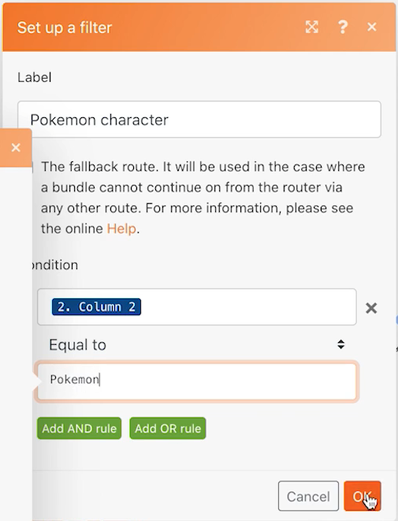

# 라우터

라우터의 중요성과 이 라우터를 사용하여 서로 다른 모듈을 조건부로 처리하는 방법을 이해합니다.

## 연습 개요

라우터를 사용하여 Pokemon과 슈퍼히어로들 번들을 올바른 경로로 전달한 다음 각 캐릭터에 대한 작업을 만듭니다.

## 수행할 단계

1. 이전 연습에서 범용 커넥터 사용 시나리오를 복제합니다. 이름을 &quot;라우터를 사용하여 다른 경로 만들기&quot;로 지정합니다.

   **모듈을 복제하고 라우터를 추가하여 슈퍼 히어로에게 새 경로를 만듭니다.**

   

1. Get Pokemon 정보 모듈을 마우스 오른쪽 버튼으로 클릭하고 Clone 을 선택합니다. 복제한 후 드래그하여 새 HTTP 모듈과 CSV 구문 분석 모듈 사이의 행에 연결합니다.

   >[!NOTE]
   >
   > 두 개의 경로가 있는 라우터를 자동으로 추가하는 방법을 확인합니다.

1. 이 모듈의 이름을 &quot;Get superhero appearance&quot;로 지정합니다.
1. 이 모듈을 복제하고 클론을 오른쪽으로 이동한 다음 이름을 &quot;슈퍼히어로 기능 얻기&quot;로 지정합니다.
1. 도구 모듈을 복제하고 두 번째 경로의 끝으로 이동합니다.
1. 도구 모음에서 선택 아이콘 - 자동 정렬 단추 를 클릭합니다.

   **시나리오는 다음과 같습니다.**

   

   **그런 다음 복제된 새 모듈에서 매핑된 값을 변경합니다.**

1. 이동 <https://www.superheroapi.com/> facebook 계정을 사용하여 액세스 토큰을 얻습니다.

   >[!NOTE]
   >
   >자신의 슈퍼히어로 토큰에 액세스하는 데 문제가 있으면 다음 공유 토큰을 사용할 수 있습니다. 10110256647253588. 이 공유 토큰이 모든 사람에게 계속 작동할 수 있도록 슈퍼 히어로 API를 몇 번 호출하는지 주의하십시오.

1. Get the settings for the Superhero appearance and change the URL to(슈퍼히어로 모양 가져오기 설정을 열고 URL을 다음으로 변경합니다.) `https://www.superheroapi.com/api/[access- token]/332/appearance`. 액세스 토큰을 URL에 포함해야 합니다. 확인 을 클릭합니다.
1. 슈퍼히어로 기능 가져오기 설정을 열고 URL을 다음으로 변경합니다. `https://www.superheroapi.com/api/[access- token]/332/powerstats`. 액세스 토큰을 URL에 포함해야 합니다. 확인 을 클릭합니다.
1. 각 수퍼 히어로 모듈을 마우스 오른쪽 단추로 클릭하고 이 모듈만 실행을 선택합니다. 이렇게 하면 매핑에 필요한 데이터 구조가 생성됩니다.
1. 둘 다 실행한 후 각 URL 필드의 숫자 &quot;332&quot;를 구문 분석 CSV 모듈에서 매핑된 열 4로 변경합니다.

   

   **이제 슈퍼히어로 경로에서 여러 변수 설정 모듈을 클릭하고 이름, 높이, 무게 및 기능을 업데이트할 수 있습니다.**

1. Get Superhero Capabilities 모듈(Module 8)에서 Name and Perability 필드를 업데이트합니다.

   

1. Get Superhero Appearance 모듈 - Module 6에서 Height 및 Weight 필드를 업데이트합니다.

   

   **완료되면 변수가 다음과 같이 표시됩니다. 모듈 번호는 필드 값에 나타납니다.**

   

1. 확인 을 클릭한 다음 시나리오를 저장합니다.

   **문자별로 작업을 만드는 다른 경로를 만듭니다.**

1. Workfront에서 빈 프로젝트를 만듭니다. 이름을 &quot;Shipping Manifest Project&quot;로 지정하고 URL에서 프로젝트 ID를 복사합니다.
1. Workfront Fusion으로 돌아가서 라우터의 중심을 클릭하여 다른 경로를 만듭니다.

   

1. 표시되는 빈 모듈의 중심을 클릭하고 Workfront 앱에서 레코드 만들기 모듈을 추가합니다.
1. 레코드 유형을 작업으로 설정하고 매핑할 필드 섹션에서 프로젝트 ID를 선택합니다.
1. Workfront에서 복사한 프로젝트 ID를 프로젝트 ID 필드에 붙여넣습니다.
1. 이제 매핑할 필드 섹션에서 이름 필드를 선택합니다.
1. 작업 이름을 &quot;[문자] 변환 전: [프랜차이즈],&quot;CSV 파일에서 문자 이름과 프랜차이즈 이름을 가져오는 중입니다. 3열은 캐릭터 이름이고 2열은 프랜차이즈의 이름입니다.

   

1. 확인을 클릭하고 이 모듈의 이름을 &quot;각 문자별 작업 만들기&quot;로 변경합니다.

   **오류 없이 시나리오를 실행할 수 있도록 필터를 추가합니다. 여러분은 포키몬 캐릭터들만 맨 위 아래로 내려가고, 슈퍼히어로 캐릭터만 가운데 아래로 내려가고, 모든 캐릭터들이 아래 아래로 내려가게 하고 싶습니다.**

1. 첫 번째 필터를 만들려면 Get Pokemon 정보 모듈 왼쪽에 있는 점선을 클릭합니다. &quot;포키몬 캐릭터&quot; 라고 이름붙여라.
1. 조건: 프랜차이즈(2열)가 &quot;포키몬&quot;과 동일한 레코드만 허용하십시오. &quot;같음&quot; 연산자를 선택합니다.
1. 다음 필터를 만들려면 [슈퍼히어로 표시 가져오기] 모듈 왼쪽에 있는 점선을 클릭합니다. &quot;슈퍼히어로 캐릭터&quot;라고 이름붙여라.
1. 슈퍼히어로들은 다양한 프랜차이즈로부터 올 수 있기 때문에 슈퍼히어로 아이디 필드(4열)를 사용하여 캐릭터가 슈퍼히어로인지 아닌지를 판단하세요.

   **필터는 다음과 같습니다.**

   

   

1. 시나리오를 저장하고 실행 을 한 번 클릭합니다. 실행 관리자를 사용하여 모든 작업이 성공했는지 확인하고 Workfront 프로젝트에서 생성된 작업을 확인합니다.

   
