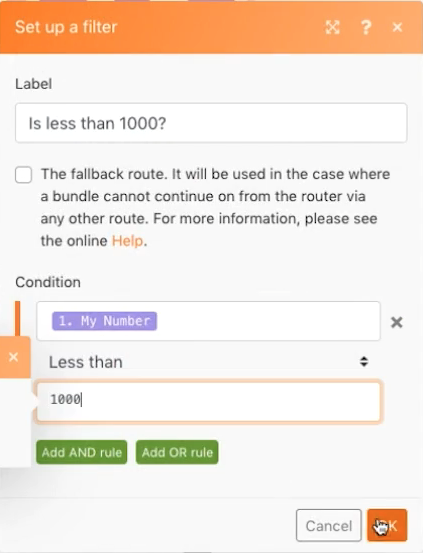

# 라우팅 패턴

다른 API를 실제로 처리하지 않고도 라우팅 및 대체 경로의 개념을 보강합니다.

## 연습 개요

변수 설정 모듈을 사용하여 여러 경로를 통해 숫자를 전송하여 라우팅 시 필터 및 폴백이 작동하는 방식을 확인할 수 있습니다.

## 수행할 단계

1. 새 시나리오를 만들고 &quot;라우팅 패턴 및 폴백&quot;이라고 합니다.
1. 트리거의 경우 변수 설정 도구 모듈을 추가합니다. 변수 이름에 &quot;My Number&quot;를 입력하고 변수 라이프타임을 1로 유지하고 변수 필드를 &quot;75&quot;로 설정합니다.

   

1. 다른 모듈을 추가하고 라우터 모듈을 선택합니다. 두 경로의 경우 [증분 함수 도구]를 선택하고 각 경로를 변경하지 않고 [확인]을 클릭합니다.

   + 첫 번째 경로에 대해 필터를 만들고 이름을 &quot;100보다 작음&quot;으로 지정하고 조건을 로 설정합니다 [내 번호] 100 미만.

   + 두 번째 경로에 대해 필터를 만들고 이름을 &quot;1000보다 작음&quot;으로 지정하고 조건을 로 설정합니다 [내 번호] 1000 미만. 둘 다에 숫자 연산자를 사용해야 합니다.

   

   

1. 한 번 실행 을 클릭하고 번들이 &quot;100개 미만&quot; 경로를 통과하는 것을 확인합니다.
1. 그런 다음 변수 모듈 설정 필드를 950으로 변경하고 다시 실행합니다. 두 번째 경로를 따라 흐르는 것을 보세요.
1. 라우터를 클릭하고 경로를 하나 더 추가합니다. 증분 함수 도구 모듈을 추가합니다. 필터에 대해 &quot;대체 경로&quot; 확인란을 클릭합니다. 해당 경로를 가리키는 화살표가 대체 경로임을 나타내는 캐럿으로 바뀝니다.

   

1. 변수 번호 설정 을 9500으로 변경하고 한 번 실행합니다. 숫자가 100개 이상 또는 1000개 미만이므로 이 번들은 대체 경로를 따라 이동합니다.

Increment 함수 도구 모듈로 경로를 한 개 더 추가하지만 필터를 설정하지 않으면 다시 실행을 클릭하면 어떻게 됩니까? 네 번째 경로가 추가된 대체 경로를 따라 번들이 내려가나요?

+ 아니요. 필터 세트가 없으므로 모든 번들은 항상 대체 경로 대신 이 경로로 이동하게 됩니다.
