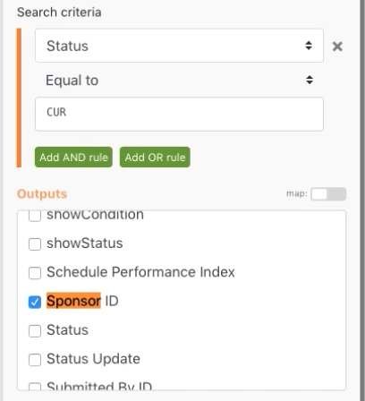

# 변수 설정/가져오기

변수 설정 및 가져오기 모듈을 사용하여 다른 경로의 한 경로에서 사용할 수 있는 필드를 사용하는 방법에 대해 알아봅니다.

## 연습 개요

Workfront에서 프로젝트에 대한 정보를 조회하고 관련 정보가 포함된 이메일을 보냅니다.

## 따라야 할 단계

1. 새 시나리오를 만들고 이름을 &quot;라우팅 경로 간 변수 공유&quot;로 지정합니다.
1. 트리거는 Workfront 앱에서 검색 모듈을 선택합니다.

   + 레코드 유형을 프로젝트로 설정합니다.
   + 결과 세트에 대해 일치하는 모든 레코드를 선택합니다.
   + 검색 기준의 경우 CUR과 동일한 상태로 설정합니다.
   + [출력]에서 [ID], [이름], [설명] 및 [스폰서 ID]를 선택합니다.

   

   

1. 확인 을 클릭하고 이 모듈의 이름을 &quot;현재 프로젝트 찾기&quot;로 바꿉니다.
1. 다른 모듈을 추가하고 Workfront 레코드 읽기 모듈을 선택합니다.

   + 레코드 유형에 대해 사용자를 선택합니다.
   + [출력]에서 [이름]을 선택합니다.
   + 검색 모듈의 스폰서 ID를 ID 필드에 매핑합니다.

1. 확인을 클릭합니다.
1. 모듈 이름을 &quot;스폰서 이름 찾기&quot;로 바꿉니다.

   

1. 시나리오를 저장하고 실행 을 한 번 클릭합니다.

   레코드 읽기 모듈에 오류가 표시되면 검색 모듈이 스폰서가 나열되지 않은 프로젝트를 찾기 때문일 수 있습니다.

   **이 오류를 방지하려면 스폰서 ID가 있는 프로젝트의 경로와 없는 프로젝트의 경로 등 두 가지 경로를 만듭니다.**

1. 라우터와 레코드 읽기 모듈 사이에 있는 렌치 아이콘을 클릭하여 두 모듈 사이에 라우터를 추가합니다. &quot;스폰서가 존재함&quot; 필터를 설정하고 조건을 스폰서 ID가 존재함으로 설정합니다.

   

1. 라우터를 클릭하여 다른 경로를 만듭니다. 이메일 앱에서 이메일 보내기 모듈을 추가합니다.

   + 받는 사람 필드에 자신의 이메일 주소를 입력합니다.
   + 제목 필드에 &quot;현재 프로젝트 정보&quot;를 입력합니다.
   + 콘텐츠 필드에 프로젝트 이름, 설명 및 스폰서를 입력합니다.
   + 레코드 읽기 모듈에서 스폰서 이름 출력을 가져올 수 없습니다. 라우터 이전의 검색 모듈에서만 스폰서 ID에 액세스할 수 있습니다. 다른 라우터 경로에서 스폰서 이름에 액세스하는 방법을 찾아야 합니다.

   

1. 지금 [확인]을 클릭하고 이 모듈의 이름을 &quot;프로젝트 정보 보내기&quot;로 바꿉니다.

   **변수 설정/가져오기 를 사용하여 서로 다른 경로 간에 데이터를 공유합니다.**

1. 스폰서 이름 찾기 모듈 뒤에 변수 설정 도구 모듈을 추가합니다.

   + 변수 이름으로 &quot;스폰서 이름&quot;을 입력합니다.
   + 변수 라이프타임을 한 주기 로 둡니다.
   + 스폰서 이름 찾기 모듈의 이름 출력에 필드를 매핑합니다.

1. 확인 을 클릭한 다음 &quot;스폰서 이름 설정&quot; 모듈의 이름을 바꿉니다.

   

1. 그런 다음 라우터와 이메일 전송 모듈 사이를 마우스 오른쪽 버튼으로 클릭하여 변수 가져오기 도구 모듈을 추가합니다. 변수 이름 필드에 &quot;스폰서 이름&quot;을 입력합니다.
1. 확인을 클릭합니다. 모듈 이름을 &quot;스폰서 이름 가져오기&quot;로 바꿉니다.

   

1. 이메일 전송 모듈로 돌아가서 스폰서 이름 가져오기 모듈의 값을 컨텐츠 필드에 매핑합니다. 확인을 클릭합니다.

   

   >[!IMPORTANT]
   >
   >시나리오를 테스트하기 전에 이메일이 범람하는 것을 방지하기 위해 처리하는 프로젝트 수를 제한하는 것이 좋습니다.

1. Workfront 테스트 드라이브로 이동하여 Northstar Fashion Exhibitors Booth 프로젝트를 찾습니다. 스폰서가 있는 현재 프로젝트입니다. URL에서 프로젝트 ID를 복사합니다.

   

1. 시나리오에서 현재 프로젝트 찾기 모듈을 클릭합니다. 녹색 &quot;AND 규칙 추가&quot; 버튼을 클릭하여 검색 기준에 다른 조건을 추가합니다. ID가 복사한 프로젝트 ID와 같도록 지정합니다. 확인을 클릭합니다.
1. 시나리오를 저장하고 실행 을 한 번 클릭합니다.
1. 실행 검사기 및 받은 이메일을 검토합니다.

   
