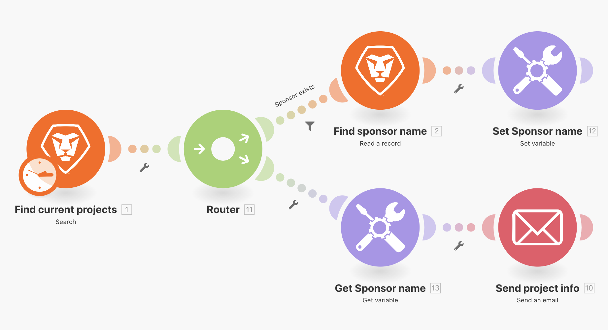

# Switch 함수

스위치 기능을 사용하여 스위치 기능을 사용하는 방법을 알아봅니다.

## 연습 개요

간단한 데이터 변경의 경우 Switch 함수를 사용하여 모듈 필드 내에서 한 값을 다른 값으로 변환합니다. 이 연습에서는 두 글자 키를 프로젝트 진행 상태에 대한 실제 이름으로 변경하여 전자 메일을 보냅니다.

## 수행할 단계

1. &quot;라우팅 경로 간 변수 공유&quot;라는 시나리오를 복제합니다.
1. 새 시나리오 이름을 &quot;라우팅 경로 간 변수 공유 - 스위치&quot;로 지정합니다.
1. 트리거 모듈을 클릭하고 진행률 상태를 출력 섹션에 추가합니다.
1. 이메일 모듈 전송에서 컨텐츠 필드에 진행 상태를 추가합니다.

   + 검색 모듈에서 나오는 값을 매핑하기만 하면 진행 상태에 대한 두 문자 코드가 있습니다.
   + 가능한 각 진행 상태의 전체 이름에 대한 코드를 &quot;스위치&quot;하려면 일반 함수 탭에서 &quot;스위치&quot; 함수를 사용합니다.

1. 스위치 함수는 Progress Status 값 또는 표현식을 키로 사용한 다음 해당 키를 기반으로 출력 값을 반환합니다.

   + 키 값은 진행 상태(&quot;LT&quot;) 다음에 첫 번째 위치에 정의되며 두 번째 위치(&quot;지연&quot;)에 해당 출력이 정의되어 있습니다.
   + 다음 키 값은 세 번째 위치에 정의되며, 네 번째 위치 등에 해당 출력이 원하는 수만큼 표시됩니다.

      
