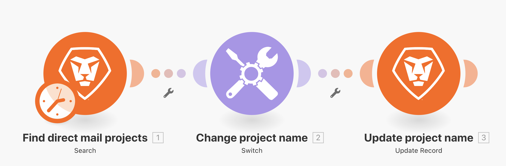

# 모듈 전환

더욱 복잡하거나 동적인 데이터 변환을 수행해야 하는 경우 스위치 모듈을 사용하는 방법을 이해합니다.

## 연습 개요

테스트 드라이브에서 DM 프로젝트를 검색한 다음 프로젝트에 첨부된 사용자 정의 필드에서 선택한 값을 기반으로 각 프로젝트의 이름을 변경합니다.

## 따라야 할 단계

1. 새 시나리오를 만들고 이름을 &quot;Using the Switch module&quot;로 지정합니다.
1. 트리거 모듈의 경우 Workfront 검색 모듈을 사용합니다.
1. Workfront 연결을 설정하고 레코드 유형을 프로젝트로 설정합니다.
1. 검색 기준에서 채널 사용자 정의 필드에 값이 있는 프로젝트만 표시하도록 지정합니다.
1. 출력의 경우 ID, 이름, 참조 번호 및 채널 사용자 지정 필드를 선택합니다.

   

1. 도구에서 스위치 모듈을 추가합니다.
1. 입력 필드의 경우 검색 모듈에서 채널 사용자 정의 필드를 매핑합니다.

   

1. 다음으로 채널 사용자 정의 필드에서 발생할 수 있는 각 값에 대해 대소문자를 추가합니다. 가능한 값은 패턴 필드에 표시됩니다. 출력 필드에 프로젝트 참조 번호 다음에 프로젝트 이름이 오는 특정 3자 코드를 포함시키려고 합니다.

   **매핑 패널은 다음과 같아야 합니다.**

   

1. 원하는 만큼 사례를 추가할 수 있습니다. 맨 아래에 Else 필드가 표시됩니다. 입력 값이 대소문자와 일치하지 않는 경우 이 값이 사용됩니다.

   **Workfront에서 프로젝트 이름을 업데이트합니다.**

   

1. Workfront 업데이트 레코드 모듈을 추가합니다.
1. ID 필드에서 트리거 모듈의 ID에 매핑합니다.
1. 레코드 유형을 프로젝트로 설정합니다.
1. Select Fields to Map 섹션에서 Name 필드를 선택하고 Switch 모듈의 출력에 매핑합니다.
1. 시나리오를 저장하고 한 번 실행합니다. 테스트 드라이브에서 업데이트된 프로젝트 이름을 봅니다.
