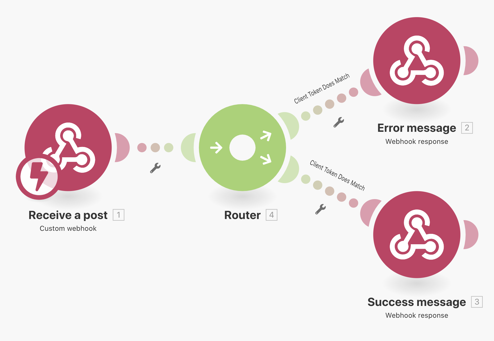
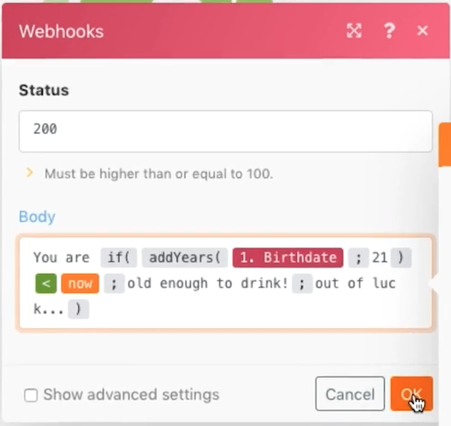

# 웹훅

Webhook에서 시작한 시나리오를 만들고, 트리거하고, 관리하는 방법을 알아봅니다.

## 연습 개요

이 시나리오의 목적은 편의점에 판매하는 앱을 만들어 고객이 술을 구매할 수 있을 정도로 나이를 먹었는지 여부를 쉽게 판단할 수 있도록 하는 것이다. 계산원은 제공된 URL에 고객의 이름과 생년월일을 게시하기만 하면 됩니다. 해당 게시물은 답변을 계산하고 요청자에게 반환하는 시나리오를 트리거합니다.

1. 시나리오는 세 개의 웹후크로 구성됩니다.
1. 트리거 모듈은 게시물을 수신하는 사용자 지정 웹후크입니다.
1. POST를 받으면 다음 모듈 중 하나로 출력됩니다.
1. 다음 모듈은 요청자에게 응답을 반환합니다.

   

## 따라야 할 단계

**트리거 웹후크를 설정합니다.**

1. 새 시나리오를 만들고 이름을 &quot;Using webhooks&quot;로 지정합니다.
1. 트리거를 위해 Webhooks 앱에서 Custom Webhook 모듈을 추가합니다.
1. 추가 를 클릭하여 새 Webhook을 만듭니다.
1. &quot;음주 연령 앱&quot;의 Webhook 이름을 입력합니다.
1. IP 제한을 비워 두면 누구나 데이터를 전송할 수 있습니다.
1. 저장을 클릭합니다.

   

1. [웹후크 매핑] 패널로 돌아가면 이 특정 웹후크에 대한 URL이 작성되었습니다. 해당 URL을 복사하려면 &quot;클립보드에 주소 복사&quot;를 클릭합니다.
1. 확인을 클릭합니다.
1. 실행 을 한 번 클릭합니다.
1. Postman의 URL을 사용하여 사용자 지정 웹후크에 이름과 생년월일을 보냅니다. Postman 설정에 대한 지침은 [Webhooks 연습](https://experienceleague.adobe.com/docs/workfront-learn/tutorials-workfront/fusion/beyond-basic-modules/webhooks-walkthrough.html?lang=en) 튜토리얼.

   **Webhooks 모듈 패널은 다음과 같이 표시되어야 합니다.**

   

   **이제 웹후크는 데이터 구조를 결정하기 위해 데이터를 수신하는 상태입니다.**

1. 가져올 페이로드의 데이터 구조를 정의할 수 있습니다(데이터 구조는 나중에 설명됨). 데이터 구조를 정의하지 않으면 게시물이 전송될 때 Fusion에서 데이터 구조를 자동으로 결정합니다.
1. Postman 측에서 복사한 URL로 보내려고 합니다. 게시물에는 기본 양식 데이터가 포함되어야 합니다. 이 예제에서는 Name, Birthdate 및 clientToken의 세 가지 필드가 필요합니다.

   

1. Postman에서 보내기 를 클릭하면 게시물이 수락되었음을 나타내는 표시가 나타납니다.
1. 이 점은 데이터 구조가 성공적으로 결정되었음을 시나리오에 보여 줍니다.
1. 실행 검사기를 열어 데이터를 받은 것을 알 수 있습니다.

   

   **클라이언트 토큰에 대한 라우팅을 설정합니다.**

1. 트리거 모듈에 라우터를 추가합니다.
1. 상위 경로에서 Webhook 응답 모듈을 추가합니다. 클라이언트 토큰이 일치하지 않을 경우 이 경로가 됩니다.
1. 상태를 401로 설정합니다.
1. 본문을 {&quot;error&quot;: &quot;요청 인증 실패&quot;로 설정하십시오. clientToken&quot;}을 확인하십시오.

   

1. 라우터와 Webhook 응답 모듈 사이에 필터를 만듭니다. 이름을 &quot;클라이언트 토큰이 일치하지 않습니다.&quot;로 지정합니다.
1. Condition의 경우, 트리거 모듈의 clientToken 필드를 사용하고 숫자 &quot;같지 않음&quot;을 숫자 5121933과 비교합니다.

   

1. 맨 아래 경로에서 다른 Webhook 응답 모듈을 추가합니다. 이는 클라이언트 토큰이 일치할 때의 경로입니다.
1. 상태를 200으로 설정합니다.
1. Body를 설정할 때 매핑 패널 기능을 사용하여 21세 이상인지 테스트합니다. 만약 그들이 있다면, &quot;당신은 마실 수 있을 만큼 충분히 나이가 들었다!&quot;고 되돌리거나, 그렇지 않으면 &quot;당신은 운이 없다...&quot;라고 되돌려라.

   

1. 하위 경로의 라우터와 Webhook 응답 모듈 사이에 필터를 생성합니다. 이름을 &quot;클라이언트 토큰이 일치하지 않습니다.&quot;로 지정합니다.
1. Condition의 경우, 트리거 모듈의 clientToken 필드를 사용하고 숫자 5121933과 &quot;같음&quot;(Equal to)을 비교합니다.

   

1. 실행 아래에 있는 예약 버튼을 한 번 클릭하여 새 게시물이 수신될 때마다 시나리오를 활성화한 다음 두 경로 중 하나로 이동하여 응답을 생성합니다.
