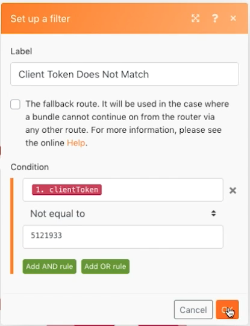

# Webhooks

Webhook 시작 시나리오를 작성, 트리거 및 관리하는 방법을 알아봅니다.

## 연습 개요

이 시나리오의 목적은 편의점에 판매할 앱을 만들어 고객이 술을 구입할 만큼 나이가 들었는지를 쉽게 판별하는 것입니다. 계산원은 고객의 이름과 생년월일을 제공한 URL에 게재하면 됩니다. 해당 게시물은 응답을 계산하고 요청자에게 반환하는 시나리오를 트리거합니다.

1. 시나리오는 세 개의 웹 후크로 구성됩니다.
1. 트리거 모듈은 게시물을 수신하는 사용자 정의 웹 후크입니다.
1. 게시물을 받으면 다음 모듈 중 하나로 출력합니다.
1. 다음 모듈은 요청자에 대한 응답을 반환합니다.

   

## 수행할 단계

**트리거 웹 후크를 설정합니다.**

1. 새 시나리오를 만들고 이름을 &quot;Webhooks 사용&quot;으로 지정합니다.
1. 트리거의 경우 Webhooks 앱에서 사용자 지정 웹 후크 모듈을 추가합니다.
1. 추가 를 클릭하여 새 웹 후크를 만듭니다.
1. &quot;음주 연령 앱&quot;의 웹 후크 이름을 입력합니다.
1. IP 제한 사항을 비워 두면 누구나 데이터를 IP에 보낼 수 있습니다.
1. 저장을 클릭합니다.

   

1. 다시 Webhooks 매핑 패널에서 이 특정 웹 후크에 대한 URL이 만들어졌습니다. &quot;클립보드에 주소 복사&quot;를 클릭하여 해당 URL을 복사합니다.
1. 확인 을 클릭합니다.
1. 실행을 한 번 클릭합니다.
1. Postman의 URL을 사용하여 이름과 날짜를 사용자 지정 웹 후크에 보냅니다. Postman 설정에 대한 지침은 [Webhooks 연습](https://experienceleague.adobe.com/docs/workfront-learn/tutorials-workfront/fusion/beyond-basic-modules/webhooks-walkthrough.html?lang=en) 자습서입니다.

   **Webhooks 모듈 패널은 다음과 같아야 합니다.**

   

   **이제 웹 후크가 데이터 구조를 결정하기 위해 데이터를 수신하는 상태에 있습니다.**

1. 가져올 페이로드의 데이터 구조를 정의할 수 있습니다(데이터 구조는 나중에 논의됨). 데이터 구조를 정의하지 않으면 Fusion에서 게시물이 전송될 때 데이터 구조가 자동으로 결정됩니다.
1. Postman 측에서 복사한 URL로 전송할 것입니다. 게시물에는 기본 양식 데이터가 포함되어야 합니다. 이 예제에서는 다음 세 개의 필드가 필요합니다. 이름, Original 날짜 및 clientToken.

   

1. Postman에서 보내기 를 클릭하면 게시물이 수락되었음을 나타내는 메시지가 표시됩니다.
1. 시나리오가 데이터 구조가 성공적으로 결정되었음을 나타내는 지점입니다.
1. 실행 관리자를 열어 데이터를 수신했음을 확인할 수 있습니다.

   

   **클라이언트 토큰에 대한 라우팅을 설정합니다.**

1. 트리거 모듈에 라우터를 추가합니다.
1. 위쪽 경로에서 Webhook 응답 모듈을 추가합니다. 클라이언트 토큰이 일치하지 않는 경우에 대한 경로가 됩니다.
1. 상태를 401로 설정합니다.
1. Body 를 {&quot;error&quot; 로 설정합니다. &quot;요청을 인증하지 못했습니다. clientToken&quot;}을 확인하십시오.

   

1. 라우터와 웹 후크 응답 모듈 사이에 필터를 만듭니다. 이름을 &quot;클라이언트 토큰이 일치하지 않습니다.&quot;로 지정합니다.
1. Condition의 경우 트리거 모듈에서 clientToken 필드를 사용하고 숫자 &quot;Not equal to&quot;(다음과 같지 않음)를 5121933.

   

1. 하단 경로에서 다른 Webhook 응답 모듈을 추가합니다. 클라이언트 토큰이 일치할 때의 경로가 됩니다.
1. 상태를 200으로 설정합니다.
1. 본문을 설정할 때 매핑 패널 함수를 사용하여 사람이 21 이상인지 테스트합니다. 만약 그렇다면, &quot;너는 마실 수 있는 나이가 되었다!&quot; 를 돌려주고, 그렇지 않으면 &quot;너는 운이 없다..&quot; 를 돌려라.

   

1. 아래 경로의 라우터와 웹 후크 응답 모듈 사이에 필터를 만듭니다. 이름을 &quot;클라이언트 토큰이 일치합니다.&quot;로 지정합니다.
1. Condition의 경우 트리거 모듈에서 clientToken 필드를 사용하고 숫자 &quot;Equal to&quot;를 5121933.

   

1. 한 번 실행 아래의 예약 단추를 클릭하여 새 게시물이 수신될 때마다 메시지를 수신하고, 두 경로로 이동하고, 응답을 생성합니다.
