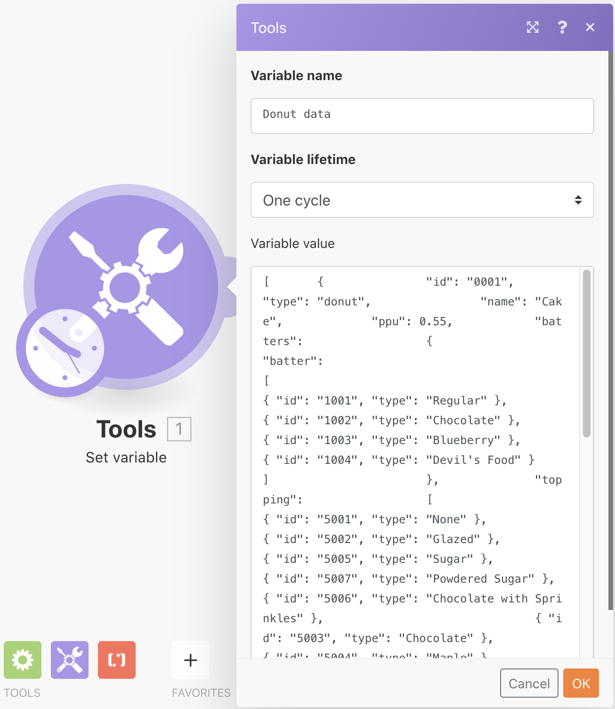
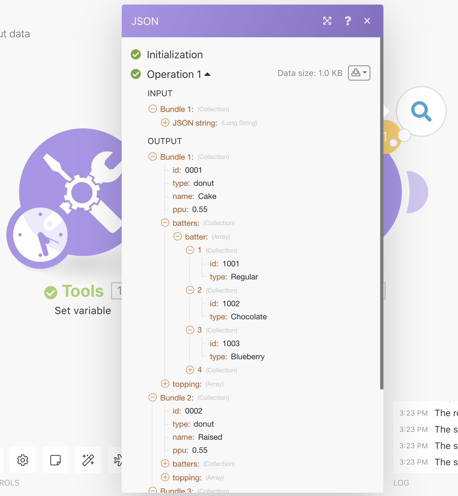

# JSON 작업 연습

디자인 요구 사항을 지원하도록 시나리오 내에서 JSON을 만들고 구문 분석하는 방법을 알아봅니다.

## 연습 개요

이러한 연습 목적은 JSON 형식의 시나리오로 전송된 정보를 시나리오 전체에서 매핑할 수 있는 필드 및 항목으로 구문 분석하여 활용하는 방법을 개념적으로 보여 주는 것입니다. 그런 다음 매핑된 배열에서 정보를 가져오거나 정보를 JSON으로 집계한 다음 JSON을 수신 입력으로 예상하는 다른 시스템으로 보낼 수 있습니다.

## 따라야 할 단계

**데이터 구조를 만들고 JSON을 구문 분석합니다.**

1. 새 시나리오를 만들고 이름을 “Working with JSON donut data”로 지정합니다.
1. 트리거 모듈의 경우, 변수 설정 모듈을 사용합니다.
1. 변수 이름에 “도넛형 데이터”를 입력합니다.
1. 변수 값의 경우, 테스트 드라이브의 Fusion 연습 파일 폴더에 있는 “_Donut Data - Sample JSON.rtf” 문서의 내용을 복사하여 붙여넣습니다.

   

1. 이 모듈의 이름을 “다른 커넥터의 JSON”으로 바꿉니다.
1. JSON 부문 분석 모듈을 추가합니다.
1. 데이터 구조 필드에 대해 추가를 클릭합니다.
1. 생성기를 선택하고 샘플 데이터 필드에 복사한 도넛형 데이터 - 샘플 JSON 데이터를 붙여넣습니다.

   

1. 저장을 클릭하고 데이터 구조 이름을 “도넛형 데이터”로 지정합니다. 그런 다음 저장을 클릭합니다.
1. 변수 설정 모듈의 도넛형 데이터를 JSON 문자열 필드에 매핑합니다.

   

1. 시나리오를 저장한 다음 한 번 실행을 클릭하여 출력을 확인합니다.

   **JSON 구문 분석 모듈의 출력은 다음과 같아야 합니다.**

   

   **특정 배열 변수에 매핑합니다.**

1. JSON 구문 분석 모듈 다음에 라우터를 추가합니다.
1. 상단 경로에서 변수 설정 모듈을 추가합니다.
1. 변수 이름에 “도넛별 배터 유형”을 입력합니다.
1. 변수 값의 경우, 매핑 기능을 사용하여 배터 배열에서 배터 유형을 가져옵니다.

   

1. 확인을 클릭한 다음, 한 번 실행을 클릭합니다.
1. 실행 검사기를 열어 세 작업에 대한 출력 번들을 확인하고 각각에 대한 배터 유형을 표시합니다.

   

   **시나리오 데이터를 JSON에 집계합니다.**

1. 하위 라우팅 경로에서 JSON에 집계 모듈을 추가합니다.
1. 소스 모듈의 경우, 반복기--JSON 구문 분석 모듈을 선택합니다.
1. 데이터 구조의 경우, 데이터 구조를 생성하거나 선택합니다. 이 예에서는 도넛형 데이터를 사용합니다.
1. 계속해서 아래와 같이 이 예에 대한 필드를 직접 매핑합니다.
1. 배터 및 토핑에 도달하면 배열임을 알 수 있으므로 항목 추가를 클릭하여 매핑해야 합니다.

   

1. 시나리오를 저장하고 한 번 실행을 클릭합니다.

시나리오 데이터를 JSON에 집계 모듈에 대한 실행 검사기를 보고 세 개의 번들을 단일 JSON 문자열로 집계할 수 있었던 방법을 확인합니다. 그런 다음 JSON을 예상하는 다른 시스템에 이 문자열을 보낼 수 있습니다.

